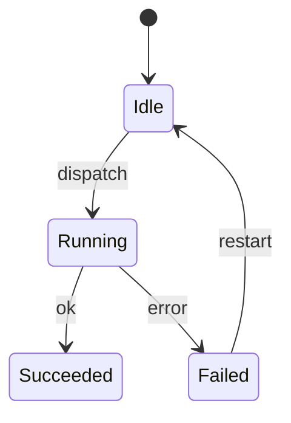
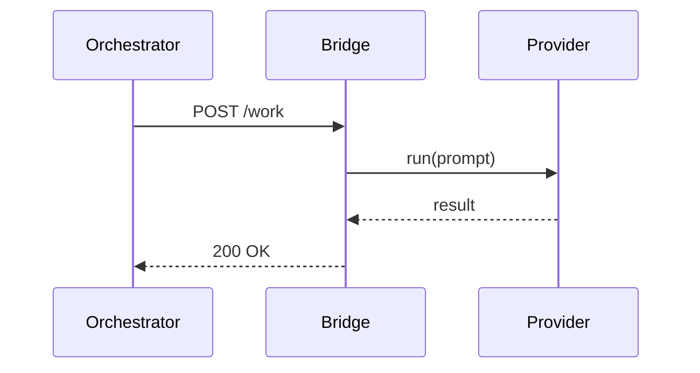

# plan-to-project

Convert a markdown requirements plan into a fully structured, template-compliant
GitHub Project backlog in a single workflow.

## Prerequisites

- `gh` CLI authenticated (`gh auth status`). If not: `gh auth login`
- Python 3.9+ available (`PyJWT` + `cryptography` required for the App-token
  helper; the rest of the skill has no Python deps beyond stdlib)
- Target GitHub org has Issue Types configured: `Project Scope`, `Initiative`, `Epic`,
  `User Story`, `Task` — or pass `--auto-create-issue-types` (FR #46) to have
  preflight create them via GraphQL
- Target GitHub Project V2 has fields: `Priority` (P0/P1/P2), `Size` (XS/S/M/L/XL),
  `Status` (Backlog/In Progress/Done/Blocked)
- Input plan follows KDTIX markdown structure (see [plan-format.md](https://github.com/kdtix-open/skill-plan-to-project/blob/main/references/plan-format.md))
  — and per FR #45, uses the full subsection schema by default

### Auth: personal PAT vs GitHub App installation token (FR #49)

For **Enterprise-owned orgs**, personal fine-grained PATs cannot combine user-scoped
permissions (e.g. "Copilot Requests") with Enterprise-org-scoped permissions
(e.g. `read:project` + `project`). The correct pattern for automation against
Enterprise-owned orgs is a **GitHub App installation token**.

The skill ships a helper:

```bash
# One-time setup
export SDLCA_APP_ID=<App-ID>
export SDLCA_APP_PRIVATE_KEY_PATH=~/.sdlca/<app-slug>.pem
chmod 0600 $SDLCA_APP_PRIVATE_KEY_PATH

# Mint 1-hour installation token (auto-discovers installation for the org)
source scripts/use-app-token.sh kdtix-open
# Exports GH_TOKEN + COPILOT_GITHUB_TOKEN (same value, both aliases set)

# Skill now works against Enterprise-owned org repos
python3 -m scripts.create_issues preflight \
  --org kdtix-open --repo kdtix-open/agent-project-queue --project 7
```

Alternative for non-Enterprise orgs: personal fine-grained PAT or `gh auth login`
with `read:project` + `project` scopes continues to work.

## Inputs

| Input | Description | Example |
|-------|-------------|---------|
| `PLAN_FILE` | Path to markdown plan | `plan-project-plan.md` |
| `ORG` | GitHub org login | `kdtix-open` |
| `REPO` | Target repo (owner/name) | `kdtix-open/my-project` |
| `PROJECT_NUMBER` | GitHub Project V2 number | `8` |

## Installation

### Codex user skill (`~/.codex/skills`)

Install directly with Codex's built-in GitHub skill installer:

```bash
python3 ~/.codex/skills/.system/skill-installer/scripts/install-skill-from-github.py \
  --repo kdtix-open/skill-plan-to-project \
  --path .
```

### Codex native installer CLI (GitHub-backed)

This repo also publishes a native installer entry point so users can install from the
GitHub remote without cloning first:

```bash
uvx --from git+https://github.com/kdtix-open/skill-plan-to-project \
  plan-to-project-install --destination home-skill
```

### Claude Code native installer CLI (GitHub-backed)

Install as a personal Claude Code skill under `~/.claude/skills`:

```bash
uvx --from git+https://github.com/kdtix-open/skill-plan-to-project \
  plan-to-project-install --destination claude-skill
```

### Cursor project rule installer CLI (GitHub-backed)

Install as a repo-local Cursor project rule under `.cursor/rules`:

```bash
uvx --from git+https://github.com/kdtix-open/skill-plan-to-project \
  plan-to-project-install --destination cursor-rule --repo-root /path/to/repo
```

> **Note:** Cursor's official docs support project rules in `.cursor/rules`,
> global user rules in settings, and deeplinks for MCP servers. This repo
> installs the supported project-rule surface because `plan-to-project` is a
> reusable workflow, not an MCP server.

### Codex plugin install

Install as a home-local plugin:

```bash
uvx --from git+https://github.com/kdtix-open/skill-plan-to-project \
  plan-to-project-install --destination home-plugin
```

Install into a chosen repo as a repo-local plugin:

```bash
uvx --from git+https://github.com/kdtix-open/skill-plan-to-project \
  plan-to-project-install --destination repo-plugin --repo-root /path/to/repo
```

> **Note:** The supported repo-local distribution model is a Codex plugin
> (`plugins/` + `.agents/plugins/marketplace.json`). User-scoped skills install under
> `~/.codex/skills`.

## Workflow

### Phase 1 — Pre-flight validation

```bash
python scripts/create_issues.py preflight \
  --org ORG --repo REPO --project PROJECT_NUMBER
```

Validates Issue Type IDs and Project V2 field IDs. Exits with clear error if anything
is missing. Writes `manifest-config.json` with field/type IDs for downstream scripts.

### Phase 2 — Parse plan

```bash
python scripts/create_issues.py parse --plan PLAN_FILE
```

Reads the markdown plan and extracts the 5-level hierarchy (Scope → Initiative →
Epics → Stories → Tasks) with title, description, priority, size, parent reference,
and blocking relationships. Prints a summary for review.

### Phase 3 — Create issues (top-down)

```bash
python scripts/create_issues.py create \
  --plan PLAN_FILE --org ORG --repo REPO --project PROJECT_NUMBER
```

Creates all issues top-down (Scope first, Tasks last) with template-compliant bodies
(including auto-injected TDD language and Security/Compliance sections where required).
Writes `manifest.json` with `number`, `nodeId`, and `databaseId` for every issue.

**Key behaviors:**
- Bodies written to temp files, passed via `--body-file` (avoids shell escaping)
- 0.5s sleep between creations (rate limit protection)
- Manifest JSON is the handoff artifact for all downstream scripts

### Phase 4 — Set sub-issue relationships

```bash
python scripts/set_relationships.py \
  --manifest manifest.json --repo REPO
```

Links each child issue to its parent using the GitHub sub-issues REST API
(`databaseId` integer, `-F` flag). Reads parent/child pairs from `manifest.json`.

### Phase 5 — Apply blocking labels

```bash
python scripts/set_relationships.py \
  --manifest manifest.json --repo REPO --labels-only
```

Applies `blocks` label to blocker issues and `blocked` label to blocked issues.
Updates the dependency table in each blocked issue's body with correct issue numbers.

> **Note:** Phases 4 and 5 are both run by `set_relationships.py`. Omit
> `--labels-only` to run both in one pass.

### Phase 6 — Set project V2 fields

```bash
python scripts/set_project_fields.py \
  --manifest manifest.json --config manifest-config.json \
  --org ORG --project PROJECT_NUMBER
```

Runs GraphQL mutations to set `Priority`, `Size`, and `Status` on every issue in the
project. Reads option IDs from `manifest-config.json` produced in Phase 1.

### Phase 7 — Assign Issue Types

```bash
python scripts/set_project_fields.py \
  --manifest manifest.json --config manifest-config.json \
  --org ORG --project PROJECT_NUMBER --issue-types-only
```

Assigns the correct Issue Type (Scope/Initiative/Epic/User Story/Task) to each issue
using the type IDs from `manifest-config.json`.

> **Note:** Phases 6 and 7 are both run by `set_project_fields.py`. Omit
> `--issue-types-only` to run both in one pass.

### Phase 8 — Compliance review & P0 auto-fix

```bash
python scripts/compliance_check.py \
  --manifest manifest.json --repo REPO
```

Checks every issue body against the KDTIX template standard:
- **P0 gaps** (auto-fixed): missing TDD language, missing Security/Compliance on
  mutation issues, missing dependency table on blocked issues
- **P1/P2 gaps** (reported): missing Assumptions, MoSCoW, Implementation Options,
  Subtasks Needed column

Writes `compliance-report.json` with gap summary per issue.

### Phase 9 — Queue order output

```bash
python scripts/queue_order.py \
  --manifest manifest.json --repo REPO --project PROJECT_NUMBER
```

Applies the priority algorithm to Story-level issues and outputs a recommended
execution order. Eligible issues: `Status=Backlog`, no `blocked` label, parent
`In Progress` or `Done`. Sort order: `P0>P1>P2`, `S<M<L`, lowest `#` tiebreaker.

Prints ordered list to stdout and writes `queue-order.json`.

### Refresh (in-place backlog upgrade) — no new / duplicate issues

```bash
python scripts/create_issues.py refresh \
  --plan PLAN_FILE --repo REPO --scope-issue SCOPE_NUMBER --dry-run
# Review the unified diff output, then:
python scripts/create_issues.py refresh \
  --plan PLAN_FILE --repo REPO --scope-issue SCOPE_NUMBER --apply
```

Patches an existing backlog that was created with an older version of the skill.
Walks the sub-issue tree rooted at `SCOPE_NUMBER`, matches each existing issue
to its corresponding plan item by normalized title, re-renders the body with the
current template + structured-subsection logic, and applies `gh issue edit` when
the body would change. Defaults to `--dry-run` — you must explicitly pass
`--apply` to mutate GitHub. The dry-run report (`refresh-report.json`) includes
a unified diff per would-update so you can review exactly what changes.

### Structured subsection schema (FR #34 Stage 2)

Plans may opt into per-item structured subsections to populate template
placeholder groups 1:1 (otherwise they fall back to the primary narrative field
— Vision for scope, Objective for initiative/epic, TL;DR for story, Summary for
task). Each subsection heading can use any markdown depth (`##` through
`######`) so long as the text (case-insensitive) matches one of:

| Level | Canonical subsection | Heading aliases | Type |
|-------|----------------------|-----------------|------|
| scope | `business_problem` | Business Problem, Business Problem & Current State, Current State | paragraph |
| scope | `success_criteria` | Success Criteria | bullets |
| scope | `in_scope_capabilities` | In-Scope Capabilities, In-Scope | bullets or paragraph |
| scope | `assumptions` | Assumptions | bullets |
| scope | `out_of_scope` | Out of Scope | bullets |
| scope | `moscow` | MoSCoW, MoSCoW Classification | nested bullets with `**Must Have**:`, `**Should Have**:`, `**Could Have**:`, `**Won't Have**:` sub-groups |
| scope | `done_when` | I Know I Am Done When, Done When | bullets |
| initiative/epic | `objective`, `release_value`, `success_criteria`, `feature_scope`, `assumptions`, `dependencies`, `done_when` | as-named | mixed |
| epic | `code_areas`, `questions_tech_lead`, `security_compliance` | as-named | mixed |
| story | `user_story`, `tldr`, `why_this_matters`, `moscow`, `acceptance_criteria`, `constraints`, `implementation_notes`, `security_compliance`, `subtasks_needed` | as-named | mixed |
| task | `summary`, `context`, `done_when`, `implementation_notes`, `security_compliance` | as-named | mixed |

Subsections are OPTIONAL BY CONSTRUCTION but REQUIRED FOR SHIP by default (FR #45).
Per-level required lists + escape-hatch flag documented in
[plan-format.md](https://github.com/kdtix-open/skill-plan-to-project/blob/main/references/plan-format.md#required-subsections-per-level-fr-45).
`create` and `refresh` fail-fast by default; pass `--allow-shallow-subsections`
to bypass (emergencies only; document why in commit / PR body).

### Mermaid diagram support (FR #40)

Any item may attach one or more Mermaid diagrams via diagram-specific subsection
headings. Diagrams are rendered into a conventional hook section — GitHub
renders them natively (no extra tooling required). Validation catches invalid
Mermaid syntax before ship as a new **P0-5** compliance rule.

**Recognized diagram subsection headings** (case-insensitive):

| Heading | Canonical key | Default type |
|---|---|---|
| Architecture Diagram, Architecture, C4 Context, C4 Container, C4 Component | `architecture_diagram` | `C4Context` |
| Sequence Diagram, Sequence | `sequence_diagram` | `sequenceDiagram` |
| State Diagram, State Machine | `state_diagram` | `stateDiagram-v2` |
| Flowchart, Flow Diagram | `flowchart` | `flowchart` |
| ER Diagram, Entity Relationship Diagram, ERD | `er_diagram` | `erDiagram` |
| Requirement Diagram, Requirements Diagram | `requirement_diagram` | `requirementDiagram` |
| Class Diagram | `class_diagram` | `classDiagram` |
| Diagram (generic) | `diagram` | inferred from block directive |

**Per-level recommendations** (guidance, not enforcement):

| Level | Rendered section | Best-fit diagram types |
|---|---|---|
| Scope | `## Architecture & Diagrams` | requirementDiagram, C4Context |
| Initiative | `## Architecture & Diagrams` | C4Container, architecture-beta, erDiagram |
| Epic | `## Architecture & Diagrams` | C4Component, flowchart, stateDiagram-v2 |
| Story | `## Workflow & Diagrams` | sequenceDiagram, stateDiagram-v2, flowchart |
| Task | (no hook) | usually too tactical; add manually if needed |

**Authoring example** (Story with both state + sequence diagrams):

````markdown
### Story: Bridge session auth + recovery

#### State Diagram



#### Sequence Diagram


````

Backward compatibility: plans without diagram subsections render identically to
pre-FR-#40 bodies (the diagram hook section is elided cleanly).

#### Deeper validation (optional) — companion `mermaid` skill

`plan-to-project` ships a fast, in-process directive check (P0-5) that catches
the most common mistake — operator pastes prose into a `\`\`\`mermaid` block.
It does NOT parse, render, or visually inspect the diagram because we don't
want `plan-to-project` to require `mmdc` / Playwright / a browser in
non-interactive CI contexts.

Operators who want stronger validation should run a companion `mermaid` skill
on the plan file **before** `/plan-to-project`:

- A Codex user-skill at `~/.codex/skills/mermaid/` provides a closed-loop
  pipeline (`scripts/iterate_mermaid.py`) that validates syntax via `mmdc`,
  renders both light + dark variants, screenshots them via Playwright, and
  scores clipping / overlap / contrast — with optional LLM-driven repair.
- The MCP tool `validate_and_render_mermaid_diagram` (when available in the
  host agent) performs a one-shot parse + render check.

Use either before running plan-to-project if you want to catch render-time
failures (unclosed brackets, invalid arrow types, overlapping labels) that
the directive check cannot see.

## Design Decisions

See [design-decisions.md](https://github.com/kdtix-open/skill-plan-to-project/blob/main/references/design-decisions.md) for the full
rationale. Key choices:

| Decision | Choice | Why |
|----------|--------|-----|
| Language | Python 3 + `gh` CLI | Available everywhere; no extra auth setup |
| Body injection | `--body-file` | Avoids shell escaping with special characters |
| Sub-issue API key | `databaseId` (integer, `-F` flag) | nodeId rejected by sub-issues REST API |
| Creation order | Top-down (Scope first) | Parents must exist before children can be linked |
| Manifest format | JSON with number + nodeId + databaseId | All downstream scripts need different ID types |
| TDD | Red before Green | No production code without a failing test first |

## Templates and References

- [template-scope.md](https://github.com/kdtix-open/skill-plan-to-project/blob/main/assets/template-scope.md) — Project Scope issue body template
- [template-initiative.md](https://github.com/kdtix-open/skill-plan-to-project/blob/main/assets/template-initiative.md) — Initiative issue body template
- [template-epic.md](https://github.com/kdtix-open/skill-plan-to-project/blob/main/assets/template-epic.md) — Epic issue body template
- [template-story.md](https://github.com/kdtix-open/skill-plan-to-project/blob/main/assets/template-story.md) — User Story issue body template
- [template-task.md](https://github.com/kdtix-open/skill-plan-to-project/blob/main/assets/template-task.md) — Task issue body template
- [plan-format.md](https://github.com/kdtix-open/skill-plan-to-project/blob/main/references/plan-format.md) — Expected markdown plan structure
- [github-graphql.md](https://github.com/kdtix-open/skill-plan-to-project/blob/main/references/github-graphql.md) — GraphQL queries for Issue Types and project fields
- [sub-issues-api.md](https://github.com/kdtix-open/skill-plan-to-project/blob/main/references/sub-issues-api.md) — Sub-issues REST API patterns
- [gh-cli-patterns.md](https://github.com/kdtix-open/skill-plan-to-project/blob/main/references/gh-cli-patterns.md) — Reliable `gh` CLI invocation patterns
- [compliance-rules.md](https://github.com/kdtix-open/skill-plan-to-project/blob/main/references/compliance-rules.md) — P0/P1/P2 gap definitions and auto-fix rules
- [design-decisions.md](https://github.com/kdtix-open/skill-plan-to-project/blob/main/references/design-decisions.md) — Full design rationale
