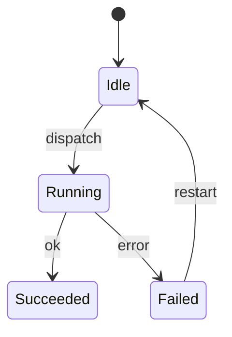
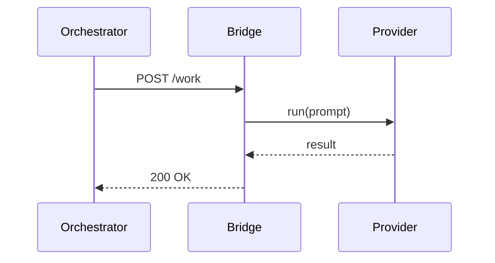

# Plan Format Reference

The plan-to-project skill expects a markdown file structured with the KDTIX
5-level hierarchy. A single project scope may contain one or more initiatives.

## Hierarchy Levels

| Level | Marker Pattern | Example |
|-------|---------------|---------|
| Scope | `# Project Scope:` or `# PS-` | `# Project Scope: PS-001 My Project` |
| Initiative | `## Initiative:` or `## INIT-` | `## Initiative: INIT-001 My Initiative` |
| Epic | `### Epic:` or `### EP-` | `### Epic: EP-001 My Epic` |
| Story | `### Story:`, `### User Story:`, `#### Story:`, or `#### User Story:` | `### Story: Author the widget` |
| Task | `#### Task:` or `##### Task:` | `#### Task: Implement the parser` |

## Required Frontmatter Per Item

Each item should include the following attributes (as bold key-value pairs or blockquotes):

```
Priority: P0 | P1 | P2
Size: XS | S | M | L | XL
Blocks: #123, #160      (optional, comma-separated issue references)
Blocking: #123, #160    (optional alias of Blocks:, same semantics)
```

`Blocks:` and `Blocking:` are treated as aliases. In both cases, the current
item is the blocker, and the referenced issues are the issues it blocks.

## Minimal Example

```markdown
# Project Scope: PS-001 Build Widget Platform

## Initiative: INIT-001 Widget Core

### Epic: EP-001 Widget Engine
Priority: P0
Size: M

#### Story: Build parser
Priority: P0
Size: S

##### Task: Implement tokenizer
Priority: P0
Size: XS
```

## Parser Behavior

- Headers are matched case-insensitively
- Story and task headers accept both the compact documented depth and the deeper nested depth used by older examples
- Items without an explicit Priority default to `P1`
- Items without an explicit Size default to `M`
- Blocking references are extracted from `Blocks:` and `Blocking:` lines
- `Blocks:` / `Blocking:` means the current item blocks the referenced issue(s)
- `#123` references are resolved against existing GitHub issue numbers in the
  target repository
- Text references are resolved against parsed issue titles in the current
  manifest
- The parser returns a dict:
  ```json
  {
    "scope": { "title": "...", "description": "...", "priority": "P0", "size": "M", "blocking": [] },
    "initiative": { ... },
    "initiatives": [ { ... } ],
    "epics": [ { ... } ],
    "stories": [ { "parent_ref": "EP-001", ... } ],
    "tasks": [ { "parent_ref": "Story title", ... } ]
  }
  ```
- `initiative` is preserved as a backward-compatible alias to the first item in
  `initiatives`
- Epics inherit the most recently declared initiative as their `parent_ref`

## Structured Subsections (FR #34 Stage 2)

Each item may declare one or more subsections inside its body. The parser
recognizes known subsection headings and maps them 1:1 to placeholder groups in
the generated issue template. Subsection headings can use any markdown depth
(`##` through `######`) — the depth doesn't matter, only the heading text.

Subsections are OPTIONAL. When absent, the item's raw body text populates the
primary narrative field (Vision / Objective / TL;DR / Summary) and other
placeholders remain as template text (the P0-4 scanner flags them).

### Recognized subsection names per level

**Scope:**
- `Vision`, `Project Vision` → paragraph → replaces `[VISION — ...]`
- `Business Problem`, `Business Problem & Current State`, `Current State` → paragraph
- `Success Criteria` → bullets → replace `- [ ] [CRITERION 1]` / `[CRITERION 2]`
- `In-Scope Capabilities`, `In-Scope` → bullets or paragraph
- `Assumptions` → bullets
- `Out of Scope` → bullets
- `MoSCoW`, `MoSCoW Classification` → nested bullets (see MoSCoW format below)
- `I Know I Am Done When`, `Done When`, `Definition of Done` → bullets

**Initiative:** `Objective`, `Release Value`, `Success Criteria`, `Feature Scope`,
`Assumptions`, `Dependencies`, `Out of Scope`, `Artifacts`,
`I Know I Am Done When`.

**Epic:** `Objective`, `Release Value`, `Success Criteria`, `Feature Scope`,
`Assumptions`, `Dependencies`, `I Know I Am Done When`, `Code Areas`
(alias `Code Areas to Examine`), `Questions for Tech Lead`,
`Security/Compliance` (aliases `Security`, `Compliance`).

**Story:** `User Story`, `TL;DR` (alias `TLDR`), `Why This Matters`, `Assumptions`,
`MoSCoW`, `Dependencies`, `I Know I Am Done When`, `Acceptance Criteria`,
`Constraints`, `Implementation Notes`, `Security/Compliance`,
`Subtasks Needed` (alias `Subtasks`).

**Task:** `Summary`, `Context`, `I Know I Am Done When`, `Implementation Notes`,
`Security/Compliance`.

### MoSCoW format

```
#### MoSCoW

**Must Have**:
- Item A
- Item B

**Should Have**:
- Item C

**Could Have**:
- Item D

**Won't Have**:
- Item E
```

Each `**Group**:` line starts a new bullet group. Recognized group names:
`Must Have`, `Should Have`, `Could Have`, `Won't Have` (or `Wont Have`).

### Full example

```markdown
# Project Scope: PS-001 Build Widget Platform

Delivers the widget platform with full provider parity.

#### Business Problem

Existing widget service has no provider abstraction and cannot onboard new
customers without a fresh rebuild.

#### Success Criteria

- All five providers reach feature parity
- End-to-end test suite is green
- Admin dashboard ships to production

#### Assumptions

- Target org has a GitHub Project V2 with required fields
- Bridge has valid credentials on the host

#### Out of Scope

- Native Windows supervisor (deferred to Phase 2)

#### MoSCoW

**Must Have**:
- Token metering
- Admin dashboard

**Should Have**:
- Realtime alerts

**Could Have**:
- Slack integration

**Won't Have**:
- Per-user throttling (this release)

#### I Know I Am Done When

- All Initiatives are Done
- Widget dashboard live in prod

## Initiative: INIT-001 Widget Core
Priority: P0
Size: M

#### Objective

Ship the widget core engine that all five providers use.

#### Release Value

Teams can onboard a new provider in under one day instead of one week.
```

### Required subsections per level (FR #45)

As of FR #45, the `create` and `refresh` commands enforce a per-level REQUIRED
subsection list by default. Plans that omit required subsections cause the
commands to exit non-zero with a per-item gap report, BEFORE any GitHub API
call is made.

| Level | Required subsections |
|---|---|
| Project Scope | `business_problem`, `success_criteria`, `assumptions`, `out_of_scope`, `done_when` |
| Initiative | `objective`, `release_value`, `success_criteria`, `feature_scope`, `done_when` |
| Epic | `objective`, `release_value`, `success_criteria`, `done_when` |
| User Story | `user_story`, `tldr`, `why_this_matters`, `done_when`, `acceptance_criteria` |
| Task | `summary`, `context`, `done_when`, `implementation_notes` |

These are the MINIMUMS. Operators may add any additional subsections freely.

#### Escape hatch: `--allow-shallow-subsections`

When a plan genuinely cannot meet the required list (emergency seeding, legacy
plans being refreshed in-place), pass `--allow-shallow-subsections` on either
`create` or `refresh`. The command prints a warning + the gap list + proceeds.
Resulting issue bodies will carry template placeholder leaks (flagged by the
P0-4 scanner).

Use SPARINGLY. Document why in the commit / PR body:

```bash
python3 -m scripts.create_issues create --plan plan.md --org X --repo X/Y \
    --project N --allow-shallow-subsections
```

### Backward compatibility

Plans without `####` subsections continue to render exactly as they did before
— the skill falls back to using the item's raw body as the primary narrative
field. You can adopt the subsection schema on a single plan at a time.
**Note**: without `--allow-shallow-subsections`, such plans now fail the FR #45
gate by default.

## Mermaid Diagrams (FR #40)

Any item may attach one or more Mermaid diagrams via diagram-specific
subsection headings. Each diagram goes in its own `#### <Type> Diagram`
subsection containing a fenced `\`\`\`mermaid` block.

### Recognized diagram subsection headings

- `Architecture Diagram`, `Architecture`, `C4 Context`, `C4 Container`, `C4 Component`
- `Sequence Diagram`, `Sequence`
- `State Diagram`, `State Machine`
- `Flowchart`, `Flow Diagram`
- `ER Diagram`, `Entity Relationship Diagram`, `ERD`
- `Requirement Diagram`, `Requirements Diagram`
- `Class Diagram`
- `Diagram` (generic — type inferred from the block's first directive)

### Per-level diagram recommendations

| Level | Where it pays off most | Best-fit types |
|---|---|---|
| **Project Scope** | "What do we deliver + to whom" | `requirementDiagram`, `C4Context` |
| **Initiative** | "How does this system fit together" | `C4Container`, `architecture-beta`, `erDiagram` |
| **Epic** | "What are the pieces + how do they interact" | `C4Component`, `flowchart`, `stateDiagram-v2` |
| **User Story** | "Exact workflow I'll implement" | `sequenceDiagram`, `stateDiagram-v2`, `flowchart` |
| **Task** | Usually too tactical | Occasional `classDiagram` or `flowchart` |

Operators may use any diagram type at any level — the table is heuristic.

### Where diagrams render

- Scope / Initiative / Epic: rendered into a `## Architecture & Diagrams` section
- User Story: rendered into a `## Workflow & Diagrams` section
- Task: no default hook — add your own section if needed

### Validation

Each `\`\`\`mermaid` block's first non-blank, non-comment line must start with
a recognized directive (`flowchart`, `sequenceDiagram`, `classDiagram`,
`stateDiagram-v2`, `erDiagram`, `C4Context`, `C4Container`, `C4Component`,
`requirementDiagram`, `architecture-beta`, etc.). Blocks with unrecognized
first lines are flagged by the **P0-5** compliance rule.

### Example (User Story with both state + sequence diagrams)

````markdown
### Story: Bridge session auth + recovery

Priority: P1
Size: M

#### TL;DR

Bridge maintains a session state machine with auto-recovery on auth errors.

#### State Diagram



#### Sequence Diagram


````

### Multiple diagrams per item

When an item has more than one diagram, each diagram gets a `### <Type>`
sub-heading in the rendered section so readers can navigate between them.
