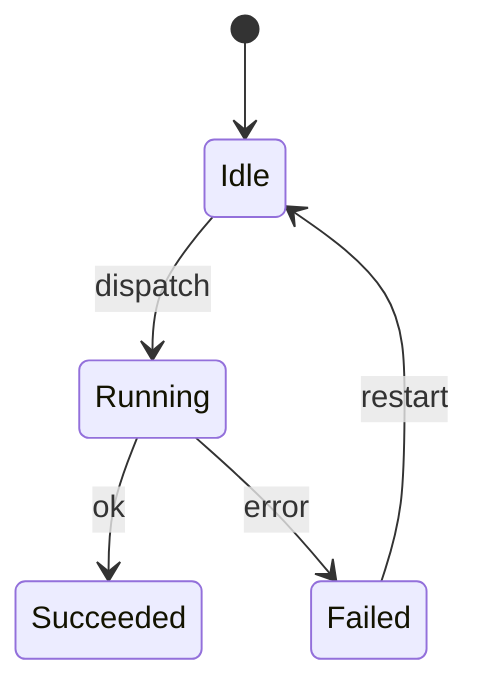
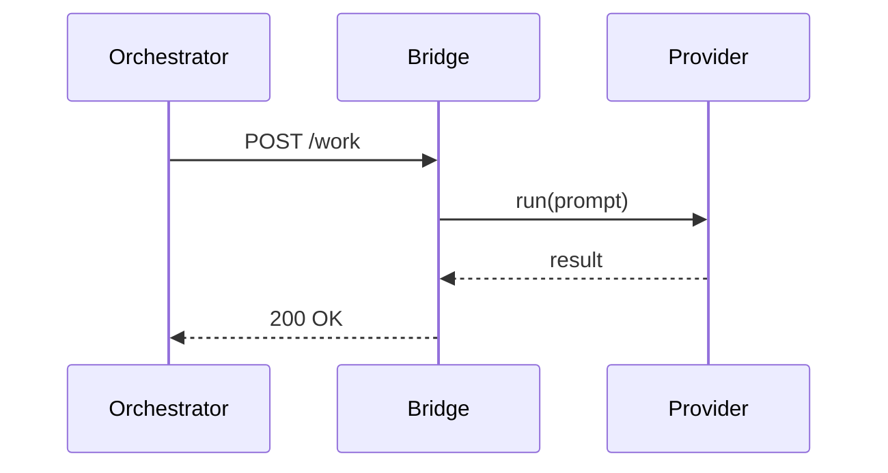

# Plan Format Reference

The plan-to-project skill expects a markdown file structured with the KDTIX
5-level hierarchy. A single project scope may contain one or more initiatives.

## Hierarchy Levels

| Level | Marker Pattern | Example |
|-------|---------------|---------|
| Scope | `# Project Scope:` or `# PS-` | `# Project Scope: PS-001 My Project` |
| Initiative | `## Initiative:` or `## INIT-` | `## Initiative: INIT-001 My Initiative` |
| Epic | `### Epic:` or `### EP-` | `### Epic: EP-001 My Epic` |
| Story | `### Story:`, `### User Story:`, `#### Story:`, or `#### User Story:` | `### Story: Author the widget` |
| Task | `#### Task:` or `##### Task:` | `#### Task: Implement the parser` |

## Required Frontmatter Per Item

Each item should include the following attributes (as bold key-value pairs or blockquotes):

```
Priority: P0 | P1 | P2
Size: XS | S | M | L | XL
Blocks: #123, #160      (optional, comma-separated issue references)
Blocking: #123, #160    (optional alias of Blocks:, same semantics)
```

`Blocks:` and `Blocking:` are treated as aliases. In both cases, the current
item is the blocker, and the referenced issues are the issues it blocks.

## Minimal Example

```markdown
# Project Scope: PS-001 Build Widget Platform

## Initiative: INIT-001 Widget Core

### Epic: EP-001 Widget Engine
Priority: P0
Size: M

#### Story: Build parser
Priority: P0
Size: S

##### Task: Implement tokenizer
Priority: P0
Size: XS
```

## Parser Behavior

- Headers are matched case-insensitively
- Story and task headers accept both the compact documented depth and the deeper nested depth used by older examples
- Items without an explicit Priority default to `P1`
- Items without an explicit Size default to `M`
- Blocking references are extracted from `Blocks:` and `Blocking:` lines
- `Blocks:` / `Blocking:` means the current item blocks the referenced issue(s)
- `#123` references are resolved against existing GitHub issue numbers in the
  target repository
- Text references are resolved against parsed issue titles in the current
  manifest
- The parser returns a dict:
  ```json
  {
    "scope": { "title": "...", "description": "...", "priority": "P0", "size": "M", "blocking": [] },
    "initiative": { ... },
    "initiatives": [ { ... } ],
    "epics": [ { ... } ],
    "stories": [ { "parent_ref": "EP-001", ... } ],
    "tasks": [ { "parent_ref": "Story title", ... } ]
  }
  ```
- `initiative` is preserved as a backward-compatible alias to the first item in
  `initiatives`
- Epics inherit the most recently declared initiative as their `parent_ref`

## Structured Subsections (FR #34 Stage 2)

Each item may declare one or more subsections inside its body. The parser
recognizes known subsection headings and maps them 1:1 to placeholder groups in
the generated issue template. Subsection headings can use any markdown depth
(`##` through `######`) — the depth doesn't matter, only the heading text.

Subsections are OPTIONAL. When absent, the item's raw body text populates the
primary narrative field (Vision / Objective / TL;DR / Summary) and other
placeholders remain as template text (the P0-4 scanner flags them).

### Recognized subsection names per level

**Scope:**
- `Vision`, `Project Vision` → paragraph → replaces `[VISION — ...]`
- `Business Problem`, `Business Problem & Current State`, `Current State` → paragraph
- `Success Criteria` → bullets → replace `- [ ] [CRITERION 1]` / `[CRITERION 2]`
- `In-Scope Capabilities`, `In-Scope` → bullets or paragraph
- `Assumptions` → bullets
- `Out of Scope` → bullets
- `MoSCoW`, `MoSCoW Classification` → nested bullets (see MoSCoW format below)
- `Dependencies` → paragraph → rendered as its own `## Dependencies` section
  (the scope template has no placeholder slot; issue #74)
- `Security/Compliance` (aliases `Security`, `Compliance`) → paragraph →
  rendered as its own `## Security/Compliance` section
- `Artifacts` → bullets → rendered as its own `## Artifacts` checkbox section
- `I Know I Am Done When`, `Done When`, `Definition of Done` → bullets

**Initiative:** `Objective`, `Release Value`, `Success Criteria`, `Feature Scope`,
`Assumptions`, `Dependencies`, `Out of Scope`, `Artifacts`,
`I Know I Am Done When`.

**Epic:** `Objective`, `Release Value`, `Success Criteria`, `Feature Scope`,
`Assumptions`, `Dependencies`, `Artifacts`, `I Know I Am Done When`,
`Code Areas` (alias `Code Areas to Examine`), `Questions for Tech Lead`,
`Security/Compliance` (aliases `Security`, `Compliance`).

**Story:** `User Story`, `TL;DR` (alias `TLDR`), `Why This Matters`, `Assumptions`,
`MoSCoW`, `Dependencies`, `Artifacts`, `I Know I Am Done When`,
`Acceptance Criteria`, `Constraints`, `Implementation Notes`,
`Security/Compliance`, `Subtasks Needed` (alias `Subtasks`).

Epic and Story `Artifacts` parse as bullets and render as a dedicated
`### Artifacts` checkbox section before `I Know I Am Done When` (the epic and
story templates carry no placeholder slot for them; issue #74). Previously
these headings were silently folded into the preceding recognized subsection.

**Task:** `Summary`, `Context`, `I Know I Am Done When`, `Implementation Notes`,
`Security/Compliance`.

### MoSCoW format

Two equivalent forms are accepted:

**Bare form** (original):
```
#### MoSCoW

**Must Have**:
- Item A
- Item B

**Should Have**:
- Item C

**Could Have**:
- Item D

**Won't Have**:
- Item E
```

**Bullet-prefixed form** (recommended for indentation hygiene):
```
#### MoSCoW Classification

- **Must Have**:
  - Item A
  - Item B

- **Should Have**:
  - Item C

- **Could Have**:
  - Item D

- **Won't Have**:
  - Item E
```

Both forms are parsed identically. Use the bullet-prefixed form when writing
plans in editors that reformat indented lists — it avoids accidental un-nesting.

Each `**Group**:` line starts a new bullet group. Recognized group names:
`Must Have`, `Should Have`, `Could Have`, `Won't Have` (aliases `Wont Have`,
`Won't Have This Time`, `Wont Have This Time`). Group-name matching is
case-insensitive and normalizes curly apostrophes (`’`) to straight ones, so
`Won’t Have This Time` is recognized too. All `Won't Have` variants merge into
the rendered `Won't Have` rows.

**Table form** (accepted as a fallback): when a MoSCoW subsection contains no
recognized `**Group**:` sub-headers but does contain a markdown table, the
table's data rows are passed through into the rendered MoSCoW table verbatim
(header and delimiter rows stripped — the issue template supplies its own).
Authored MoSCoW content is never elided (issue #74).

### Dependencies format (story level)

The Story `#### Dependencies` subsection accepts two equivalent formats.

**Table form** (recommended for new plans):
```markdown
#### Dependencies

| Ticket | Description | Status |
|--------|-------------|--------|
| #207 | Access-token proactive renewal | Open |
| #213 | Revocation invalidates active lease | Open |
```

**Bulleted form** (auto-converted; accepted for legacy / quick authoring):
```markdown
#### Dependencies

- #184 — Parent Epic "Phase 1 Verification Harness" (In Progress)
- Blocks: none (operator-side workaround exists)
- Blocked by: none
```

The renderer auto-converts bulleted source to the table format before rendering.
Two bullet patterns are supported:

| Bullet pattern | Rendered table row |
|---|---|
| `- #NNNN — description (Status)` | `\| #NNNN \| description \| Status \|` |
| `- plain text` | `\| (none) \| plain text \| — \|` |

Parentheticals at the end of `- #NNNN — ...` lines are treated as the Status
cell. Parentheticals inside plain-text bullets (no issue ref) remain in the
Description cell. The separator between issue ref and description may be an
em-dash (`—`), en-dash (`–`), or hyphen (`-`). Bullet markers `*` and `-` are
both accepted.

Use the **table form** for new plans — it is the canonical format and makes the
column schema explicit. The bullet form is accepted for backward compatibility
with plans authored before the table convention was adopted.

**Dependencies bullet format — single-line per entry.** Multi-line continuation
(e.g. wrapping a long description across two lines via leading whitespace) is
NOT supported by the bullet → table converter. Each bullet must be on a single
physical line. Multi-line content silently drops the continuation line. Use
the markdown table format if you need multi-line description content.

Bullets with an issue ref but empty description (e.g. `- #42 —`) produce a row
with an empty Description cell. Avoid degenerate inputs; the helper does not
warn.

### Full example

```markdown
# Project Scope: PS-001 Build Widget Platform

Delivers the widget platform with full provider parity.

#### Business Problem

Existing widget service has no provider abstraction and cannot onboard new
customers without a fresh rebuild.

#### Success Criteria

- All five providers reach feature parity
- End-to-end test suite is green
- Admin dashboard ships to production

#### Assumptions

- Target org has a GitHub Project V2 with required fields
- Bridge has valid credentials on the host

#### Out of Scope

- Native Windows supervisor (deferred to Phase 2)

#### MoSCoW

**Must Have**:
- Token metering
- Admin dashboard

**Should Have**:
- Realtime alerts

**Could Have**:
- Slack integration

**Won't Have**:
- Per-user throttling (this release)

#### I Know I Am Done When

- All Initiatives are Done
- Widget dashboard live in prod

## Initiative: INIT-001 Widget Core
Priority: P0
Size: M

#### Objective

Ship the widget core engine that all five providers use.

#### Release Value

Teams can onboard a new provider in under one day instead of one week.
```

### Required subsections per level (FR #45)

As of FR #45, the `create` and `refresh` commands enforce a per-level REQUIRED
subsection list by default. Plans that omit required subsections cause the
commands to exit non-zero with a per-item gap report, BEFORE any GitHub API
call is made.

| Level | Required subsections |
|---|---|
| Project Scope | `business_problem`, `success_criteria`, `assumptions`, `out_of_scope`, `done_when` |
| Initiative | `objective`, `release_value`, `success_criteria`, `feature_scope`, `done_when` |
| Epic | `objective`, `release_value`, `success_criteria`, `done_when` |
| User Story | `user_story`, `tldr`, `why_this_matters`, `done_when`, `acceptance_criteria` |
| Task | `summary`, `context`, `done_when`, `implementation_notes` |

These are the MINIMUMS. Operators may add any additional subsections freely.

#### Escape hatch: `--allow-shallow-subsections`

When a plan genuinely cannot meet the required list (emergency seeding, legacy
plans being refreshed in-place), pass `--allow-shallow-subsections` on either
`create` or `refresh`. The command prints a warning + the gap list + proceeds.
Resulting issue bodies will carry template placeholder leaks (flagged by the
P0-4 scanner).

Use SPARINGLY. As of skill version 0.2.0 (issue #68 / Self-Healing R-19), the
flag is no longer a no-op — it must be paired with three layered guards:

##### Guard A — `--shallow-justification "<reason>"` (required, ≥30 chars)

```bash
python3 -m scripts.create_issues create --plan plan.md --org X --repo X/Y \
    --project N \
    --allow-shallow-subsections \
    --shallow-justification "Stage-0 recon for OH-001 hot-lane; Stages 1-4 backfill filed as kdtix-open/agent-project-queue#NNN"
```

The justification is captured into:
- `manifest.json` as the top-level `shallow_subsections_justification` field;
- every generated issue body as a grep-friendly HTML comment marker
  (`<!-- shallow-subsections: justified by "<reason>" — see Self-Healing R-19 ... -->`);
- a `shallow:created` label on the root scope/initiative/epic issue (best-effort
  — warns + continues if the label doesn't exist on the repo).

##### Guard B — P0 JSONL audit log

Every shallow `create` / `refresh` / `amend` invocation appends a structured
JSONL entry to
`${SDLCA_AUDIT_DIR:-~/.sdlca}/skill-plan-to-project-audit.jsonl`. The audit dir
is auto-created with mode `0o700` if missing. Schema includes timestamp, actor
email, token kind (`github-app` / `pat` / `unknown`), command, plan path,
scope issue, repo, list of items missing required subsections, the verbatim
justification, severity (`P0`), skill version, and the full argv. Inspect with:

```bash
python3 -m scripts.audit_log tail -n 10
```

##### Guard C — fail-closed refresh + `--close-shallow-debt` graduation

A subtree is "marked shallow" if EITHER the per-scope manifest under
`manifests/<scope-issue>.json` records `shallow_subsections: true` OR the root
issue carries the `shallow:created` label. Subsequent `refresh` / `amend`
invocations against a marked subtree fail-closed (exit 2) when the plan still
fails the FR #45 schema gate AND no fresh `--shallow-justification` is
provided. The error message reports the marker source, the schema-gate failure
summary, and three remediation paths (deepen plan + graduate; re-acknowledge
bypass; abandon refresh).

To clear the marker once the plan has been deepened and now passes the gate:

```bash
python3 -m scripts.create_issues refresh --plan plan.md --repo X/Y \
    --scope-issue 271 --close-shallow-debt --apply
```

This validates the plan passes the gate, sets `shallow_subsections: false` on
the manifest with `shallow_debt_closed_at` + `shallow_debt_closed_by`, swaps
the `shallow:created` label for `shallow:graduated` on the root issue, emits an
INFO `shallow_debt_closed` audit entry, and proceeds with the regular body
re-render in the same shot.

### Backward compatibility

Plans without `####` subsections continue to render exactly as they did before
— the skill falls back to using the item's raw body as the primary narrative
field. You can adopt the subsection schema on a single plan at a time.
**Note**: without `--allow-shallow-subsections`, such plans now fail the FR #45
gate by default.

## Mermaid Diagrams (FR #40)

Any item may attach one or more Mermaid diagrams via diagram-specific
subsection headings. Each diagram goes in its own `#### <Type> Diagram`
subsection containing a fenced `\`\`\`mermaid` block.

### Recognized diagram subsection headings

- `Architecture Diagram`, `Architecture`, `C4 Context`, `C4 Container`, `C4 Component`
- `Sequence Diagram`, `Sequence`
- `State Diagram`, `State Machine`
- `Flowchart`, `Flow Diagram`
- `ER Diagram`, `Entity Relationship Diagram`, `ERD`
- `Requirement Diagram`, `Requirements Diagram`
- `Class Diagram`
- `Diagram` (generic — type inferred from the block's first directive)

### Per-level diagram recommendations

| Level | Where it pays off most | Best-fit types |
|---|---|---|
| **Project Scope** | "What do we deliver + to whom" | `requirementDiagram`, `C4Context` |
| **Initiative** | "How does this system fit together" | `C4Container`, `architecture-beta`, `erDiagram` |
| **Epic** | "What are the pieces + how do they interact" | `C4Component`, `flowchart`, `stateDiagram-v2` |
| **User Story** | "Exact workflow I'll implement" | `sequenceDiagram`, `stateDiagram-v2`, `flowchart` |
| **Task** | Usually too tactical | Occasional `classDiagram` or `flowchart` |

Operators may use any diagram type at any level — the table is heuristic.

### Where diagrams render

- Scope / Initiative / Epic: rendered into a `## Architecture & Diagrams` section
- User Story: rendered into a `## Workflow & Diagrams` section
- Task: no default hook — add your own section if needed

### Validation

Each `\`\`\`mermaid` block's first non-blank, non-comment line must start with
a recognized directive (`flowchart`, `sequenceDiagram`, `classDiagram`,
`stateDiagram-v2`, `erDiagram`, `C4Context`, `C4Container`, `C4Component`,
`requirementDiagram`, `architecture-beta`, etc.). Blocks with unrecognized
first lines are flagged by the **P0-5** compliance rule.

### Example (User Story with both state + sequence diagrams)

````markdown
### Story: Bridge session auth + recovery

Priority: P1
Size: M

#### TL;DR

Bridge maintains a session state machine with auto-recovery on auth errors.

#### State Diagram


```mermaid
stateDiagram-v2
    [*] --> Idle
    Idle --> Running : dispatch
    Running --> Succeeded : ok
    Running --> Failed : error
    Failed --> Idle : restart
```

#### Sequence Diagram


```mermaid
sequenceDiagram
    Orchestrator->>Bridge: POST /work
    Bridge->>Provider: run(prompt)
    Provider-->>Bridge: result
    Bridge-->>Orchestrator: 200 OK
```
````

### Multiple diagrams per item

When an item has more than one diagram, each diagram gets a `### <Type>`
sub-heading in the rendered section so readers can navigate between them.

## Authoring at Scale

A plan with full Stage-2 subsection coverage (every Story has `User Story`,
`Why This Matters`, `I Know I Am Done When`, `Acceptance Criteria`, `MoSCoW`,
etc.) produces the highest-fidelity rendered issue bodies and the least
placeholder leakage. That depth also makes the plan the single most
context-rich artifact a Worker or Reviewer can read.

Producing that depth efficiently requires scoped authoring. A single agent
reading the entire plan for a large backlog (>1 Epic × >5 Stories per Epic)
will exceed safe context budgets before it finishes writing — producing
shallow or truncated subsections, or timing out entirely. The better approach
is to fan the authoring work out across multiple sub-agents, one per Epic,
each given only that Epic's body and its child Story titles.

See [sub-agent-fan-out-pattern.md](./sub-agent-fan-out-pattern.md) for the
full operator workflow: when to use it, how to isolate each sub-agent in its
own git worktree, what context each sub-agent needs in its prompt, and how to
compose and merge the resulting PRs without conflicts.
