<!--
FIXTURE PROVENANCE (do not regenerate without updating the counts this
test file hard-codes): frozen snapshot of
docs/plans/drafts/Agentic Orchestration Persona Governance, Commissioning,
and Backlog Alignment Plan.md from kdtix-open/agent-project-queue, taken
at merge commit 1ca4a86ceb (PR #2002, merged 2026-07-29). 6,259 lines,
SHA-256 aed5ff027619be215eca24b81de2e9e95101da3b04bedfce96aaa8ec016c07f2.

This diverges slightly from the 6,251-line / SHA-256 e1c1f80ee16f...
snapshot cited in the skill-plan-to-project#74 audit — that exact working-
copy state was not reachable from the source repo's commit history at the
time this fixture was captured. This PR #2002 merge commit is the closest
durable snapshot and reproduces every audit count (8 items leaking 32
placeholders, 9 bodies leaking #[N], 37 authored Artifacts headings with
1 parsed / 36 folded into security_compliance) exactly.
-->

# Agentic Orchestration Persona Governance, Commissioning, and Backlog Alignment

> **Status: DRAFT — OPERATOR GOVERN DECISION REQUIRED.**
>
> The complete draft source corpus is versioned at
> [`docs/plans/references/personas/`](../references/personas/). The corpus is
> evidence and design input; it is not ratified authority. The proposed
> amendments are isolated in
> [`docs/audits/2026-07-27-agentic-persona-govern-amendment/`](../../audits/2026-07-27-agentic-persona-govern-amendment/).
> Current ratified PURPOSE and current commissioned grants remain authoritative
> until every applicable effectivity condition in this plan is met. The source
> plan passes the required Stage-2 subsection schema, but GitHub issue seeding
> remains fail-closed on
> [`skill-plan-to-project#74`](https://github.com/kdtix-open/skill-plan-to-project/issues/74)
> until the renderer emits no child-table placeholders and preserves every
> authored subsection.

This plan turns the captured persona and RACI research into a controlled
governance, commissioning, implementation-catch-up, and backlog-alignment
program. It preserves the architecture before implementation continues,
prevents a Markdown file or runtime process name from becoming authority by
implication, and gives each existing issue one stable current-versus-target
RACI reference.

# Project Scope: PS-PER-001 Govern and Commission the Agentic Orchestration Persona System

Priority: P0

Size: XL

#### Vision

Establish a versioned and testable persona system in which every atomic
decision has one Accountable owner, every runtime identity has attributable
authority, and every authority transfer is ratified, commissioned, verified,
and reversible without erasing the current safe operating boundary.

#### Business Problem

Twenty related persona or attendance-contract drafts and their RACI research
were created outside Git while the implementation backlog continued to evolve.
Several partially implemented services, journals, issue families, and
temporary identities now use overlapping role language. Without immediate
preservation and a governed migration, the documentation can be lost, backlog
issues can drift into competing ownership models, and implementation names can
be mistaken for commissioned principals.

The risk is already concrete: Operations Helm has both a Detect-only target
charter and an older ruling that gives it remediation influence; Token
Reporting work combines usage accounting, quota admission, credentials,
forecasting, and efficiency KPIs; incident roundtables can treat advisory
quorum as restore authorization; and a UAT boundary note contradicted its own
atomic RACI. Governance, implementation, and emergency repair therefore need
separate paths.

#### Success Criteria

- All 31 canonical source artifacts and 19 distinct pre-SME backup drafts are
  durably versioned with status, manifests, links, and reproducible SHA-256
  evidence.
- PURPOSE contains only ratified amendments; proposed text remains outside the
  ratified ledger until an attributable Operator decision.
- The Operator can approve, revise, or reject each proposed standing persona
  boundary and R-36 independently.
- Every persona has one atomic RACI, peer-overlap boundaries, conflict and
  recusal rules, escalation semantics, and measurable commissioning evidence.
- Runtime identities, services, scripts, topics, models, and reports are never
  treated as personas or authority merely because they exist.
- Existing authority remains with the current owner until a specific target
  transfer is effective.
- All 50 materially affected open issues in the 20 deduplicated drift families
  point to one canonical current-versus-target interpretation without
  duplicate comment noise.
- Duplicate Token Reporting activation journal #2015 is retired in favor of
  the evidence-bearing #2013 journal.
- A machine check detects invalid corpus links, missing atomic owners,
  conflicting current-versus-target declarations, and non-ratified PURPOSE
  ledger entries.
- AAH is used only for a reproducible, self-sabotaging normal-loop invariant;
  governance, broad persona implementation, and documentation cleanup stay in
  the normal plan.
- The plan parses through the `plan-to-project` Stage-2 schema gate and every
  Mermaid diagram validates before backlog seeding.

#### In-Scope Capabilities

- Canonical draft corpus preservation, provenance, and change discipline.
- Operator GOVERN decision packet for 15 new/completed persona boundaries,
  four already-covered personas, one inherited attendance contract, R-36, and
  the Auditor AAH authority conflict.
- Atomic RACI, current-versus-target authority, conflict-of-interest,
  independent-review, advisory-vote, tie, escalation, and 30-minute
  Agentic-Scrum rules.
- Per-persona identity, AgentCard, capability, grant, revocation, handback,
  observability, UAT, and effectivity contracts.
- Four dependency-ordered commissioning waves covering all 20 draft files.
- Deduplicated backlog reconciliation across the 20 SME-identified issue
  families.
- Stabilization of partially implemented persona-like runtimes and narrow AAH
  treatment only where live evidence meets the ratified trigger.
- Plan-of-Plans registration and drift-prevention automation.

**Execution dependencies**

| Dependency | Why it matters | State |
|---|---|---|
| Ratified PURPOSE | Source of current authority and amendment procedure | Current; amendment pending Operator |
| PR #2002 | Durable corpus, evidence, GOVERN proposal, and this plan | Open |
| Self-Healing and AAH rules | Define normal-loop and exceptional repair boundaries | Current, one Auditor conflict to adjudicate |
| A2A/ACI plan | Carries identity, task, artifact, and delegation conformance | Draft/partial |
| Event log/Kafka/EMI work | Carries durable non-authorizing event evidence | Partial/as-built |
| Local Bridge | Carries host-local execution and raw provider receipts | Partial/as-built |
| Token Reporting | Supplies existing usage collection and reporting runtime | Active, not a commissioned Token-Agent |
| Open-issue reconciliation manifest | Narrows 366 open issues to 50 actions in 20 families | SME complete |
| `skill-plan-to-project#74` | Restores placeholder-complete rendering and subsection preservation before seeding | Open publication blocker |

**Required evidence artifacts**

| Artifact | Purpose |
|---|---|
| `docs/plans/references/personas/` | Complete versioned draft corpus and research |
| `docs/audits/2026-07-27-agentic-persona-govern-amendment/` | Operator decision and provenance packet |
| This plan | Backlog-seedable governance and implementation hierarchy |
| `docs/plans/Plan-of-Plans.md` | Human navigation and reading order |
| Issue reconciliation comments/body updates | Current-versus-target links for material drift families |
| Persona drift validator | Link, owner, effectivity, and ledger checks |
| Commissioning evidence packets | Per-capability identity, grant, verification, UAT, and handback proof |

#### Assumptions

- The Operator remains the Principal Agentic Architecture Orchestration Govern
  authority.
- Current `.github/docs/philosophy/PURPOSE.md` remains authoritative until a
  proposed amendment is explicitly ratified and recorded.
- Ratification approves a target boundary but does not create a principal,
  deploy code, issue a grant, transfer authority, or make a capability
  effective.
- One runtime may implement several roles and one role may have several
  instances, but role Accountability remains atomic and separately
  attributable.
- Transient SME sub-agents inherit the parent persona's scope and authority;
  they are not automatically standing personas.
- Existing code and issue text are evidence of current state, not proof of
  intended target authority.
- GraphQL exhaustion does not prevent REST-based issue inventory and
  reconciliation.

#### Out of Scope

- Ratifying the amendments on behalf of the Operator.
- Creating principals, AgentCards, capability grants, credentials, or
  cryptographic keys in this documentation PR.
- Automatically transferring authority from a current owner.
- Deploying every proposed persona in one release.
- Treating every specialized helper, model, service, topic, script, or
  ceremony participant as a separately commissioned Agent.
- Replacing domain payload owners with ACI, EMI, Liaison, Guide, Scrum,
  Reviewer, Auditor, or another cross-cutting role.
- Bypassing independent review, UAT, current positive truth, or hard-action
  gates through voting, elapsed time, silence, or emergency naming.
- Reopening accurate or capped backlog items merely to add persona links.

#### MoSCoW

- **Must Have**:
  - Preserve and index the complete draft corpus.
  - Obtain explicit Operator decisions before amending PURPOSE.
  - Preserve current authority until explicit effectivity.
  - Define atomic RACI and safe conflict/tie/escalation behavior.
  - Reconcile critical overlapping-authority and parallel-ledger issue
    families.
  - Correct proven AAH ownership defects and preserve independent review.
  - Validate plan schema, diagrams, links, manifests, and PR review state.
  - Bind authority to stable principal identity, capability, scope, issuer,
    audience, proof, validity window, revocation, and replay protection.
  - Re-derive current positive truth at every hard-action boundary.
  - Require conflict-of-interest disclosure, recusal, and independent
    current-HEAD review.
  - Exclude credentials, provider tokens, admin tokens, transcript secrets,
    and authorization proofs from persona Markdown and issue bodies.
  - Preserve BSL 1.1 boundaries and append-preserving correction history.

- **Should Have**:
  - Commission personas in dependency-ordered waves with capability-specific
    evidence.
  - Add machine-readable persona, authority, and current-versus-target fields
    to coordination records.
  - Add drift checks to CI and plan refresh workflows.

- **Could Have**:
  - Generate read-only RACI visualizations from the canonical corpus.
  - Add a registry query that explains why a principal is or is not effective.
  - Publish anonymized aggregate efficiency measurements after authority and
    privacy boundaries are proven.

- **Won't Have**:
  - Big-bang activation of all personas.
  - Majority-rule authorization or a Scrum casting vote.
  - A second token usage emitter, ledger, KPI store, or admin-token collector.
  - A mandatory Liaison intermediary between the Operator and peers.

#### I Know I Am Done When

- The Operator's attributable decisions are recorded without inference from
  silence or elapsed time.
- Approved PURPOSE text is exact, reviewed, and separately traceable to its
  decision; rejected text is retained as historical evidence.
- Each approved persona is either explicitly uncommissioned or has a verified
  principal/card/grant/effectivity record for each live capability.
- All 20 drift families have one non-duplicative resolution and the 316
  unaffected issues remain untouched.
- AAH candidates have trigger evidence and all other catch-up work follows the
  normal plan.
- Corpus equality, SHA-256 manifest, links, Stage-2 schema, Mermaid, generated
  plan status, and docs-only PR checks all pass.
- Independent review covers the latest PR HEAD and all addressed review threads
  are resolved.
- TDD evidence exists for each code or automation change before implementation.

#### Diagram

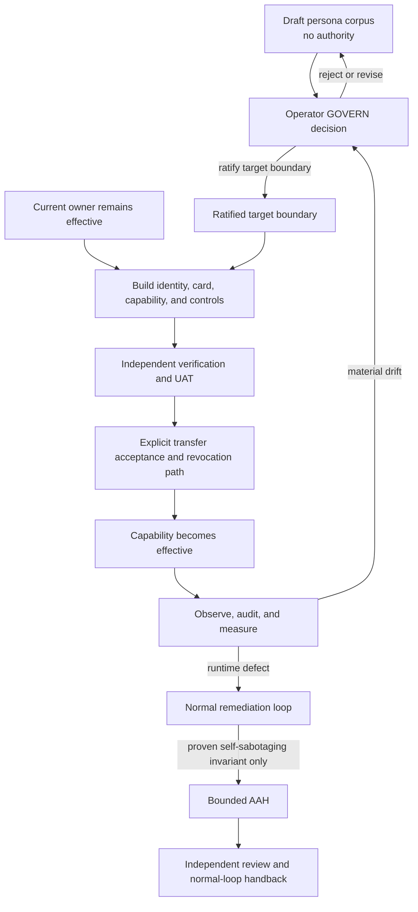

## Initiative: INIT-PER-001 Establish Governed Persona Boundaries and Safe Effectivity

Priority: P0

Size: XL

#### Objective

Convert the preserved persona research into an Operator-ratified target
architecture, commission approved capabilities in dependency order, reconcile
existing implementation and backlog truth, and prevent future role drift.

#### Release Value

The ecosystem gains a single referenceable role model without risking an
implicit authority expansion. Contributors can tell which persona owns a
decision, which runtime currently performs it, which target transfer is
approved, and what evidence must exist before the target becomes effective.

#### Success Criteria

- The GOVERN packet resolves the 15 proposed standing boundaries, R-36, and the
  Auditor AAH conflict without altering unapproved policy.
- The commissioning waves cover every candidate persona and the
  Scrum-Participant inherited contract.
- Each wave has explicit entry, verification, effectivity, rollback, and
  handback criteria.
- Backlog alignment touches only the SME-identified material drift families.
- Partially implemented runtimes receive current-versus-target labels and
  bounded catch-up work instead of retroactive commissioning.
- Continuous checks prevent a runtime identity, quorum, or report from
  laundering authority.

#### Feature Scope

- **EP-PER-001:** governance, corpus, effectivity, and atomic RACI.
- **EP-PER-002:** Wave 1 foundations — Guide, ACI, EMI, Orchestrator, OH, and
  Local-Bridge.
- **EP-PER-003:** Wave 2 delivery evidence — Discovery, PO, Reviewer, SBR, and
  UAT.
- **EP-PER-004:** Wave 3 coordination — PM, Scrum-Coordinator,
  Scrum-Participant, and Liaison.
- **EP-PER-005:** Wave 4 governance, learning, and measurement — IMO, Auditor,
  Provost, Token, and Optimizer.
- **EP-PER-006:** deduplicated backlog alignment and drift prevention.
- **EP-PER-007:** partial-runtime stabilization, AAH classification, and safe
  normal-loop handback.

#### Assumptions

- Wave numbers express dependency order, not automatic schedule or authority.
- A persona can be approved but remain uncommissioned indefinitely.
- A capability can become effective independently when its transfer boundary
  is atomic and its dependencies are met.
- The current open-PR budget favors consolidating this documentation in PR
  #2002 instead of opening one PR per planning Epic.

#### Dependencies

| Epic | Depends on | Rationale |
|---|---|---|
| EP-PER-001 | Operator GOVERN | Establishes target boundaries and effectivity |
| EP-PER-002 | EP-PER-001 | Establishes protocol, event, runtime, and health foundations |
| EP-PER-003 | EP-PER-001, EP-PER-002 | Uses attributable task/event/execution evidence |
| EP-PER-004 | EP-PER-001, EP-PER-003 | Coordinates already bounded participants |
| EP-PER-005 | EP-PER-001, EP-PER-002 | Measures and governs evidence without owning delivery |
| EP-PER-006 | EP-PER-001 | Backlog must cite approved current/target boundaries |
| EP-PER-007 | EP-PER-001, live incident evidence | Exceptional work cannot pre-authorize itself |

#### Out of Scope

- Selecting production providers, models, credentials, or spend.
- Merging PR #2002 before the Operator's amendment decision and independent
  current-HEAD review.
- Seeding implementation issues before the plan passes schema/diagram checks
  and governance-blocked stories are labeled accordingly.

#### Artifacts

| Artifact | Producer | Consumer |
|---|---|---|
| Ratification decision record | Operator GOVERN | All Epics |
| Persona transfer ledger | EP-PER-001 | Commissioning waves |
| Capability evidence packets | EP-PER-002 through EP-PER-005 | Operator, Reviewer, UAT |
| Backlog reconciliation ledger | EP-PER-006 | Orchestrator, contributors |
| Stabilization/AAH evidence | EP-PER-007 | Auditor, Reviewer, Orchestrator |
| Drift and effectivity checks | EP-PER-001/006 | CI and plan refresh |

#### I Know I Am Done When

- Each Epic has full Stage-2 detail, concrete stories, artifacts, security
  boundaries, and diagrams.
- Each Story names one Accountable decision owner or explicitly preserves the
  current owner pending a target transfer.
- Governance-blocked work fails closed while safe documentation, tests, and
  read-only discovery can proceed.
- The implementation sequence prioritizes existing partial runtime safety
  before greenfield persona expansion.
- Plan-to-project and Mermaid validation both pass with no placeholder text.

#### Diagram

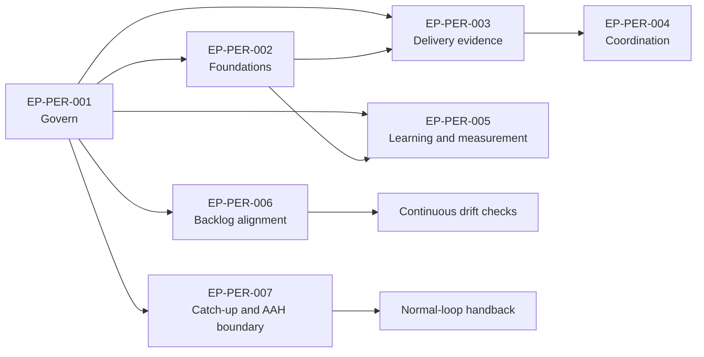

### Epic: EP-PER-001 Governance, Canonical Corpus, Effectivity, and Atomic RACI

Priority: P0
Size: XL

#### Objective

Establish a durable, Operator-governed foundation for the Agentic Orchestration
persona system before any proposed persona is treated as current authority.
Preserve the complete draft corpus in Git, reconcile PR #2002 to the current
20-persona evidence set, define the independent states of proposal,
ratification, implementation, commissioning, and effective authority, and
adjudicate the constitutional conflicts that cannot be resolved by
implementation code or SME consensus.

The Epic must preserve the current safe state while enabling later persona
implementation:

- current authority and target accountability remain separately visible;
- every atomic decision, attestation, verdict, or hard action has one
  Accountable principal;
- a built runtime, AgentCard, task, event, report, voice alias, or favorable
  metric never creates authority;
- conflicts of interest, recusal, independent verification, advisory voting,
  tie handling, and the 30-minute ad hoc Agentic-Scrum are governed consistently;
- Liaison delegation is cryptographically or session-verifiably attributable to
  the Operator and fails closed on validation or revocation uncertainty;
- R-36 has complete, Operator-adjudicated gate-OFF and gate-ON paths; and
- the conflict between ratified PURPOSE AAH language and the current
  Auditor-Agent draft receives an explicit Operator ruling.

#### Release Value

The organization gains one reviewable, version-controlled persona baseline and
one authority-effectivity model that plans, backlog issues, AgentCards,
runtimes, and reviewers can reference without inventing authority. Operator
GOVERN decisions become independently adjudicable, existing partially built
systems can be stabilized without persona drift, and later commissioning work
can proceed from explicit transfer records rather than assumptions.

#### Success Criteria

- The complete current persona corpus is reproducibly stored under
  `docs/plans/references/personas/`, with source hashes and all local links
  validated.
- PR #2002 reviews all 20 current persona charters and supporting RACI research,
  not the obsolete 17-entry excerpt-only intake.
- PURPOSE or its staged amendment text defines proposal, ratification, build,
  commissioning, effective authority, suspension, revocation, and ownership
  transfer as independent states.
- Every atomic RACI row resolves one current Accountable principal or an
  explicit fail-closed gap; no group-valued or implicit Accountable owner
  remains.
- A common conflict-of-interest, recusal, independent-verification, advisory
  voting, no-casting-vote, and 30-minute impasse protocol is approved or
  explicitly rejected by the Operator.
- Liaison delegation proof is bound to the complete delegation envelope and is
  independently validated by each receiver, including expiry, replay, audience,
  and revocation checks.
- The Operator records complete R-36 paths and an independent Auditor/AAH
  authority ruling without bundling either decision into another persona
  approval.
- No proposed persona is represented as commissioned or effective before its
  recorded prerequisites and transfer are complete.

#### Feature Scope

- Preserve and index the 31-artifact draft corpus and its provenance.
- Stage separately adjudicable persona, effectivity, Liaison, R-36, and
  Auditor/AAH GOVERN decisions.
- Define current-versus-target ownership, one Accountable principal per atomic
  decision, conflict/recusal, independent review, advisory voting, and the
  never-extended 30-minute impasse protocol.
- Produce machine-verifiable authority-transfer, delegation, and drift
  contracts without commissioning a runtime.

#### Assumptions

- Ratified PURPOSE remains controlling until an attributable amendment becomes
  effective.
- The Operator can approve, revise, or reject each decision independently.
- Existing runtime and backlog evidence can be inspected without treating it as
  proof of authority.
- A structurally independent reviewer can cover the current PR head.

#### Dependencies

| Dependency | Type | Owner | State |
|---|---|---|---|
| PR #2002 source capture and proposal | Evidence | Governance author | Open |
| Current PURPOSE and amendment procedure | Authority | Operator | Effective |
| Persona/RACI source corpus | Design evidence | Operator-supplied corpus | Preserved |
| Independent current-HEAD review | Verification | Reviewer | Required |

#### I Know I Am Done When

- [ ] A Git commit contains the complete corpus snapshot, source manifest, index,
      and Plan-of-Plans references.
- [ ] A second, independently reviewed commit resolves known internal corpus
      contradictions without erasing the preserved intake snapshot.
- [ ] The governance proposal contains one separately adjudicable ruling for
      each persona boundary and each cross-cutting constitutional rule.
- [ ] The authority-effectivity contract is present in the ratification packet
      and reflected in the persona registry's current-versus-target table.
- [ ] Machine validation reports zero broken in-scope local links, zero malformed
      Markdown tables, and zero unexplained shared-Accountable cells.
- [ ] Liaison proof-envelope negative tests cover tampering, wrong audience,
      expiry, replay, revocation, and unknown verification key.
- [ ] R-36 and Auditor/AAH decisions each have an attributable Operator ruling,
      dissent or open questions, effective date, and implementation disposition.
- [ ] Independent review covers the current HEAD containing the final corpus and
      governance text.
- [ ] The Epic closes with no runtime, grant, AgentCard, or authority claim that
      is unsupported by an explicit commissioning and effectivity record.

#### Code Areas

- `.github/docs/philosophy/PURPOSE.md`
- `docs/audits/2026-07-27-agentic-persona-govern-amendment/`
- `docs/plans/references/personas/`
- `docs/plans/Plan-of-Plans.md`
- `docs/architecture/agent-interop-protocol-planes.md`
- `docs/plans/drafts/`
- Persona registry, principal, grant, AgentCard, and commissioning schemas
  identified during implementation discovery
- Validation scripts for plan schema, Markdown links/tables, RACI atomicity,
  source hashes, and authority-effectivity records

#### Questions for Tech Lead

- Does the Operator preserve current PURPOSE's standing narrow AAH authorization,
  or amend it so every AAH mutation remains Operator-Accountable until a separate
  Auditor commissioning transfer?
- What are the complete canonical R-36 paths for gate OFF, gate ON plus bypass,
  and gate ON plus hold, including the disposition of post-loop SBR?
- Which currently unassigned duties require an interim named owner, and which
  must remain blocked rather than defaulting to the Operator or another peer?
- Is Liaison proof implemented as a signed delegation object, a reference to an
  authenticated Operator session and authorization ledger, or both?
- Which persona capabilities require an AgentCard, and which may be commissioned
  without A2A exposure while still retaining a stable principal and bounded
  grant?
- Should cross-persona effectivity and impasse rules be one constitutional
  amendment or independently approvable rulings?

#### Security/Compliance

- Operator GOVERN, principal creation, grant issuance, credential authority,
  production deployment, and hard-action exceptions remain outside automated
  approval.
- No plan, persona, runtime, voice alias, event, report, vote, or task completion
  may self-commission or transfer authority.
- Delegation validation fails closed on missing proof, unknown issuer or key,
  wrong audience, signature or digest mismatch, expiry, replay, excessive
  delegation depth, or revocation uncertainty.
- Source evidence and delegation records must be tamper-evident, attributable,
  minimally disclosed, and free of embedded secrets or raw credentials.
- Independent verification must be structurally separate from authorship,
  implementation, KPI benefit, and the decision being challenged.
- Existing positive-truth gates, read-only guards, production-protection
  sentinels, tenant boundaries, and audit requirements remain binding.
- Documentation preservation and governance work must not silently activate
  runtime capabilities or mutate GitHub backlog state.

#### Artifacts

- `docs/plans/references/personas/README.md`
- Complete `docs/plans/references/personas/` corpus and `Research/` subtree
- Updated persona source and SHA-256 manifest
- Updated `PURPOSE-AMENDMENT-PROPOSAL.md`
- Operator decision ledger for persona boundaries, RACI safeguards, R-36, and
  Auditor/AAH
- Authority-effectivity and ownership-transfer schema
- Liaison proof-envelope schema and validation threat model
- RACI atomicity, local-link, Markdown-table, and source-hash validation reports
- Updated `docs/plans/Plan-of-Plans.md`
- Independent current-HEAD review record

#### Diagram

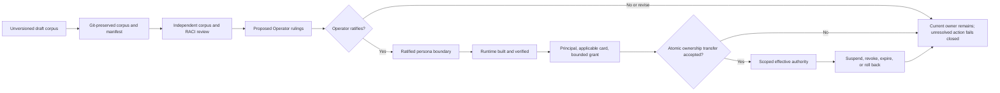

#### User Story: US-PER-001-01 Preserve and Index the Canonical Draft Persona Corpus

Priority: P0
Size: L

##### User Story

As the Operator and governance reviewers, we need the complete current persona
and Research corpus preserved in the repository with immutable provenance so
that no RACI decision depends on an unversioned workstation directory,
incomplete excerpt, or irretrievable hash.

##### TL;DR

Vendor the full 31-artifact current draft corpus under the established
`docs/plans/references/personas/` path, preserve its relative structure and
bytes in the intake commit, index it, validate it, and make Plan-of-Plans point
to it without presenting it as ratified authority.

##### Why This Matters

PR #2002 currently claims a durable source capture but contains only hashes and
partial excerpts from an older 17-entry intake. The current 20-persona system
and its RACI risk/research artifacts are not under Git. Without full
preservation, the Operator cannot reproduce the evidence, review changed
boundaries, or prevent plans and backlog issues from drifting from the newly
captured model.

##### I Know I Am Done When

- [ ] All 20 current persona Markdown files are present in the repository.
- [ ] `RACI-Matrix Informed-Risk.md`, all eight Research Markdown files,
      `AI_Workflow_Agents.csv`, and the workflow-map JPEG are present.
- [ ] The first preservation commit matches the recorded SHA-256 for every
      imported artifact.
- [ ] `.DS_Store`, `.codegraph/`, and the non-canonical `backup/` directory are
      excluded from the active corpus.
- [ ] A repository-owned README defines source order, draft status, update
      discipline, and the one canonical Git-controlled location.
- [ ] Plan-of-Plans links the corpus from its companion text, References table,
      and reading order.
- [ ] Known content repairs occur after the preserved intake commit and remain
      visible in Git history.

##### Acceptance Criteria

- Given the unversioned source directory, when the preservation manifest is
  generated, then it lists exactly 31 in-scope artifacts with relative path,
  SHA-256, media type, source date, and repository destination.
- Given the imported corpus, when local-link validation runs, then every
  in-scope relative Markdown link resolves or has a documented external target.
- Given the Research CSV, when referential validation runs, then every canonical
  persona row resolves to its repository charter and all 20 charters are
  represented exactly once.
- Given the existing PM, PO, and UAT repository copies, when the corpus is
  imported, then their prior Git history is retained and the current versions
  replace stale content.
- Given a reader entering through Plan-of-Plans, when it follows the persona
  reference, then it reaches the corpus README, current-versus-target status,
  risk register, and all persona sources in no more than two hops.
- Given the corpus README, when a reader evaluates authority, then it is told
  that PURPOSE and attributable Operator rulings outrank the draft corpus.

##### MoSCoW

- **Must Have**:
  - Full 31-artifact preservation and source manifest
  - Exact relative structure and link integrity
  - Corpus README with non-authoritative/effectivity warning
  - Plan-of-Plans registration
  - Two-commit preservation-then-correction history

- **Should Have**:
  - Automated manifest regeneration and drift detection
  - Markdown table and Mermaid validation
  - Git blob identifiers recorded beside SHA-256 after commit

- **Could Have**:
  - A separately labeled dated archive of pre-SME backup artifacts

- **Won't Have**:
  - `.DS_Store`, `.codegraph`, caches, or editor metadata
  - Treating the imported corpus as a commissioning or authority event

##### Dependencies

| Ticket | Description | Status |
|---|---|---|
| PR #2002 | Existing governance proposal and obsolete source capture to reconcile | Open |
| EP-PER-001 | Parent governance and atomic-RACI Epic | Planned |
| (none) | Full current source corpus is available at the Operator-supplied local path | Available |

##### Constraints

- Preserve spaces, punctuation, filenames, relative directories, and binary
  bytes in the intake snapshot.
- Do not add front matter or license headers to imported files before the exact
  preservation commit.
- Do not establish two editable canonical copies after migration.
- Do not include historical backup content in the active reference index.

##### Assumptions

- The current source directory is the Operator-selected intake source for this
  preservation event.
- Git history is the future backup and provenance mechanism.
- A new repository README and manifest may wrap the imported corpus without
  changing imported bytes.
- Any later canonical-path change will use an explicit redirect/migration record.

##### Implementation Notes

- Reuse `docs/plans/references/personas/`, where PM, PO, and UAT references
  already live.
- Copy root persona/risk files to the corpus root and preserve the `Research/`
  subtree verbatim.
- Record source hashes before copy and destination hashes after copy; fail on
  any mismatch.
- Update `PERSONA-SOURCE-CAPTURE.md` to link the full files. Preserve prior
  17-entry hashes as historical intake evidence, not the current ratification
  basis.
- Apply the known stale UAT boundary correction only after the exact snapshot
  exists in Git.
- Add a synchronization rule requiring future charter changes to update the
  CSV, Research README, SME report, risk register, and manifest in the same PR.

##### Security/Compliance

- Run a secret scan before committing the corpus, especially the CSV, personal
  provenance, image metadata, and research notes.
- Preserve personal provenance only as Operator-supplied context; do not infer
  identity claims or authority from it.
- Remove only confirmed secrets or unsafe metadata through an attributable
  redaction record; never silently rewrite evidence.
- Imported drafts confer no principal, grant, card, credential access, or
  runtime capability.

##### Artifacts

- `docs/plans/references/personas/README.md`
- `docs/plans/references/personas/*.md`
- `docs/plans/references/personas/Research/*`
- Updated `PERSONA-SOURCE-CAPTURE.md`
- Source/destination SHA-256 manifest
- Local-link, CSV-reference, Markdown-table, Mermaid, and secret-scan reports
- Updated `docs/plans/Plan-of-Plans.md`

##### Diagram

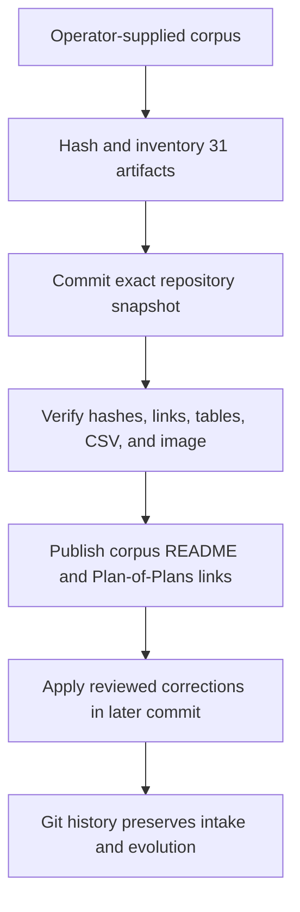

#### User Story: US-PER-001-02 Ratify the Authority-Effectivity and Atomic-RACI Contract

Priority: P0
Size: XL

##### User Story

As the Operator, accountable peers, and implementation teams, we need one
constitutional contract separating proposed, ratified, built, commissioned,
and effective authority and governing multi-peer decisions so that target RACI,
runtime progress, consultation, or a vote cannot create shadow authority.

##### TL;DR

Stage and adjudicate a cross-persona rule for current-versus-target ownership,
single atomic Accountability, explicit transfer and revocation, COI/recusal,
independent verification, advisory voting without a casting vote, and the
never-extended 30-minute ad hoc Agentic-Scrum.

##### Why This Matters

The current persona system contains target-state Accountable roles for proposed
personas, partially built substrate, active but incompletely commissioned roles,
group-valued historical approvals, and overlapping recommendations. Without a
common effectivity and decision protocol, documentation can be mistaken for
authorization, implementers can self-certify, and stalled multi-peer work can
launder authority through a coordinator or majority vote.

##### I Know I Am Done When

- [ ] The Operator has approved, revised, or rejected each lifecycle state and
      transition independently.
- [ ] Every persona has a current owner, target owner, and effectivity condition
      for each target Accountable duty.
- [ ] Every atomic RACI row has one Accountable principal or an explicit
      fail-closed unassigned state.
- [ ] Group business gates are modeled as separately owned attestations and a
      conjunction, not a shared Accountable cell.
- [ ] COI disclosure, scoped recusal, substitute selection, waiver authority,
      and independent-verifier rules are binding and testable.
- [ ] Advisory ballots cannot authorize action, ties preserve the safe state,
      and the facilitator has no casting vote.
- [ ] The 30-minute impasse protocol has typed inputs, deadlines, outputs,
      escalation, and a never-extend rule.

##### Acceptance Criteria

- Given a persona marked PROPOSED, when its runtime is built, then its target
  Accountabilities remain inactive until ratification, commissioning, and an
  accepted atomic transfer record.
- Given a ratified charter without a principal or grant, when a peer sends work,
  then no persona authority is inferred and the current owner or fail-closed
  state remains.
- Given an authority transfer, when it becomes effective, then the record names
  the atomic duty, prior owner, new owner, scope, authority reference,
  prerequisites, acceptance, effective time, expiry/revocation, rollback owner,
  and independent verifier.
- Given a revoked, expired, suspended, or failed transfer, when an action is
  attempted, then it fails closed or returns to the explicitly recorded prior
  owner; it never falls implicitly to a coordinator, tool, or metric producer.
- Given a required independent verdict with no commissioned independent owner,
  when a gate evaluates, then the gate remains blocked; the Operator's Govern
  authority does not silently become self-review.
- Given a participant that authored the implementation, authored the disputed
  ruling, benefits from the KPI, or shares a non-independent identity/session,
  when verification begins, then the conflict is disclosed and the participant
  is recused from the affected decision or verification scope.
- Given an ad hoc Scrum with eligible non-recused roster size `E`, when an
  advisory ballot is used, then quorum is
  `max(2, ceil(2E/3))`, a recommendation requires unique support greater than
  `E/2`, silence is not consent, and 1-1, 2-2, equal top options, missing
  required owner, or failed quorum is an impasse.
- Given an impasse at minute 30, when no valid domain decision exists, then the
  last-known-safe state is preserved and the conflict escalates to the owner of
  the collided authority; the Scrum is not extended.

##### MoSCoW

- **Must Have**:
  - Independent lifecycle axes and effectivity transitions
  - Current-versus-target ownership table
  - One Accountable principal per atomic duty
  - Explicit fail-closed behavior for unassigned or invalid authority
  - COI, recusal, substitute, and independent-verifier contract
  - Advisory-only voting, no casting vote, tie behavior
  - Never-extended 30-minute ad hoc Scrum

- **Should Have**:
  - Machine-readable authority-transfer and decision-record schemas
  - CI validation for shared-Accountable markers and missing current owners
  - Common typed reason codes for blocked, recused, rejected, and escalated

- **Could Have**:
  - A read-only visualization of current and target authority transitions

- **Won't Have**:
  - Majority rule over domain authority
  - Automatic Operator fallback for independent professional attestations
  - Automatic commissioning from build or deployment status

##### Dependencies

| Ticket | Description | Status |
|---|---|---|
| US-PER-001-01 | Full current corpus must be preserved before governance text is finalized | Planned |
| PR #2002 | Staged PURPOSE amendment proposal | Open |
| (none) | Attributable Operator decision session for constitutional rulings | Required |

##### Constraints

- Current ratified PURPOSE remains authoritative until an attributable amendment
  takes effect.
- Each Operator ruling must be independently approvable; approval of one persona
  cannot imply approval of every cross-persona rule.
- RACI decomposition must not create a generic super-agent or mandatory hub.
- Coordination records, events, cards, reports, and votes remain
  non-authorizing.

##### Assumptions

- Existing current owners continue within their recorded grants while target
  personas remain inactive.
- Some duties have no valid current independent owner and must remain blocked
  until one is named.
- Persona commissioning may occur capability by capability rather than as one
  all-or-nothing activation.
- The Operator retains Govern and authority-assignment decisions but does not
  automatically become every domain verifier.

##### Implementation Notes

- Define at least these orthogonal states: `proposed`, `ratified`,
  `not_built|partly_built|built`, `uncommissioned|commissioned`,
  `inactive|effective|suspended|revoked|expired`.
- A transfer record should include `decisionId`, `atomicDutyId`, `authorityRef`,
  `currentOwnerId`, `targetOwnerId`, `scope`, `capabilities`, `prerequisiteRefs`,
  `acceptedBy`, `effectiveAt`, `expiresAt`, `revocationRef`, `rollbackOwnerId`,
  and `independentVerifierId`.
- Model multi-attestation gates as named independent predicates. Never encode
  `PO + Stakeholders` or another group as one Accountable value.
- Reuse the risk register's minimum joint-work record and 30-minute phase
  sequence.
- Validate current and target matrices separately so a target-only `A` does not
  satisfy a current-authority check.
- Keep the rule staged in the audit proposal until the Operator ratifies it;
  do not register a merely proposed amendment as applied PURPOSE.

##### Security/Compliance

- Grant scope, expiry, revocation, transfer acceptance, and rollback are
  security-relevant and must be tamper-evident and attributable.
- No author, implementer, metric beneficiary, or prior decision author may be
  the sole independent verifier of its own work.
- Recusal must remove only the conflicted role scope; the participant still
  supplies attributable facts.
- A waiver of required independence or an authority collision requires an
  attributable Operator decision and cannot be created by a Scrum ballot.
- Preserve production protection, read-only enforcement, tenant isolation, and
  positive-truth hard-action gates.

##### Artifacts

- PURPOSE authority-effectivity amendment text
- Current-versus-target persona authority table
- Atomic RACI validation rules and report
- Authority-transfer, recusal, waiver, ballot, and impasse schemas
- 30-minute Agentic-Scrum protocol and example record
- Operator ruling ledger and independent-review evidence

##### Diagram

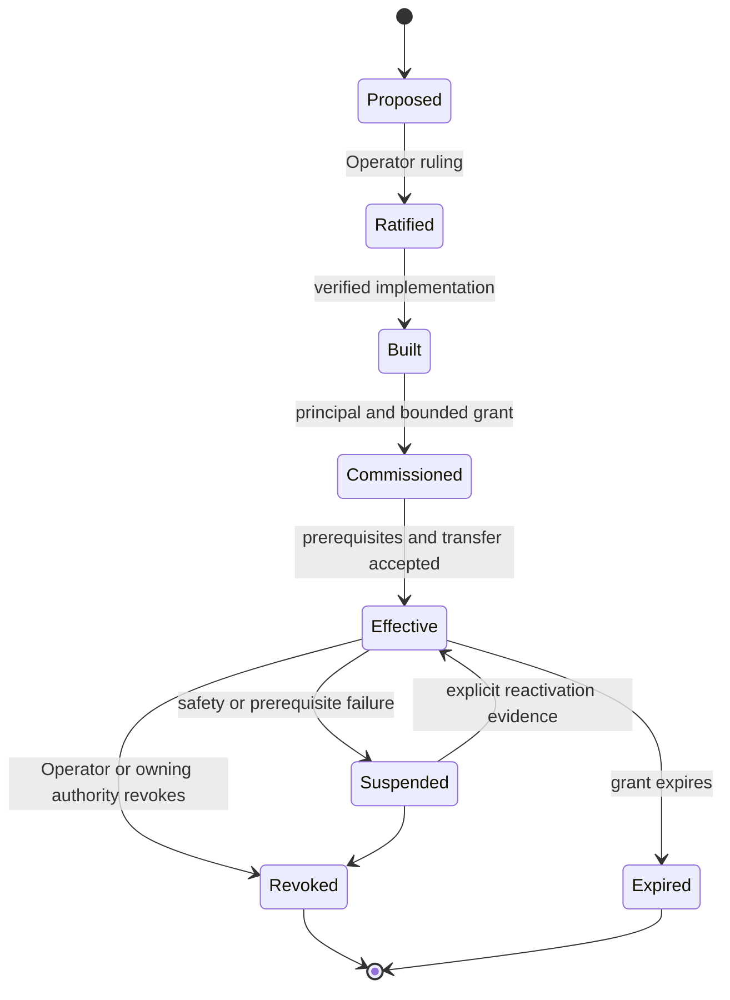

#### User Story: US-PER-001-03 Bind Liaison Delegation to Verifiable Operator Authority

Priority: P0
Size: L

##### User Story

As the Operator and every receiving accountable peer, we need a Liaison
delegation envelope whose authorization can be verified independently across
A2A and API hops so that E.V.A. can coordinate bounded work without becoming an
unverifiable impersonation path or a hard-action bypass.

##### TL;DR

Complete the `OperatorDelegationEnvelope` with proof binding, issuer/audience,
anti-replay, delegation-depth, verification-key, expiry, and revocation
semantics; define fail-closed receiver behavior and preserve
request-never-authorize.

##### Why This Matters

The draft envelope currently carries an `operatorPrincipal` value but does not
prove that an authenticated Operator session authorized the exact envelope
fields. A forged or replayed Liaison request could therefore appear
Operator-authorized across peer boundaries. Liaison cannot safely be
commissioned until receivers can validate origin, integrity, scope, audience,
freshness, delegation depth, and revocation.

##### I Know I Am Done When

- [ ] The proof binds every authority-bearing envelope field to an authenticated
      Operator action or verifiable authorization-ledger entry.
- [ ] Every receiver validates issuer, subject, audience, digest/signature,
      issued time, expiry, nonce, scope, request class, delegation depth, and
      revocation before accepting work.
- [ ] Replay, tampering, unknown key, wrong audience, expiry, and revocation tests
      fail closed with typed reasons.
- [ ] Operator cancellation propagates to every active child task and produces a
      final attributable state.
- [ ] Liaison remains Accountable only for intent/delegation fidelity, task-graph
      continuity, synthesis, and reporting.
- [ ] No proof or completed Liaison task authorizes merge, deploy, close, board
      mutation, quarantine, loop stop, credential mutation, policy change, or
      another peer's domain decision.

##### Acceptance Criteria

- Given a valid Operator delegation, when a receiving peer validates it, then
  the verified claims match the canonical envelope digest, intended receiver
  audience, active scope, allowed request class, and unrevoked policy state.
- Given any changed objective, scope, allowed action, excluded action,
  expiration, audience, source-evidence hash, or delegation depth, when the
  original proof is reused, then validation fails.
- Given the same one-shot delegation or nonce twice, when the second request is
  received, then it is rejected as replay and recorded without performing work.
- Given an unknown verification key, unavailable revocation source, expired
  proof, or clock outside the approved tolerance, when validation occurs, then
  no material work begins and a typed blocked result is returned.
- Given Operator revocation, when active Liaison child tasks next observe the
  revocation signal, then they cancel or enter a safe terminal state and report
  their last action and residual risk.
- Given a valid request outside the receiving peer's capability, charter,
  positive-truth gate, or safety boundary, when evaluated, then the peer may
  return a typed refusal without being treated as arbitrarily blocking Liaison.
- Given a valid completed request, when a hard action is considered, then the
  owning peer re-derives its independent authority and positive truth.

##### MoSCoW

- **Must Have**:
  - Authenticated proof bound to canonical envelope fields
  - Issuer, subject/operator, receiver audience, issuance, expiry, and nonce
  - Verification key or authenticated-session reference
  - Revocation and anti-replay validation
  - Delegation-depth enforcement and downstream proof propagation
  - Typed fail-closed response behavior
  - Request-never-authorize preservation

- **Should Have**:
  - Key rotation and overlapping verification windows
  - Clock-skew policy and observable validation metrics
  - One-shot and standing-policy conformance fixtures

- **Could Have**:
  - Hardware-backed signing for high-impact standing delegations

- **Won't Have**:
  - Raw Operator credentials inside an envelope
  - Liaison-held unrestricted signing authority
  - Public delegation endpoints before tenant authorization lands

##### Dependencies

| Ticket | Description | Status |
|---|---|---|
| US-PER-001-02 | Authority-effectivity and atomic-RACI contract | Planned |
| ACI governance | ACI owns envelope schema and interoperability conformance after ratification | Proposed |
| Multi-tenant authorization plan | Required before any customer/public exposure | Draft |

##### Constraints

- The implementation must not expose Operator credentials, private keys, voice
  recordings, or raw authorization tokens in GitHub, events, logs, or reports.
- Liaison is optional; direct Operator-to-peer communication remains available.
- Receivers retain their own scope, safety, capability, and hard-action gates.
- Verification must work across the chosen A2A/API transport without making the
  transport itself an authority source.

##### Assumptions

- The Operator can authenticate to a trusted issuance or authorization-ledger
  surface.
- Receiving peers have a trusted verification-key or session-proof discovery
  mechanism and a revocation-check path.
- ACI and security review will choose the final proof format; this Story defines
  required semantics rather than prematurely locking one cryptographic library.
- Clocks are synchronized within an explicitly bounded tolerance.

##### Implementation Notes

- Extend the envelope with fields or proof claims equivalent to:
  `issuer`, `operatorPrincipal`, `audience[]`, `delegationId`, `nonce`/`jti`,
  `issuedAt`, `notBefore`, `expiresAt`, `scope`, `allowedRequestClasses`,
  `excludedActions`, `delegationDepth`, `sourceEvidenceDigest`,
  `canonicalEnvelopeDigest`, `verificationKeyId`, `standingPolicyRef`,
  `revocationEpoch`, and `authorizationProof`.
- Canonicalize authority-bearing fields before signing or ledger hashing.
- Store proof material or an immutable proof reference, never private signing
  material.
- Bind every child delegation to the parent delegation id, reduced scope,
  remaining depth, and same-or-earlier expiry.
- Maintain an idempotent nonce/replay ledger with bounded retention.
- Return typed validation states such as `invalid_proof`, `wrong_audience`,
  `expired`, `revoked`, `replayed`, `scope_exceeded`, and
  `verification_unavailable`.
- Threat-model confused deputy, replay, scope widening, stale standing policy,
  key compromise, transcript substitution, and revocation races.

##### Security/Compliance

- Use a reviewed modern signature or authenticated-session proof mechanism; do
  not invent cryptography.
- Apply least privilege, explicit audience restriction, bounded lifetime,
  revocation, key rotation, and audit logging.
- Hash or reference voice/text source evidence with access controls appropriate
  to personal and potentially sensitive content.
- Log claims and validation decisions without logging credentials, raw bearer
  tokens, private keys, or unnecessary personal data.
- Treat proof verification as necessary for delegated coordination but
  insufficient for every downstream hard action.

##### Artifacts

- Versioned `OperatorDelegationEnvelope` schema
- Canonicalization and proof-binding specification
- Receiver validation and typed-rejection contract
- Revocation, replay, and key-rotation design
- Threat model
- Positive and negative conformance fixtures
- Independent security and ACI review record
- Sanitized UAT evidence

##### Diagram

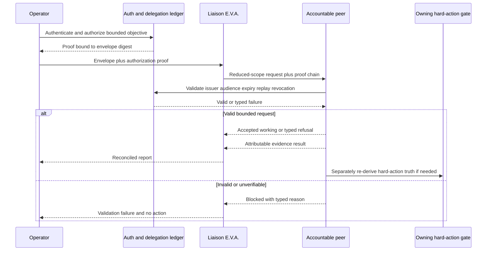

#### User Story: US-PER-001-04 Adjudicate Complete R-36 Gate Paths

Priority: P0
Size: M

##### User Story

As the Operator, Discovery, PO, SBR, Orchestrator, and affected Stakeholders, we
need complete and independently adjudicable R-36 workflow paths so that a
partial chain cannot remove, duplicate, or silently relocate Sprint Backlog
Review or treat missing Stakeholder intent as permission.

##### TL;DR

Preserve ratified A-2026-07-24 R4 until changed, present full gate-OFF and every
gate-ON outcome through post-loop disposition, obtain an attributable Operator
ruling, and keep R-36 DESIGNED/NOT BUILT until implementation and UAT prove the
selected paths.

##### Why This Matters

PR #2002's proposed replacement chain ends at `loop`, while ratified R4 ends at
post-loop SBR. Its gate-ON choices mention bypass or hold for SBR without
defining whether they refer to a pre-loop pass, post-loop pass, both, or neither.
Implementing that ambiguity could strand a Project Scope, erase an independent
review stage, or treat silence as authorization.

##### I Know I Am Done When

- [ ] The current ratified R4 chain is quoted exactly and remains the safe
      default until an amendment becomes effective.
- [ ] The proposal contains a complete gate-OFF path from Discovery through the
      final post-loop state.
- [ ] The proposal contains complete gate-ON bypass and hold paths, including
      every SBR occurrence and the final loop-engagement outcome.
- [ ] Each path identifies one owner for the gate toggle, decision request,
      Stakeholder assertion, enforcement, SBR verdict, and audit record.
- [ ] Silence, missing identity, stale assertion, or ambiguous scope never
      evaluates as permission.
- [ ] The Operator independently approves, revises, or rejects R-36 without that
      decision implying approval of persona commissioning.
- [ ] Implementation remains disabled until tests and UAT cover every approved
      transition.

##### Acceptance Criteria

- Given `gateEnabled = false`, when a Project Scope reaches the engagement
  boundary, then behavior follows the complete Operator-approved gate-OFF chain
  and requires no fabricated permission record.
- Given `gateEnabled = true` and no current attributable decision, when
  engagement is evaluated, then the Project Scope is held in a typed
  input-required state; absence is neither bypass nor hold consent.
- Given a gate-ON bypass decision, when the chain is evaluated, then the
  approved path explicitly states which SBR pass is bypassed and whether
  post-loop SBR remains.
- Given a gate-ON hold decision, when SBR completes, then the approved path
  explicitly identifies the evidence and named Stakeholder action required to
  release or continue the hold.
- Given a changed plan version, Project Scope, deciding Stakeholder, gate toggle,
  or decision expiry, when the old assertion is evaluated, then it is rejected
  as out of scope or stale.
- Given an Operator rejection or revision of R-36, when the proposal is updated,
  then ratified R4 remains intact except for the exact clauses explicitly
  amended.
- Given the selected design, when implementation tests run, then every legal
  state transition and every missing/stale/contradictory input has a
  deterministic outcome.

##### MoSCoW

- **Must Have**:
  - Full current R4, gate-OFF, bypass, and hold chains
  - Explicit pre-loop and post-loop SBR disposition
  - Named Stakeholder identity and attributable assertion
  - Default-OFF and absence-is-not-permission behavior
  - Independent Operator ruling and effective date
  - State-transition tests before enablement

- **Should Have**:
  - Versioned R-36 decision schema and audit event
  - UI and API explanation of the current gate state and next required actor

- **Could Have**:
  - A read-only migration preview for existing Project Scopes

- **Won't Have**:
  - Inferred consent
  - Global enablement without per-project decision
  - Runtime enforcement before the governing paths are adjudicated

##### Dependencies

| Ticket | Description | Status |
|---|---|---|
| A-2026-07-24 R4 | Current ratified canonical chain | Effective |
| PR #2002 A-2026-07-27B | Proposed R-36 reconciliation | Open |
| US-PER-001-02 | Atomic decision and effectivity contract | Planned |

##### Constraints

- Do not infer the complete paths from incomplete persona prose; the Operator
  must adjudicate the missing semantics.
- R-36 remains independent from A-2026-07-27A persona-boundary decisions.
- Discovery owns elicitation, PO owns curation/value, SBR owns its verdict and
  authorized write-back, the named Stakeholder owns its decision, and
  Orchestrator enforces only after implementation is authorized.
- Existing work must not be grandfathered through fabricated assertions.

##### Assumptions

- The per-project gate remains default OFF unless the Operator rules otherwise.
- Current PURPOSE and A-2026-07-24 R4 remain authoritative during review.
- A named Stakeholder principal and authenticated decision record can be
  represented before runtime enablement.
- The selected path may require a separate migration decision for in-flight
  scopes.

##### Implementation Notes

- Present all candidate paths side by side in the Operator decision packet;
  avoid wording such as “replacement chain” until the complete successor is
  visible.
- Give each transition a stable state and event name, including
  `gate_disabled`, `decision_required`, `bypass_asserted`, `hold_asserted`,
  `sbr_required`, `sbr_completed`, `released_to_loop`, and final post-loop
  disposition.
- Record `projectScopeId`, `planVersion`, `gateEnabled`,
  `decidingStakeholderId`, `decision`, `authorityRef`, `issuedAt`, `expiresAt`,
  `evidenceRefs`, and `supersedes`.
- Keep design, implementation, enablement, and migration status separate.
- Require tests for stale decisions, changed plan versions, missing signer,
  contradictory assertions, toggle changes, replay, and fail-closed recovery.

##### Security/Compliance

- The Stakeholder assertion must be authenticated, attributable, scoped,
  current, and tamper-evident.
- Neither SBR, Discovery, PO, Liaison, nor Orchestrator may manufacture the
  Stakeholder's decision.
- R-36 records must not expose unnecessary personal data or credentials.
- Gate evaluation must fail closed on unavailable identity or authority
  verification.
- Runtime mutation remains guarded by the Orchestrator's positive-truth and
  read-only protections.

##### Artifacts

- Complete R-36 path comparison
- Operator decision record for A-2026-07-27B
- Versioned R-36 state and decision schema
- Updated PURPOSE/rulings ledger after ratification
- Implementation and migration disposition
- State-transition test matrix
- UAT scenarios and independent review

##### Diagram

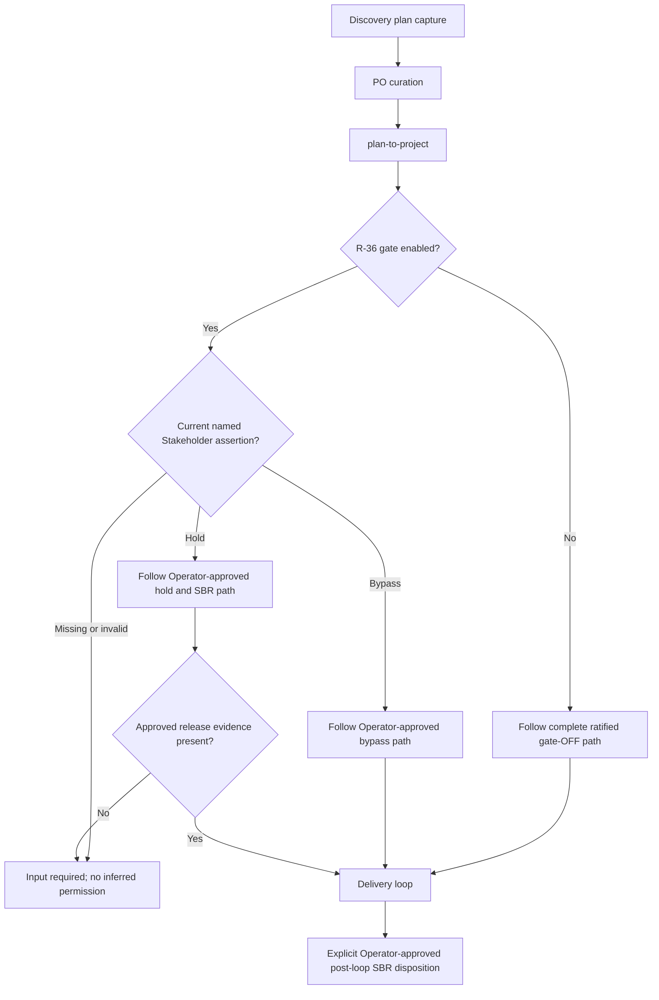

#### User Story: US-PER-001-05 Adjudicate Auditor and AAH Current Authority

Priority: P0
Size: L

##### User Story

As the Operator, AI-Auditor, Operations Helm, Orchestrator, Reviewer, and
production-protection owners, we need one explicit ruling for current and target
Auditor/AAH authority so that last-resort class repair is possible without
conflicting Accountable owners, self-review, indefinite exception authority, or
silent changes to ratified PURPOSE.

##### TL;DR

Resolve the conflict between PURPOSE's standing narrow AAH authorization and
the current Auditor draft's Operator-Accountable interim model; define trigger,
scope, grant, mutation authority, independent review, executed-action record,
expiry, handback, and excluded decisions as one separately adjudicated
Operator ruling.

##### Why This Matters

Ratified PURPOSE states that narrow evidence-backed AAH may proceed without
additional Operator approval, but the new Auditor RACI says the Operator remains
Accountable for every AAH mutation until the persona is ratified and
commissioned. Both cannot be the current authority model. The ambiguity also
collides with Orchestrator's normal remediation/merge Accountability and could
either disable a needed recovery path or permit unbounded exceptional action.

##### I Know I Am Done When

- [ ] The Operator explicitly selects the current AAH authority model and names
      the superseded text.
- [ ] Current and target Auditor Accountabilities are separately documented.
- [ ] The ruling distinguishes Critical diagnosis/pattern truth, class-level
      repair, normal run remediation, hard-action execution, and Govern.
- [ ] Every AAH activation has a typed trigger, incident scope, grant or standing
      authority reference, expiry, stop conditions, rollback, and handback.
- [ ] Reviewer or another valid independent verifier covers the current HEAD and
      post-cure evidence; the Auditor never approves its own fix.
- [ ] All executed actions are recorded, and normal Orchestrator/OH ownership
      resumes at the documented handback point.
- [ ] Prioritization, provider choice, secrets, GitHub permissions, user-facing
      scope, and constitutional changes still escalate to the Operator.

##### Acceptance Criteria

- Given current PURPOSE and the Auditor draft, when the decision packet is
  reviewed, then the contradictory clauses are quoted with source, status, and
  exact decision requested.
- Given the Operator's selected model, when an AAH incident begins, then one
  Accountable principal exists for each atomic mutation and the normal
  Orchestrator owner is not silently duplicated.
- Given no valid trigger, expired grant, disputed authority, missing independent
  reviewer, or unresolved production-protection sentinel, when AAH execution is
  attempted, then mutation remains blocked and the evidence is escalated.
- Given a valid AAH activation, when work executes, then it uses an isolated
  branch/worktree, regression-test-first change, bounded scope, current-HEAD
  independent review, required CI, deploy verification, and an executed-action
  ledger.
- Given a proposed fix that changes prioritization, provider, secret,
  permission, user-facing scope, PURPOSE, or the carding boundary, when
  classified, then the Auditor provides evidence and the Operator decides.
- Given restored healthy motion and accepted class-fix evidence, when handback
  occurs, then OH resumes first-line Detect, Orchestrator resumes normal
  remediation/merge/closeout, and residual work is routed through a typed packet.
- Given a recurrence after teaching, when observed fishing fails, then the
  incident re-enters class-level diagnosis without leaving an indefinite AAH
  grant active.

##### MoSCoW

- **Must Have**:
  - One explicit current AAH authority ruling
  - Current-versus-target Auditor boundary
  - Typed activation trigger and scoped authority reference
  - Independent current-HEAD and post-cure verification
  - Executed-action ledger, expiry, rollback, and handback
  - Preserved Orchestrator normal-loop and OH first-line boundaries
  - Operator-only exclusions

- **Should Have**:
  - Machine-readable AAH activation and handback packet
  - Maximum duration and renewal rules
  - Automated detection of missing review or expired authority

- **Could Have**:
  - A read-only dashboard of active and historical AAH engagements

- **Won't Have**:
  - Auditor self-commissioning
  - Auditor self-review
  - Standing unbounded mutation authority
  - AAH as a shortcut for persona implementation or backlog prioritization

##### Dependencies

| Ticket | Description | Status |
|---|---|---|
| US-PER-001-02 | Effectivity, atomic RACI, COI, and independent-verification contract | Planned |
| PR #2002 | Governance proposal must add the omitted Auditor persona source and decision | Open |
| `.agents/skills/auditor-authorized-hotfix/SKILL.md` | Current operational AAH process evidence | Existing |
| PURPOSE escalation model | Current ratified AAH language | Effective |

##### Constraints

- Current ratified PURPOSE wins until an attributable amendment becomes
  effective.
- The governance plan may stage and compare alternatives but must not choose the
  Operator's ruling.
- AAH is last-resort class repair, not routine run clearing or a bypass of
  working lanes.
- The Auditor's SME sub-agents remain bounded evidence contributors under the
  Auditor's incident scope.
- No vote, Liaison request, metric, report, or incident severity label creates
  AAH authority.

##### Assumptions

- The Operator wants to preserve a bounded last-resort recovery path.
- Normal-loop Orchestrator and first-line OH accountabilities remain unchanged.
- A structurally independent reviewer can be commissioned or explicitly named
  for each AAH change.
- The existing AAH skill, audit packet schema, and PURPOSE clauses provide
  evidence but may require reconciliation.

##### Implementation Notes

- Present at least two explicit alternatives:
  1. preserve PURPOSE's standing narrow Auditor authorization and define the
     incident activation record as an execution control rather than an
     Accountability transfer; or
  2. amend PURPOSE so the Operator remains Accountable for each mutation until
     a later commissioning transfer.
- For either alternative, decompose `Critical diagnosis`, `forensic verdict`,
  `class-fix design`, `code mutation`, `merge`, `deploy`, `independent review`,
  `residual handoff`, and `Govern` into atomic rows.
- Define the relationship among `authorityRef`, incident id, trigger evidence,
  affected repositories/environments, permitted mutations, excluded decisions,
  branch/worktree, reviewer, rollback, expiry, and handback.
- Preserve every executed action in the audit packet and link it to review,
  CI, deployment, and observed-fishing evidence.
- Do not update the canonical PURPOSE ledger with a merely proposed choice.

##### Security/Compliance

- AAH must retain least privilege, bounded scope, explicit expiration,
  revocation, full action logging, and rollback.
- Secrets, production credentials, and private keys must not enter audit
  packets, PR bodies, logs, or SME prompts.
- Independent review is mandatory for Auditor-authored changes and cannot be
  satisfied by the same agent identity, session, or non-independent provider
  context when independence is required.
- Production-protection sentinels halt mutation and propagate in full to the
  owning safety authority.
- Any authority, architecture, identity, or COI dispute preserves the
  last-known-safe state and escalates to the Operator.

##### Artifacts

- Auditor/AAH source-conflict evidence table
- Independent Operator ruling
- Atomic current/target Auditor RACI
- Versioned AAH activation, executed-action, and handback schemas
- Updated PURPOSE amendment text after ratification
- Updated Auditor persona and peer cross-maps
- Regression, security, review, CI, deploy, rollback, and observed-fishing
  evidence

##### Diagram

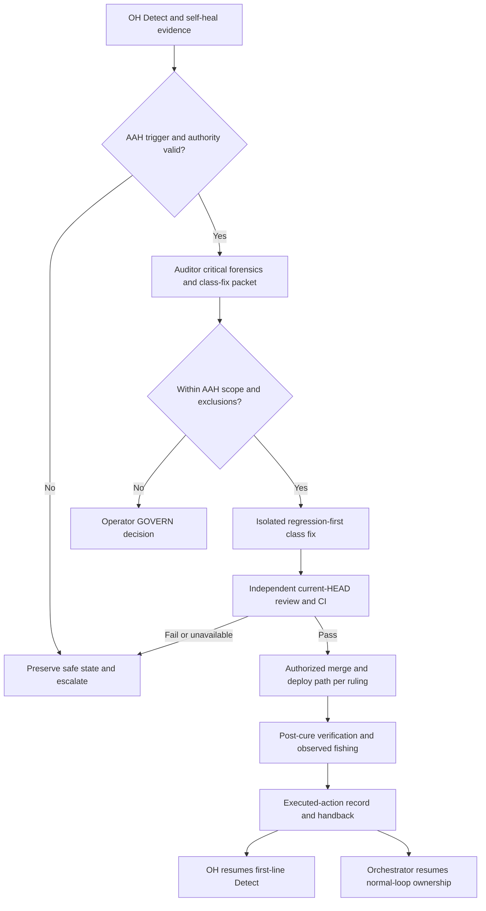

### Epic: EP-PER-002 Wave 1 Foundation Persona Boundaries and Commissioning Readiness

Priority: P0
Size: XL

#### Objective

Reconcile and make implementation-ready the six Wave 1 foundation personas—Guide, Agent Communication Interface (ACI), Event and Messaging Interface (EMI), Orchestrator, Operations Helm (OH), and Local-Bridge—without allowing draft documentation or partially built runtime to create shadow authority.

This Epic establishes a common state vocabulary that every Story and downstream issue MUST preserve:

| State | Meaning | What it does not mean |
|---|---|---|
| Draft / designed | The persona, protocol, boundary, or implementation intent has been documented for review. | It is not Operator-ratified and grants no authority. |
| Ratified | The Operator GOVERN amendment and its exact authority boundary have been accepted into the controlling governance source. | It does not prove that supporting runtime exists. |
| Built | Supporting code, documents, tests, or infrastructure exist and have passed their stated verification. | It does not commission a standing persona or make target authority effective. |
| Commissioned | A named principal, card, grant, deployment, or standing seat has been activated under the ratified boundary. | It does not broaden the grant beyond its scope or expiry. |
| Effective | The ratified and commissioned responsibility is in force at a recorded time, and prior/interim ownership has been explicitly transferred or retired. | It is not retroactive and cannot be inferred from repository presence. |

The current-to-target reconciliation MUST start from the following evidence-constrained baseline:

| Persona | Current governance state | Current implementation state | Target effectivity gate |
|---|---|---|---|
| Guide | Draft persona/corpus practices exist; publication does not transfer domain-truth authority. | Core voice/corpus practices are built or used in part; Provost and Liaison integrations remain designed/proposed. | Operator ratification, content-owner acceptance contract, Guide commissioning, and a recorded effective date. |
| ACI | Proposed only; no ratified ACI principal, AgentCard, or grant. | Wave 1 A2A profile is designed, not built as a standing ACI service. | Ratified protocol-only boundary, conformance proof, commissioned principal/card/grant, and explicit transfer from interim protocol owners. |
| EMI | Proposed only; no commissioned EMI principal, AgentCard, or grant. | File event log and Kafka substrate are partly built; OH currently owns event/Kafka Detect probes and the Orchestrator owns runtime implementation. | Ratified envelope/replay boundary, compatibility proof, commissioned EMI principal, and explicit ownership transfer records. |
| Orchestrator | The normal-loop orchestration role is already governed and effective; the new persona restatement remains part of this amendment set. | Admission, dispatch, worker/reviewer cycles, recovery/quarantine, fail-dangerous merge/autoland, and closeout are substantially built. R36 admission and the canonical per-run usage emitter remain target work. | Ratification of the restated boundary without expanding authority, current-HEAD verification, and targeted closure of documented gaps. |
| OH | The ratified boundary is Detect; it does not own dispatch, verdict, merge, deploy, AAH, event governance, or accounting. | Helm/OH substrate is partly built; a temporary stand-in holds the seat while the 24×7 productized service in #635 remains open. #1649 contains unresolved recalibration-authority language. | Operator adjudication of the #635/#1649 conflict, corrected Atomic RACI, verified 24×7 SLO evidence, commissioning, and stand-in transfer. |
| Local-Bridge | Bridge-Resident persona is designed but not commissioned as a standing peer. | Outbound lease polling and host execution runtime are built in part; lab evidence is not production commissioning. | Ratified execution-fidelity-only boundary, per-host principal/card/grant, production proof, and recorded commissioning per host. |

No Story in this Epic may treat “documented,” “present in code,” “deployed,” “observed working,” or “named in an issue” as a substitute for ratification, commissioning, or effectivity.

#### Release Value

Wave 1 gains a stable, reviewable foundation in which:

- accepted guidance remains distinguishable from the domain truth it communicates;
- interoperable protocol semantics remain distinguishable from peer payload meaning and authorization;
- event envelopes, retention, and replay remain distinguishable from producer-owned facts;
- normal-loop mutation and merge remain with the Orchestrator and current reviewer truth;
- operations observation remains Detect-only until the Operator resolves the #635/#1649 conflict;
- host execution fidelity remains distinguishable from authority to request the execution; and
- every transition from current interim ownership to a commissioned persona is explicit, reversible, and auditable.

This prevents implementation drift while allowing already-built foundations to be completed safely after governance ratification.

#### Success Criteria

- [ ] All six personas have a reviewed current-state, target-state, ratification, build, commissioning, and effectivity ledger.
- [ ] Every responsibility is decomposed to one atomic Accountable owner; no shared or inferred `A` remains.
- [ ] The Guide publication contract requires domain-owner acceptance and proves that publication never becomes subject-matter authority.
- [ ] The ACI contract assigns only protocol/lifecycle/conformance responsibility to ACI and keeps payload truth and authentication/authorization with their owning authorities.
- [ ] The EMI contract assigns envelope/schema/replay responsibility to EMI and keeps event payload truth with producers and action interpretation with consumers.
- [ ] The Orchestrator remains the sole normal-loop mutation and merge authority, while Reviewer verdict, OH Detect, Local-Bridge execution fidelity, and Auditor AAH remain separate.
- [ ] Every #635 and #1649 statement that could grant OH mutation, review, restart, or recalibration authority is inventoried and either reconciled to Detect-only operation or submitted for an explicit Operator GOVERN decision.
- [ ] Local-Bridge accepts only independently authorized, scoped, unexpired work and emits verifiable execution/refusal receipts without inferring authority.
- [ ] Every target-only ACI, EMI, OH, or Local-Bridge behavior remains inactive until its ratification and commissioning evidence is recorded.
- [ ] Independent reviewers validate the role-boundary matrix, transition records, negative-authority tests, and rollback paths.
- [ ] The Plan-of-Plans, persona registry, affected plans, and affected backlog issues reference one canonical Wave 1 authority package rather than copying divergent role text.

#### Feature Scope

- Ratify or explicitly defer the six Wave 1 atomic boundaries.
- Reconcile current implementations and temporary owners to target
  effectivity.
- Define identity/card/grant, conformance, negative-authority, rollback, and
  ownership-transfer evidence for each capability.
- Preserve Orchestrator normal-loop merge, OH Detect, and Local-Bridge
  execution-fidelity boundaries while ACI, EMI, and Guide remain
  non-authorizing.

#### Assumptions

- Wave 1 expresses dependency order, not automatic activation.
- Existing Guide, event-log/Kafka, Orchestrator, Helm, and Bridge code can be
  reused only after its exact role boundary is verified.
- ACI and EMI may remain uncommissioned while their schemas and conformance
  suites are built.
- The #635/#1649 conflict requires an attributable Operator ruling.

#### Dependencies

| Dependency | Type | Owner | State |
|---|---|---|---|
| EP-PER-001 authority/effectivity contract | Governance | Operator | Blocking |
| A2A adoption blueprint | Protocol plan | Current plan owner | Draft |
| Event log and Kafka evidence | Runtime substrate | Orchestrator/OH current owners | Partial |
| Local Bridge commissioning evidence | Host runtime | Current Bridge owner | Partial |

#### I Know I Am Done When

- [ ] EP-PER-002 and all six Stories satisfy the mandatory plan subsection schema.
- [ ] The Operator GOVERN amendment records the accepted boundaries and identifies any rejected or deferred authority proposals.
- [ ] A signed or otherwise provenance-verifiable decision record exists for the OH #635/#1649 conflict.
- [ ] Each persona has a traceability row from ratified statement to implementation evidence, commissioning evidence, effective date, and rollback/transfer record.
- [ ] Current implementation gaps are represented by backlog work and cannot be read as already effective capabilities.
- [ ] Conformance and negative-authority tests demonstrate that Guide, ACI, EMI, OH, and Local-Bridge cannot exercise authority outside their atomic assignments.
- [ ] Orchestrator merge tests prove that no stale or absent review verdict, bridge receipt, monitoring signal, message, or event can authorize merge.
- [ ] All dependent issue and plan references use the canonical persona names and authority clauses.
- [ ] An independent SME review confirms that publication, communication, eventing, orchestration, monitoring, and execution are six separate responsibilities with no accidental authority transfer.

#### Code Areas

- `.github/docs/philosophy/PURPOSE.md`
- `docs/plans/Plan-of-Plans.md`
- Canonical persona and research package under
  `docs/plans/references/personas/`
- Guide publication index, provenance records, authority-order guidance, and drift-reporting workflow
- A2A/ACI profile, AgentCard and AgentSkill schemas, task/message/context/artifact lifecycle contracts, and conformance tests
- File event-log and Kafka envelope/schema/topic/replay contracts
- Orchestration admission, dispatch, worker/reviewer loop, recovery/quarantine, merge/autoland, and closeout services
- OH/Helm plans, packages, SLO evidence, and backlog lineage rooted at #635 and #1649
- Local execution bridge lease polling, preflight, provider invocation, refusal, recovery, and receipt paths
- Persona registry, Atomic RACI matrix, commissioning registry, AgentCards, grants, and transition records

#### Questions for Tech Lead

- What exact Operator-ratified evidence makes the Guide a commissioned standing persona, and which existing publication activities remain a non-persona process?
- Which current component owns A2A protocol maintenance until ACI becomes effective, and what evidence closes that interim assignment?
- Which current component owns event-envelope and replay governance until EMI becomes effective, and which OH responsibilities transfer at that time?
- Does the Operator intend any narrowly bounded OH self-heal or review-round recalibration authority, or must every such action remain with the Orchestrator, Reviewer, Auditor, or Operator?
- Which #635 and #1649 statements are current governing decisions, which are implementation proposals, and which have been superseded?
- Is Local-Bridge commissioned once per physical host, per operating-system identity, per bridge installation, or per provider/runtime scope?
- What minimum independent verification is required before a built persona integration becomes commissioned and effective?
- Which generated commissioning artifacts belong beside the canonical corpus at
  `docs/plans/references/personas/`, and which belong in a dated
  `docs/audits/persona-commissioning/` evidence packet?

#### Security/Compliance

- No draft persona, AgentCard, protocol advertisement, message, event, monitoring signal, voice request, lease, or execution receipt grants authority.
- Every mutating action MUST cite a currently effective authority or grant, validate scope and expiry at execution time, and fail closed when evidence is missing or ambiguous.
- Credentials and identity material MUST remain outside persona prose, event payloads, messages, publication records, telemetry, and execution receipts.
- ACI and EMI endpoints MUST remain non-public unless an independently approved security boundary authorizes exposure.
- Replay MUST be idempotent and MUST NOT reissue authorization, duplicate accounting, or repeat a mutation.
- Merge MUST depend on current GitHub and reviewer truth for the current HEAD, never on cached publication, monitoring, messaging, event, or bridge evidence alone.
- OH conflict adjudication MUST preserve the last-known safe Detect-only boundary until an explicit Operator decision is effective.
- Per-host Local-Bridge grants MUST be least-privilege, revocable, time-bounded, and auditable.
- All commissioning and ownership-transfer records MUST be tamper-evident, provenance-linked, and recoverable for audit.

#### Artifacts

- `EP-PER-002 Wave 1 Authority and Effectivity Ledger.md`
- `Wave 1 Atomic RACI Matrix.md`
- `Wave 1 Ratification-to-Commissioning Traceability.csv`
- `Wave 1 Negative-Authority Conformance Report.md`
- `Wave 1 Interim Ownership and Transfer Register.md`
- `OH Authority Conflict Adjudication Record - Issues 635 and 1649.md`
- `Wave 1 Backlog and Plan Reference Update Ledger.csv`
- `Wave 1 Independent SME Review.md`

#### Diagram

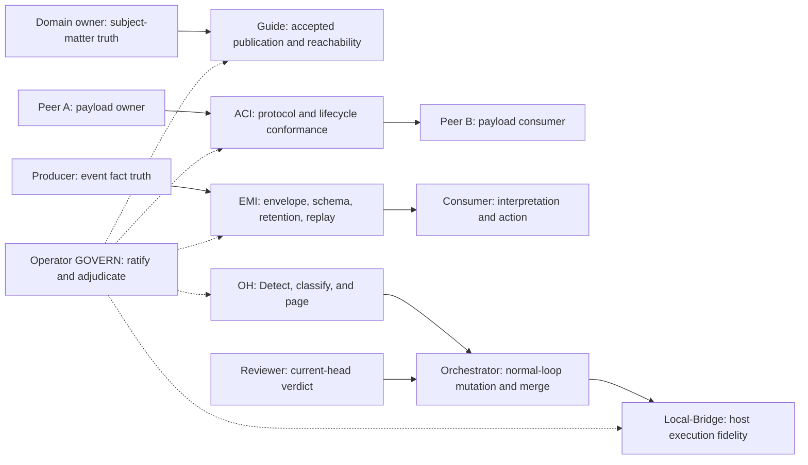

#### User Story: US-PER-002-01 — Ratify Guide Publication Without Transferring Domain Truth

Priority: P0
Size: M

##### User Story

As an Operator, domain owner, and consumer of orchestration guidance, I want the Guide persona to publish accepted, current, reachable guidance with explicit provenance, so that agents can find and follow authoritative material without mistaking the publisher for the owner of the underlying domain truth.

##### TL;DR

The Guide owns publication quality, authority ordering, reachability, voice consistency, and drift reporting. The owning domain persona or Operator owns substantive truth and acceptance. A published document is not a ruling, grant, gate verdict, dispatch instruction, merge approval, page, or implementation fact.

##### Why This Matters

The local Guide voice and corpus practices are already built or used in part, but a built publication practice can silently become a de facto policy authority if acceptance and provenance are not explicit. The target standing Guide persona must make accepted guidance easy to find while preserving the distinction between:

- who authored or owns the domain claim;
- who accepted it as current;
- who published and indexed it;
- when it became effective;
- what it supersedes; and
- who must resolve later drift.

The Guide must also keep dated research captures and superseded drafts useful as evidence without presenting them as current authority.

The Story begins with this state ledger:

| Dimension | Current | Target |
|---|---|---|
| Persona document | Draft Guide persona and research corpus exist outside the governed repository. | Canonical Guide persona is Operator-ratified and referenced by PURPOSE and Plan-of-Plans. |
| Built capability | Core voice/corpus practices and publication conventions exist in part. | Publication registry, provenance, acceptance, reachability, supersession, and drift checks are built and verified. |
| Commissioning | No standing commission may be inferred from the local files alone. Provost/Liaison integrations remain proposed until separately commissioned. | A named Guide principal/card/grant is commissioned only if the Operator elects a standing persona. |
| Effective authority | Domain owners and Operator retain substantive authority; existing accepted documents remain authoritative according to their own provenance. | Guide publication responsibility becomes effective at a recorded time, while domain truth remains with its atomic owner. |

##### I Know I Am Done When

- [ ] Every current Guide artifact has a source, content owner, acceptance authority, publication status, current/superseded state, and canonical location.
- [ ] The ratified RACI gives the Guide `A` only for accepted-publication correctness and reachability, never for the subject matter being published.
- [ ] Domain-owner acceptance is a required input before the Guide marks content current.
- [ ] A reader can reach the current authority from the canonical index in one documented hop.
- [ ] Dated captures, drafts, and superseded documents are visibly non-authoritative but remain preserved for provenance.
- [ ] The Guide can report drift to the content owner and Operator but cannot resolve a substantive disagreement on its own.
- [ ] Negative tests prove that Guide publication cannot authorize dispatch, mutation, merge, deploy, page, AAH, or commissioning.
- [ ] Ratified, built, commissioned, and effective states are independently recorded rather than collapsed into “done.”

##### Acceptance Criteria

1. **Given** a proposed domain guidance document, **when** the domain owner has not accepted its substantive content, **then** the Guide may preserve and label it as draft but MUST NOT publish it as current authority.
2. **Given** accepted guidance, **when** the Guide publishes it, **then** the publication record includes canonical URI/path, immutable source reference or hash, content owner, accepting authority, acceptance timestamp, publication timestamp, effective timestamp if different, supersession chain, and Guide publisher identity.
3. **Given** a dispute about the guidance’s substantive meaning, **when** the Guide receives conflicting interpretations, **then** it routes the dispute to the domain owner or Operator and records the outcome without issuing the ruling.
4. **Given** a broken link, stale index, ambiguous authority order, inconsistent voice, or undiscoverable current document, **when** detected, **then** the Guide owns correction or drift escalation for that publication defect.
5. **Given** a dated capture or research artifact, **when** it is indexed, **then** it is labeled as evidence, draft, historical, or superseded and cannot outrank the current governed source.
6. **Given** an accepted publication, **when** a consumer follows it, **then** any embedded role claim links to the canonical persona/RACI source and not to a copied, divergent authority paragraph.
7. **Given** an attempted publication that includes a credential, private token, or restricted runtime receipt, **when** validation runs, **then** publication fails closed and identifies the content owner responsible for remediation without exposing the secret.
8. **Given** the Guide persona has been ratified but no standing principal/card/grant has been commissioned, **when** publication work runs, **then** existing authorized publication processes continue and no Guide-agent authority is inferred.
9. Independent SME review confirms that Guide publication quality is separable from domain truth, substantive review verdict, runtime execution, and governance ratification.

##### MoSCoW

| Priority | Scope |
|---|---|
| Must | Canonical corpus preservation; provenance; content-owner acceptance; current/superseded labeling; authority ordering; one-hop reachability; drift routing; negative-authority tests. |
| Should | Automated link/currentness checks, publication diffs, and content-owner notifications. |
| Could | Search ranking, reader feedback analytics, and accessibility scoring after privacy review. |
| Won’t have this time | Guide-authored domain rulings, Guide merge/deploy authority, automatic ratification, or mining historical captures as current authority. |

##### Dependencies

- EP-PER-001 corpus preservation, authority taxonomy, and governance amendment work.
- Canonical repository destination for persona and research documents.
- Domain-owner registry and Atomic RACI source.
- Operator-ratified precedence order among PURPOSE, persona charters, plans, issues, and historical evidence.
- Provost and Liaison commissioning decisions if those integrations are later activated.

##### Constraints

- The Guide MUST NOT self-accept its own substantive domain guidance unless it is separately and explicitly the ratified domain owner for that exact atom.
- Publication MUST NOT change the effective date or authority of source content.
- Historical evidence MUST remain preserved but visually and machine-readably distinguishable from current authority.
- A broken publication path may be repaired without changing substantive content; substantive changes require renewed owner acceptance.
- A Guide AgentCard, if created, advertises publication capabilities and grants no authority.

##### Assumptions

- Existing domain personas and the Operator can be resolved to stable identities for acceptance records.
- The repository will retain human-readable Markdown while allowing machine-readable provenance metadata.
- Current informal Guide practices may continue during migration only under their existing authority, not under unratified target authority.

##### Implementation Notes

1. Inventory the local Guide persona, corpus, indexes, authority-order guidance, and all references that currently depend on them.
2. Define a `GuidePublicationRecord` or equivalent contract with source identity, content owner, acceptance evidence, publisher, effective state, and supersession.
3. Add a publication state machine: `draft -> accepted -> published-current -> superseded/withdrawn`; do not let `published` imply `accepted`.
4. Define the Atomic RACI:
   - domain owner or Operator: `A` for subject-matter truth and acceptance;
   - Guide: `A` for faithful publication, reachability, authority ordering, and publication drift;
   - Guide: `R` for packaging/indexing;
   - affected peers: `C` or `I` according to their dependency.
5. Add structural validation for provenance, currentness, link integrity, authority labels, and accidental secret inclusion.
6. Add negative tests that attempt to use a publication record as a grant, review verdict, runtime authorization, or commissioning record.
7. Record ratification, any standing Guide commissioning, and effectivity as separate events.
8. Update Plan-of-Plans and affected backlog references only after the canonical package and precedence rules are accepted.

##### Security/Compliance

- Publication metadata MUST minimize personal and operationally sensitive information.
- Source hashes and signatures MUST support provenance without exposing secrets.
- The Guide MUST fail closed on missing acceptance evidence for a current-authority label.
- Content rendering and indexing MUST sanitize untrusted markup and links.
- Publication records MUST not contain bearer tokens, bridge credentials, private event payloads, or unredacted execution receipts.
- Audit logs MUST distinguish who owned, accepted, published, superseded, and consumed the guidance.

##### Artifacts

- `Guide Persona Charter.md`
- `Guide Atomic RACI.md`
- `Guide Publication and Acceptance Contract.md`
- `Guide Canonical Corpus and Authority Index.csv`
- `Guide Supersession and Drift Register.csv`
- `Guide Negative-Authority Test Report.md`
- `Guide Ratification Commissioning and Effectivity Record.md`
- `Guide Independent SME Review.md`

##### Diagram

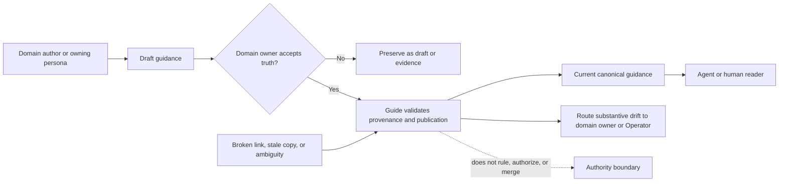

#### User Story: US-PER-002-02 — Define ACI Protocol Conformance Without Owning Payload or Authorization

Priority: P0
Size: L

##### User Story

As an Operator and collaborating persona, I want a ratifiable Agent Communication Interface persona and Wave 1 A2A profile, so that peers can exchange tasks, messages, context, and artifacts consistently without making ACI the owner of peer payload truth, authentication policy, authorization decisions, or runtime action.

##### TL;DR

ACI standardizes protocol semantics and validates conformance. The originating and receiving domain peers own payload meaning. Security and governance authorities own identity and authorization policy. The action-owning peer decides and performs an allowed action. An AgentCard advertises capabilities; it grants nothing. ACI is never a mandatory hub.

##### Why This Matters

ACI is currently proposed, not ratified, commissioned, or effective, and the Wave 1 A2A profile is designed rather than built as a standing service. Without a precise boundary, a protocol coordinator can accidentally become:

- the arbiter of the facts carried in messages;
- the issuer of identity or permission;
- a centralized message broker through which every peer must route;
- the owner of downstream actions; or
- an authority simply because an AgentCard advertises a capability.

The protocol, payload, authentication, authorization, and action atoms must remain independently accountable.

The Story begins with this state ledger:

| Dimension | Current | Target |
|---|---|---|
| Persona document | ACI is proposed; no ratified charter is effective. | Operator-ratified ACI protocol-only charter is canonical. |
| Built capability | A2A Wave 1 behavior is designed; existing peers use their current interfaces and interim ownership. | Profile, lifecycle schemas, compatibility rules, and conformance harness are built and verified. |
| Commissioning | No ACI principal, AgentCard, AgentSkill, or grant is commissioned. | A named ACI principal/card/grant is commissioned only if a standing conformance service is needed. |
| Effective authority | Current interface and security owners retain their existing responsibilities. | ACI protocol responsibility becomes effective only after explicit interim-owner transfer; payload and auth ownership do not transfer. |

##### I Know I Am Done When

- [ ] The Wave 1 A2A profile defines task, message, context, artifact, correlation, cancellation, timeout, error, and compatibility semantics.
- [ ] The Atomic RACI separately assigns protocol semantics, payload truth, authentication, authorization, action decision, and action execution.
- [ ] AgentCards and AgentSkills are explicitly descriptive and non-authorizing.
- [ ] A peer can communicate directly with another conforming peer without routing through ACI.
- [ ] Conformance tests validate protocol behavior without inspecting or overruling domain meaning.
- [ ] Missing, expired, revoked, or out-of-scope authorization fails at the action boundary even when the message is protocol-valid.
- [ ] Interim protocol owners remain effective until a signed transfer record activates ACI.
- [ ] Ratification, build completion, commissioning, and effectivity are recorded independently.

##### Acceptance Criteria

1. **Given** a syntactically and semantically valid A2A message, **when** its payload asserts a domain fact, **then** ACI validates only the protocol envelope and the originating domain owner remains accountable for that fact.
2. **Given** a valid AgentCard advertising a capability, **when** a caller requests a mutating action, **then** the action owner independently validates identity, grant, scope, expiry, and current policy before acting.
3. **Given** an invalid lifecycle transition, correlation mismatch, unsupported profile version, or malformed artifact reference, **when** conformance validation runs, **then** ACI rejects or reports the protocol defect without rewriting the domain payload.
4. **Given** two conforming peers, **when** they establish an authorized direct exchange, **then** no central ACI relay is required.
5. **Given** an authorization failure, **when** the protocol exchange itself is valid, **then** the response distinguishes protocol success from action denial and does not leak sensitive authorization details.
6. **Given** a new protocol version, **when** compatibility is assessed, **then** the profile declares supported versions, negotiation behavior, downgrade rules, and sunset dates.
7. **Given** ACI is ratified and built but no ACI principal is commissioned, **when** peers exchange messages, **then** current authorized interface owners remain effective and no implicit ACI authority exists.
8. **Given** a proposed transfer to ACI, **when** effectivity is recorded, **then** the record identifies the transferred protocol atoms, prior owner, new owner, effective time, rollback condition, and all atoms that explicitly did not transfer.
9. Independent SME review verifies request-never-authorize behavior and confirms that ACI cannot become a payload reviewer, security authority, dispatcher, merger, or mandatory hub.

##### MoSCoW

| Priority | Scope |
|---|---|
| Must | Protocol profile; lifecycle contracts; compatibility/versioning; protocol/payload/auth decomposition; non-authorizing AgentCards; direct-peer operation; conformance and negative-authority tests; transfer record. |
| Should | Reference adapters, trace correlation, capability discovery cache, and redacted diagnostics. |
| Could | Cross-language conformance fixtures and optional protocol observability dashboards. |
| Won’t have this time | Mandatory ACI message broker, ACI-owned domain payload, ACI-issued authorization, ACI runtime mutation, or automatic peer commissioning. |

##### Dependencies

- Operator GOVERN amendment and Wave 1 Atomic RACI.
- Existing peer identity, authentication, and authorization policy owners.
- Canonical AgentCard, AgentSkill, principal, and grant lifecycle contracts.
- Orchestrator task and artifact lifecycle requirements.
- EMI correlation/event conventions where an A2A exchange also emits events.
- An explicit interim-owner inventory for existing peer interfaces.

##### Constraints

- Protocol validation MUST remain content-agnostic except for fields required by the protocol contract.
- ACI MUST NOT hold a shared credential that broadens peer access.
- A message request MUST NOT be treated as permission.
- ACI availability MUST NOT be a new single point of failure for direct peer communication.
- Downgrade behavior MUST fail closed when a lower version would weaken security or authority evidence.
- AgentCard publication MUST be revocable and MUST NOT expose secrets or private endpoints.

##### Assumptions

- Existing peers can expose or adapt to a small, versioned Wave 1 profile.
- Identity and authorization decisions already have or will receive independent owners.
- Some existing runtime interfaces may remain in use during a compatibility window.
- A standing ACI service may be unnecessary if a ratified profile and distributed conformance suite satisfy the responsibility.

##### Implementation Notes

1. Inventory current peer-to-peer, planner-to-worker, worker-to-reviewer, and bridge communication surfaces and identify each interim protocol owner.
2. Define the Wave 1 A2A profile with:
   - message and task identifiers;
   - sender/recipient and correlation;
   - context and artifact references;
   - lifecycle transitions;
   - cancellation, timeout, retry, and idempotency;
   - structured error categories;
   - supported-version negotiation; and
   - provenance and redaction requirements.
3. Publish an atomic responsibility table:

   | Atom | Accountable owner |
   |---|---|
   | Protocol syntax, lifecycle, versioning, and conformance | ACI once effective; interim interface owner until transfer |
   | Domain payload truth and allowed semantic claims | Originating/owning domain persona |
   | Authentication mechanism and credential policy | Security/identity authority |
   | Authorization policy and grant decision | Operator or ratified owning authority |
   | Decision to perform an allowed action | Persona accountable for that action |
   | Runtime execution | Assigned executor under a valid grant |

4. Create conformance fixtures that use opaque payloads so tests cannot accidentally assign ACI domain authority.
5. Add negative tests for forged cards, expired grants, replayed requests, unsupported downgrade, direct-peer bypass of a proposed central hub, and valid-protocol/unauthorized-action separation.
6. Decide whether ACI is a standing principal or a distributed specification/conformance responsibility; commission a principal only if ratified.
7. Record each current-to-target ownership transfer and its effective date independently from code deployment.

##### Security/Compliance

- Mutual identity verification and transport protection MUST be provided by the ratified security boundary, not invented by ACI.
- AgentCards MUST reveal only the minimum capability and endpoint metadata needed for authorized discovery.
- Artifact references MUST be access-controlled, integrity-checked, and protected against path or URL injection.
- Messages MUST support traceability without copying secrets or excessive personal data.
- Replay protection, correlation uniqueness, expiry, and idempotency MUST be testable.
- Authorization denial MUST be indistinguishable enough to avoid capability enumeration while remaining auditable to authorized operators.
- ACI logs MUST redact payload fields designated by their domain owner.

##### Artifacts

- `ACI Persona Charter.md`
- `ACI Wave 1 A2A Profile.md`
- `ACI Atomic RACI - Protocol Payload Authentication Authorization.md`
- `ACI AgentCard and AgentSkill Non-Authority Contract.md`
- `ACI Compatibility and Versioning Policy.md`
- `ACI Conformance and Negative-Authority Test Report.md`
- `ACI Interim Ownership and Transfer Register.md`
- `ACI Ratification Commissioning and Effectivity Record.md`

##### Diagram

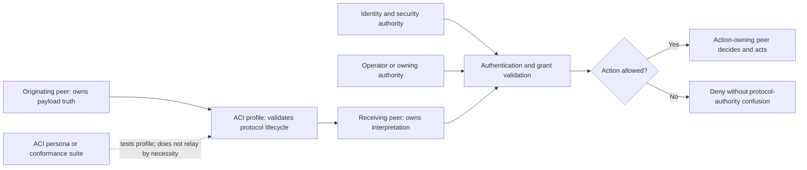

#### User Story: US-PER-002-03 — Define EMI Envelope and Replay Governance Without Owning Producer Truth

Priority: P0
Size: XL

##### User Story

As an Operator, event producer, and event consumer, I want a ratifiable Event and Messaging Interface persona that governs event envelopes, schemas, topics, retention, migration, replay, and conformance, so that the partly built file-log and Kafka substrate can mature without transferring payload truth, action authority, or current OH Detect responsibilities by implication.

##### TL;DR

EMI owns the event transport contract once effective. Producers own the facts they emit. Consumers own interpretation and authorized response. Events never authorize. OH retains current Kafka/event Detect probes until an explicit transfer. The Orchestrator retains runtime implementation responsibility. Replay must be idempotent and must not duplicate mutation, authorization, or token accounting.

##### Why This Matters

File event-log and Kafka foundations are partly built, while EMI remains proposed and uncommissioned. This creates three common drift risks:

- infrastructure presence is mistaken for a commissioned EMI authority;
- an envelope/schema owner is treated as owner of the business facts inside the event; or
- ownership of current OH probes and Orchestrator runtime code silently transfers when the EMI document is published.

The target must preserve one coherent event/log authority, deterministic migration, and replay safety while making every current-to-target transfer explicit.

The Story begins with this state ledger:

| Dimension | Current | Target |
|---|---|---|
| Persona document | EMI is proposed and not effective. | Operator-ratified EMI charter defines envelope/replay-only authority. |
| Built capability | File event log and Kafka substrate are partly built. Orchestrator owns runtime implementation; OH owns current Kafka/event Detect probes. | Topic catalog, envelope/schema registry, producer/consumer contracts, retention, replay, migration, backpressure, and conformance are built and verified. |
| Commissioning | No EMI principal, AgentCard, AgentSkill, or grant is commissioned. | EMI principal/card/grant is commissioned if standing operation is required. |
| Effective authority | Existing implementation and Detect owners remain effective. | EMI responsibility becomes effective only for named atoms in a signed transfer; producer truth and consumer action never transfer. |

##### I Know I Am Done When

- [ ] A canonical event envelope and schema/version policy cover both file-log and Kafka representations.
- [ ] Every event type has a named producer accountable for payload truth and named consumers accountable for their interpretations/actions.
- [ ] A single topic/catalog authority prevents competing event/log definitions.
- [ ] Replay and migration equivalence tests prove idempotence and no duplicated authorization, mutation, notification, or accounting.
- [ ] Backpressure, poison-event, storm-control, retention, and dead-letter behavior are defined and tested.
- [ ] OH’s current event/Kafka Detect responsibility remains in force until a signed OH-to-EMI transfer becomes effective.
- [ ] Orchestrator runtime implementation responsibility is not silently reassigned by EMI publication.
- [ ] Ratification, build, commissioning, ownership transfer, and effectivity are recorded as distinct facts.

##### Acceptance Criteria

1. **Given** an event producer, **when** it emits a fact, **then** the producer is accountable for payload meaning and validity while EMI validates envelope, schema, topic, provenance, correlation, and compatibility.
2. **Given** a consumer, **when** it interprets an event and proposes an action, **then** the consumer and action-owning authority validate current state and authorization; the event itself never grants permission.
3. **Given** the same logical event in file-log and Kafka forms, **when** equivalence tests run, **then** identity, ordering guarantees, provenance, payload hash, and consumer-visible semantics match within the documented contract.
4. **Given** a replayed event, **when** a consumer has already processed its idempotency key, **then** the consumer does not repeat mutation, authorization, notification, billing, or token accounting.
5. **Given** an incompatible schema change, **when** a producer attempts publication, **then** conformance fails or an approved migration/version path is required; EMI does not rewrite the producer’s domain truth.
6. **Given** backpressure, a poison event, or a message storm, **when** thresholds are crossed, **then** bounded retry, quarantine/dead-letter, and Detect signals operate without silently dropping accepted facts.
7. **Given** EMI is ratified and code is built but no transfer from OH or the interim implementation owner is effective, **when** operations run, **then** current owners retain their responsibilities.
8. **Given** an ownership transfer, **when** its effective time arrives, **then** the record names each transferred atom, retained atom, prerequisite proof, rollback condition, and responsible principals.
9. **Given** token-usage events, **when** EMI validates and replays them, **then** the Token-Agent or current accounting owner remains accountable for token/cost semantics and duplicate accounting is prevented.
10. Independent SME review confirms that EMI cannot become producer truth owner, consumer decision owner, action authorizer, OH by another name, or Orchestrator runtime owner.

##### MoSCoW

| Priority | Scope |
|---|---|
| Must | Event envelope; schema/versioning; topic catalog; producer/consumer ownership; retention/replay; file/Kafka equivalence; idempotency; backpressure/storm control; explicit OH and Orchestrator transfer boundaries. |
| Should | Dead-letter inspection workflow, compatibility dashboard, consumer lag/SLO measures, and redacted replay tooling. |
| Could | Multi-broker adapters and automated schema-impact simulation after the canonical contract is stable. |
| Won’t have this time | EMI-owned payload truth, event-based authorization, unbounded replay, silent ownership transfer, or a second competing event authority. |

##### Dependencies

- Operator GOVERN amendment and Wave 1 Atomic RACI.
- Existing file event-log and Kafka plans, schemas, runtime, and tests.
- Current OH event/Kafka Detect probes and their issue/plan lineage.
- Orchestrator runtime implementation and state-reducer contracts.
- Producer and consumer registry, including Token-Agent target semantics.
- ACI correlation/provenance conventions where messages result in events.
- Retention, privacy, and incident-response requirements.

##### Constraints

- The same logical fact MUST have one stable identity across transport migration.
- Event replay MUST be safe after process restart and partial consumer failure.
- EMI MUST NOT validate domain truth beyond schema and declared invariants owned by the producer.
- Consumers MUST revalidate current state and authorization before mutation.
- A transfer document MUST precede any removal of current OH Detect or Orchestrator implementation responsibility.
- Event/log data MUST not expose credentials, private prompts, unredacted voice content, or unnecessary personal data.

##### Assumptions

- The current file event log remains a compatibility source during the Kafka transition.
- Kafka and file-log behavior can be observed in shadow or dual-write mode before cutover.
- Producers can supply stable event identifiers and schema versions.
- The target EMI may be realized through a service plus governance artifacts, but standing persona commissioning remains a separate decision.

##### Implementation Notes

1. Inventory current event producers, file-log writes, Kafka writes, consumers, OH probes, replay paths, and retention behavior.
2. Define an envelope containing at least event ID, event type, schema version, producer identity, occurred/recorded timestamps, correlation/causation IDs, idempotency key, payload hash, sensitivity label, and provenance.
3. Publish an atomic responsibility table:

   | Atom | Accountable owner |
   |---|---|
   | Event envelope, topic catalog, schema compatibility, retention, replay, and migration | EMI once effective; named interim owner until transfer |
   | Payload fact meaning and producer-side validity | Domain producer |
   | Consumer interpretation and projection | Consumer owner |
   | Authorization and mutating response | Accountable action owner |
   | Event substrate implementation | Orchestrator/runtime implementation owner unless explicitly transferred |
   | Kafka/event health Detect | OH until an explicit effective transfer |
   | Token/cost accounting semantics | Token-Agent once effective; current accounting owner until then |

4. Build conformance fixtures for compatible evolution, incompatible evolution, duplicate delivery, reordering, partial failure, poison events, backpressure, and replay.
5. Run file/Kafka shadow-equivalence evidence before any authority or source-of-truth cutover.
6. Write separate transfer records for envelope governance, topic provisioning, replay operations, and Detect probes; do not use one broad “EMI owns events” statement.
7. Commission EMI only after the ratified boundary, runtime proof, and rollback path are accepted.

##### Security/Compliance

- Event payloads MUST be classified, minimized, encrypted in transit and at rest according to sensitivity, and subject to documented retention.
- Schema registries and topic provisioning MUST require authorized change provenance.
- Replay tools MUST require a scoped grant, preview affected consumers, and enforce idempotency.
- Dead-letter and diagnostic views MUST redact secrets and restricted payload fields.
- Event identities and hashes MUST support tamper detection without revealing sensitive content.
- No event, even from an authenticated producer, may substitute for action authorization.
- Storm controls MUST prevent denial-of-service while preserving an auditable record of quarantined or rejected events.

##### Artifacts

- `EMI Persona Charter.md`
- `EMI Atomic RACI - Envelope Payload Replay and Action.md`
- `EMI Event Envelope and Schema Profile.md`
- `EMI Topic Producer Consumer Catalog.csv`
- `EMI Retention Replay and Migration Policy.md`
- `EMI File-Kafka Shadow Equivalence Report.md`
- `EMI Replay Idempotency and Storm-Control Test Report.md`
- `EMI OH and Runtime Ownership Transfer Register.md`
- `EMI Ratification Commissioning and Effectivity Record.md`

##### Diagram

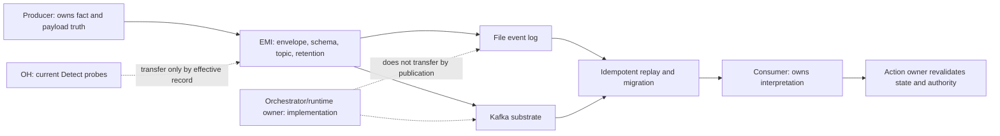

#### User Story: US-PER-002-04 — Preserve Orchestrator Normal-Loop Mutation and Merge Accountability

Priority: P0
Size: XL

##### User Story

As an Operator, worker, reviewer, and repository stakeholder, I want the Orchestrator persona and its built normal loop reconciled to the ratified Atomic RACI, so that admission, dispatch, recovery, bounded remediation, merge/autoland, and closeout remain reliable without absorbing Reviewer verdict, OH Detect, Local-Bridge execution fidelity, AAH authority, EMI event governance, or Token-Agent accounting.

##### TL;DR

The Orchestrator is the sole normal-loop mutation and merge owner. It acts only on current admissible work and current-HEAD review/check truth. A Reviewer owns the verdict; OH detects and routes; Local-Bridge faithfully executes an authorized host task; Auditor AAH is an exceptional path; ACI and EMI carry contracts rather than authority; Token-Agent accounting is target-only until effective.

##### Why This Matters

Unlike several proposed foundation personas, the Orchestrator’s core normal loop is already built and effective. A new persona package must not reset that reality, duplicate its authority, or make target-only gaps look complete. It must instead:

- trace the existing loop to the governing authority;
- harden separation of duties and current-HEAD merge truth;
- document missing R36 admission and canonical per-run usage emission;
- prevent monitoring signals, messages, events, or bridge receipts from becoming authorization; and
- integrate later personas only after their own ratification and commissioning.

The Story begins with this state ledger:

| Dimension | Current | Target |
|---|---|---|
| Persona document | Existing governance makes the normal orchestration loop effective; the new persona restatement is draft until ratified. | Canonical Orchestrator charter restates existing authority without broadening it. |
| Built capability | Admission, dispatch, worker/reviewer cycles, recovery/quarantine, fail-dangerous merge/autoland, and closeout are substantially built. | Current-HEAD evidence, separation-of-duties tests, bounded recovery, R36 admission, and canonical usage emission are complete and verified. |
| Commissioning | Active runtime already performs the normal-loop role under current governance; persona/card records may be incomplete. | Commissioning metadata and grants accurately describe the existing runtime without retroactive invention. |
| Effective authority | Orchestrator is effective for the normal loop and sole normal-loop merger. | The same authority remains effective; only explicitly ratified gaps or integrations change at recorded times. |

##### I Know I Am Done When

- [ ] The built normal-loop state machine is mapped to one ratified Orchestrator responsibility per transition.
- [ ] Reviewer verdict remains independently accountable and cannot be authored or inferred by the Orchestrator.
- [ ] Merge/autoland uses current HEAD, current required checks, current unresolved-thread truth, and a current reviewer pass.
- [ ] OH signals, ACI messages, EMI events, and Local-Bridge receipts are treated as evidence or inputs, never as permission.
- [ ] Recovery, retry, quarantine, and remediation loops are bounded, observable, and escalation-safe.
- [ ] The AAH path is separate and requires its own effective signed envelope.
- [ ] R36 admission and the canonical per-run usage emitter are labeled target/not-built until verified.
- [ ] Later persona integrations remain feature-gated or inactive until their commissioning/effectivity records exist.
- [ ] Normal-loop baseline, regression, integration, and UAT evidence are current.

##### Acceptance Criteria

1. **Given** an admitted issue, **when** the Orchestrator dispatches work, **then** the dispatch cites current project/issue state, applicable policy, selected worker/reviewer assignments, and the effective grant.
2. **Given** a worker result, **when** review begins, **then** a separately accountable Reviewer evaluates the current HEAD and the Orchestrator records but does not author the verdict.
3. **Given** any stale review, absent review, unresolved actionable thread, non-current reviewer pass, failing required workflow, or mismatched HEAD, **when** merge is evaluated, **then** merge fails closed.
4. **Given** an OH detection, ACI message, EMI event, or Local-Bridge completion receipt, **when** the Orchestrator receives it, **then** it revalidates current state and authority before any mutation.
5. **Given** a remediation loop, **when** retry/time-box limits are reached or the same blocker persists, **then** the Orchestrator quarantines or escalates according to a ratified rule rather than self-expanding its authority.
6. **Given** an emergency AAH request, **when** no valid Auditor AAH signature/envelope is effective, **then** the Orchestrator remains on the normal path and does not infer emergency authority.
7. **Given** an R36 requirement or canonical per-run usage emission requirement, **when** corresponding verified implementation evidence is absent, **then** status remains designed/open and cannot satisfy an admission or accounting gate by documentation alone.
8. **Given** an ACI, EMI, Token-Agent, OH, or Local-Bridge target integration, **when** that persona has not been commissioned and made effective, **then** the current runtime owner remains in force.
9. **Given** successful merge, **when** closeout runs, **then** linked issue/project state, review-thread closure, branch cleanup, evidence, and any required accounting event are completed or a tracked blocker prevents false completion.
10. Independent verification confirms that the Orchestrator is the sole normal-loop merger but is not Reviewer, OH, Local-Bridge, Auditor, EMI, ACI, Token-Agent, or Operator.

##### MoSCoW

| Priority | Scope |
|---|---|
| Must | Current-to-target traceability; sole normal-loop merge ownership; independent Reviewer verdict; current-HEAD checks; bounded recovery; negative-authority tests; explicit AAH separation; target-gap labeling. |
| Should | R36 admission implementation, canonical per-run usage emitter, richer reason codes, and recovery observability. |
| Could | Simulation of multi-persona failure scenarios and policy-change impact analysis. |
| Won’t have this time | Orchestrator-authored review verdicts, OH authority absorption, Bridge authorization inference, event/message-based permission, or unratified target persona activation. |

##### Dependencies

- Existing planner, automation, provider, review, merge/autoland, quarantine, and closeout implementations.
- Reviewer persona and current-head review contract.
- Auditor persona and AAH signature/envelope contract from EP-PER-001.
- OH Detect-only signal and escalation contract.
- Local-Bridge lease, execution, and receipt contract.
- ACI and EMI contracts when ratified and commissioned.
- Token-Agent accounting contract and canonical per-run usage emitter work, including the existing open target tracked by #1921.
- R36 admission design and its own TDD implementation issue.

##### Constraints

- The Orchestrator MUST NOT merge its own unreviewed work or synthesize a positive verdict.
- A green check snapshot is insufficient if it is stale, incomplete, or for a different HEAD.
- Normal-loop authority MUST remain separate from AAH exceptional authority.
- Retries and self-heal MUST have explicit limits, evidence, and escalation destinations.
- Integration with a proposed persona MUST preserve the current owner until effectivity.
- Closure MUST not hide unresolved tracked defects, findings, or cleanup obligations.

##### Assumptions

- Current normal-loop behavior can be exercised in a reproducible environment.
- GitHub provides authoritative current PR/check/review-thread state at decision time.
- Existing implementation can expose reason-coded admission, dispatch, recovery, and merge decisions for audit.
- R36 and canonical usage emission can be added without changing the Orchestrator’s core authority boundary.

##### Implementation Notes

1. Produce an as-built state machine for admission, dispatch, work, review, remediation, quarantine/recovery, merge, and closeout.
2. Map each transition to its current authority source and identify any code path that lacks a current rule.
3. Add or extend tests for:
   - stale or mismatched review HEAD;
   - unresolved review threads;
   - checks changing after verdict;
   - OH signal without a mutation rule;
   - ACI-valid but unauthorized request;
   - EMI replay without duplicate action;
   - Bridge receipt without authorization;
   - missing AAH envelope;
   - retry/time-box exhaustion; and
   - closeout with incomplete tracker state.
4. Keep Reviewer verdict as an external, attributable input and record the reviewer identity and covered HEAD.
5. Mark R36 and canonical per-run usage emission as target gaps until Red-Green-Refactor and integration evidence exist.
6. Gate later persona integrations on ratification, commissioned identity/grant, compatibility proof, and an effective transfer record.
7. Preserve existing normal-loop effectivity while updating the persona restatement; do not create an artificial gap by treating an already-operating governed role as merely proposed.

##### Security/Compliance

- All mutations MUST enforce read-only/permission mode and effective grant scope.
- Merge decisions MUST use fresh, authoritative repository state.
- Worker and reviewer identities, evidence hashes, grants, and decisions MUST be auditable.
- Logs MUST redact secrets, credentials, private prompts, and restricted artifacts.
- Recovery and retries MUST resist replay, duplicate execution, and privilege escalation.
- Quarantine MUST preserve evidence and prevent unsafe automatic re-entry.
- AAH requests MUST be cryptographically or equivalently provenance-bound to their signed envelope and expiry.

##### Artifacts

- `Orchestrator Persona Charter.md`
- `Orchestrator As-Built and Target State Machine.md`
- `Orchestrator Atomic RACI - Normal Loop.md`
- `Orchestrator Current-HEAD Merge Evidence Contract.md`
- `Orchestrator Separation-of-Duties Regression Report.md`
- `Orchestrator R36 and Usage-Emitter Gap Register.md`
- `Orchestrator Persona Integration Effectivity Gates.md`
- `Orchestrator Ratification Build Commissioning and Effectivity Record.md`

##### Diagram

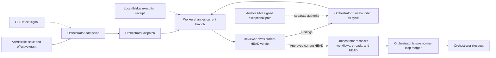

#### User Story: US-PER-002-05 — Adjudicate OH Detect-Only Boundaries and the #635/#1649 Authority Conflict

Priority: P0
Size: XL

##### User Story

As an Operator, operations stakeholder, and downstream persona, I want the Operations Helm role, #635 foundation plan, and #1649 stabilization record reconciled to one explicit authority decision, so that the target 24×7 service can detect, classify, and page reliably without silently acquiring dispatch, review, remediation, restart, merge, deploy, AAH, event-governance, or accounting authority.

##### TL;DR

OH’s current ratified responsibility is Detect. Its packages and Helm substrate are partly built, a temporary stand-in still holds the seat, and #635 remains open. #1649 contains language describing Helm as a full-auto review-round recalibration authority, which conflicts with Detect-only boundaries and must be adjudicated by the Operator. Until that decision is effective, preserve Detect-only operation and the last-known safe owners for mutation and verdict.

##### Why This Matters

OH is the highest-risk Wave 1 boundary because issue and plan history contain incompatible-looking claims:

- the persona charter assigns OH a single Accountable atom—Detect;
- #635 productizes a fragile session-bound Helm into a local-first 24×7 foundation and includes detection, restart, escalation, and voice-trigger concepts;
- #1649 remains an AAH/Helm stabilization blocker with dependencies including #645, #688, and #689 plus Operator/runner evidence;
- #1649 material describes Helm evaluating improvement evidence, authorizing worker/reviewer continuation after a positive result, using subagent forensics after a negative result, and acting as a full-auto recalibration authority.

Those statements may represent an Operator ruling, a proposed implementation, stale issue prose, or an overbroad role claim. This Story MUST NOT silently choose among them. It must preserve existing safe behavior, identify the exact provenance and precedence of each statement, and obtain an explicit Operator GOVERN adjudication before any broadened OH authority is built or made effective.

The Story begins with this state ledger:

| Dimension | Current | Target |
|---|---|---|
| Persona document | Current ratified boundary is Detect-only. Conflicting issue language has not been reconciled in the canonical persona package. | Operator-ratified OH charter and Atomic RACI explicitly accept, reject, or reassign every conflicting statement. |
| Built capability | Helm/OH substrate is partly built; #635 remains open; a temporary stand-in holds the seat. | Local-first 24×7 service, SLO probes, bounded routing, and any explicitly authorized recovery adapter are built and independently verified. |
| Commissioning | Standing 24×7 OH is not proven commissioned; temporary coverage remains. | Named OH principal/card/grant is commissioned after SLO and authority proof, and the stand-in transfer is recorded. |
| Effective authority | OH is effective for Detect; other current owners retain verdict, mutation, merge, deploy, AAH, event governance, and accounting. | Only the Operator-adjudicated atoms become effective at a recorded time; unresolved atoms remain with current owners. |

##### I Know I Am Done When

- [ ] A provenance-preserving snapshot of #635, #1649, linked plans, comments, decisions, and descendants identifies every authority-bearing statement.
- [ ] Each statement is classified as current ratified authority, proposed target, implementation detail, historical evidence, superseded text, or unresolved conflict.
- [ ] The Operator explicitly adjudicates the recalibration, restart/self-heal, voice-trigger, remediation, and continuation-authority questions.
- [ ] The Atomic RACI retains one `A` per atom and identifies the correct owner for Detect, verdict, normal-loop mutation, emergency AAH, deploy, event governance, and accounting.
- [ ] No OH code or backlog update implements broadened authority before the adjudication is effective.
- [ ] #635’s 24×7 acceptance evidence includes service availability, event continuity, deterministic escalation, restart safety, and fail-closed behavior.
- [ ] #1649’s blockers and dependencies, including #645, #688, #689 and required Operator/runner evidence, are closed or explicitly dispositioned before false completion.
- [ ] The temporary stand-in transfers the seat through a recorded handoff only after the commissioned OH satisfies its entry criteria.
- [ ] All affected backlog issues and plans reference the adjudicated authority package and no longer repeat ambiguous role claims.
- [ ] Independent SMEs confirm that Detect signals cannot become review verdicts or mutation permission by phrasing alone.

##### Acceptance Criteria

1. **Given** #635, #1649, their comments, linked plans, and descendant issues, **when** the forensic review runs, **then** it records exact source, timestamp, author/authority provenance, quoted or faithfully summarized claim, precedence basis, and current classification for each authority-bearing statement.
2. **Given** the #1649 claim that Helm can evaluate evidence and authorize the worker/reviewer loop to continue, **when** compared with the Detect-only charter, **then** the conflict is marked unresolved until the Operator explicitly assigns:
   - evidence observation to OH or another observer;
   - review verdict to Reviewer;
   - normal-loop continuation/mutation to Orchestrator;
   - governance exception to Operator; and
   - emergency remediation to Auditor only within an effective AAH envelope.
3. **Given** a #635 restart or auto-recovery requirement, **when** no explicit bounded rule identifies the action owner, preconditions, retry/time-box, rollback, and escalation, **then** OH may detect and recommend but MUST NOT mutate or restart by inference.
4. **Given** a voice request to restart, continue, escalate, or remediate, **when** it is received, **then** the system treats voice as an input requiring identity and authority validation, not as authorization by modality.
5. **Given** the Operator elects to grant a narrow OH self-heal atom, **when** the amendment is ratified, **then** the exact condition, allowed action, target, limit, evidence, rollback, escalation, principal, grant, and effective date are recorded; all broader actions remain excluded.
6. **Given** the Operator rejects OH recalibration or mutation authority, **when** issue migration runs, **then** the affected requirements are reassigned to Reviewer, Orchestrator, Auditor, or Operator and linked to their canonical charters.
7. **Given** #1649 remains blocked by open dependencies or missing SLO runner/gate evidence, **when** status is evaluated, **then** the blocked state remains truthful and no documentation-only closure is allowed.
8. **Given** a 24×7 OH candidate, **when** commissioning is requested, **then** it proves sustained local-first service, recovery after process/host disruption, deterministic alert routing, no page storm, no lost critical signal, and no unauthorized mutation.
9. **Given** commissioning succeeds, **when** effectivity begins, **then** the temporary stand-in handoff records last-known state, active incidents, unresolved blockers, grants, rollback, and the exact effective timestamp.
10. Independent verification replays representative normal, degraded, review-conflict, emergency, bridge-failure, and event-backbone scenarios and confirms that OH never exceeds the adjudicated boundary.

##### MoSCoW

| Priority | Scope |
|---|---|
| Must | #635/#1649 forensic ledger; explicit Operator adjudication; Detect-only safe interim; Atomic RACI; blocker truth; 24×7 SLO evidence; stand-in transfer; issue/plan migration; negative-authority tests. |
| Should | Deterministic page deduplication, escalation SLO dashboard, chaos/restart tests, and authority-aware signal reason codes. |
| Could | Cross-host OH redundancy and predictive degradation analysis after the single-seat authority model is stable. |
| Won’t have this time | Silent acceptance of #1649 recalibration authority, voice-as-authorization, unbounded self-heal, OH-authored review verdict, OH merge/deploy/AAH authority, or closure without runner evidence. |

##### Dependencies

- Operator GOVERN amendment and canonical PURPOSE precedence.
- Issue #635, issue #1649, their full comment/revision history, and descendant issue graph.
- Blockers/dependencies including #645, #688, and #689 plus the required Operator/runner evidence.
- Current OH/Helm packages, local-first service design, event probes, and SLO instrumentation.
- Reviewer verdict contract, Orchestrator normal-loop contract, and Auditor AAH contract.
- EMI transition plan for any future transfer of event/Kafka Detect probes.
- Local-Bridge execution and recovery evidence where OH observes host execution.
- Voice identity and authorization boundary if voice-trigger requirements remain in scope.

##### Constraints

- Until adjudication is effective, the safe boundary is Detect-only and current non-OH owners retain all mutations and verdicts.
- Historical issue language MUST be preserved for evidence; corrections must supersede rather than erase it.
- A comment attributed to an Operator ruling MUST be provenance-verified and reconciled with the governing source before implementation.
- “Auto-restart,” “resume,” “continue,” “recalibrate,” and “remediate” are mutation or decision verbs and require atomic ownership.
- OH MUST NOT self-commission or use successful telemetry as proof of authority.
- A closed dependency does not prove SLO or authority acceptance unless its required evidence is present.

##### Assumptions

- Full issue/comment history and linked evidence can be retrieved for the forensic ledger.
- The Operator can adjudicate any genuinely conflicting authority statement.
- Existing OH Detect behavior can continue safely while mutation questions are resolved.
- The 24×7 target can be tested without granting it production mutation authority.

##### Implementation Notes

1. Freeze a read-only evidence bundle for #635, #1649, linked plans, comments, revisions, project fields, dependencies, and descendants.
2. Build a conflict matrix with columns for source, exact claim, verb, target object, implied `A`, current charter owner, provenance, precedence, classification, risk, and required decision.
3. Decompose at least these atoms:

   | Atom | Safe current owner pending adjudication |
   |---|---|
   | Detect telemetry/event/review-loop condition | OH |
   | Classify and package an operational signal | OH |
   | Route/page according to an effective rule | OH |
   | Substantive review verdict | Reviewer |
   | Continue, pause, resume, retry, or mutate the normal loop | Orchestrator under an effective rule |
   | Emergency hotfix/remediation | Auditor under an effective AAH envelope |
   | Governance exception or new authority | Operator |
   | Deploy/release decision | Existing release authority |
   | Event envelope/replay governance | Current owner, then EMI only after transfer |
   | Token/cost accounting | Current owner, then Token-Agent only after effectivity |

4. Present the Operator with explicit options for each conflict rather than a bundled “make Helm autonomous” decision.
5. If any narrow self-heal is ratified, specify preconditions, bounded actions, excluded targets, retry/time-box, evidence, rollback, kill switch, and escalation.
6. Update #635, #1649, descendants, Plan-of-Plans, and the OH persona only after adjudication; link to one canonical decision instead of duplicating prose.
7. Build or complete the 24×7 service through baseline-first TDD, then collect independent SLO and failure-injection evidence.
8. Commission the standing OH and retire the temporary stand-in only after authority, runtime, and handoff gates all pass.

##### Security/Compliance

- Signal ingestion MUST authenticate sources where possible and classify untrusted input.
- Voice commands MUST be identity-verified, authorization-checked, replay-resistant, and fail closed.
- Alerts and evidence MUST redact credentials, private prompts, voice content, and sensitive payloads.
- Page deduplication and storm controls MUST prevent operational denial-of-service.
- Any ratified self-heal MUST use least privilege, explicit targets, bounded retries, rollback, and an Operator kill switch.
- Operator rulings, amendments, and commissioning records MUST have verifiable provenance and effective timestamps.
- OH MUST not possess merge, deploy, broad repository-write, or AAH credentials merely to observe system health.

##### Artifacts

- `OH Persona Charter.md`
- `OH Authority Conflict Adjudication Record - Issues 635 and 1649.md`
- `OH Issue and Decision Provenance Ledger.csv`
- `OH Detect-Only Atomic RACI.md`
- `OH Self-Heal Decision and Safety Envelope.md` if the Operator ratifies any bounded self-heal
- `OH 24x7 Commissioning and SLO Evidence.md`
- `OH Temporary Stand-in Transfer Record.md`
- `OH Backlog Descendant Update Ledger.csv`
- `OH Negative-Authority and Failure-Injection Report.md`

##### Diagram

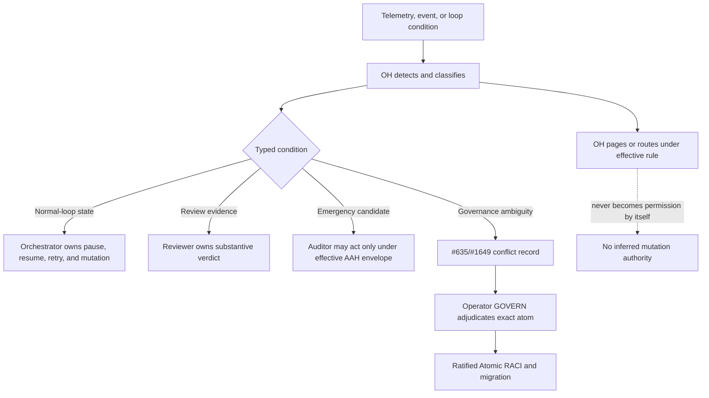

#### User Story: US-PER-002-06 — Commission Local-Bridge for Execution Fidelity Without Authorization Authority

Priority: P0
Size: L

##### User Story

As an Operator, Orchestrator, and host owner, I want each Local-Bridge persona to execute or safely refuse explicitly authorized host-local work and return trustworthy receipts, so that outbound bridge runtime can provide reliable provider access without deciding what work is allowed, merging changes, choosing product scope, selecting policy, paging, or self-commissioning.

##### TL;DR

The bridge process is infrastructure; a Bridge-Resident persona is a per-host accountable execution-fidelity role only after ratification and commissioning. The owning gate, Orchestrator, or Operator authorizes work. The bridge validates the supplied authority reference, performs preflight, executes or refuses, preserves host safety, and emits raw evidence. A lease, task, provider capability, or successful result never grants authority.

##### Why This Matters

Outbound lease polling and host execution runtime are already built in part, and lab evidence demonstrates useful behavior. The standing persona is nevertheless only designed and not commissioned. Without an explicit split:

- a process that can execute host commands may be assumed to authorize them;
- a queued lease may be treated as a grant;
- lab success may be called production commissioning;
- one bridge identity may gain unintended authority across multiple hosts or providers; or
- a completion receipt may be treated as review or merge approval.

The target needs per-host identity, least-privilege grants, deterministic preflight/refusal, recovery/rollback fidelity, and verifiable receipts while retaining authorization with the accountable action owner.

The Story begins with this state ledger:

| Dimension | Current | Target |
|---|---|---|
| Persona document | Bridge-Resident persona is designed, not ratified/commissioned as a standing peer. | Operator-ratified Local-Bridge charter limits authority to host execution fidelity. |
| Built capability | Outbound lease polling, provider execution, preflight, and receipt paths exist in part; lab/DGX proof is not production proof. | Per-host identity/grants, authority validation, safe refusal, bounded recovery, rollback, and receipt integrity are built and verified. |
| Commissioning | No production standing persona may be inferred from a running bridge process. | Each eligible host receives its own commissioned principal/card/grant and recorded scope. |
| Effective authority | Current bridge runtime operates only under its existing configured authority. | Execution-fidelity accountability becomes effective per host at commissioning; authorization always remains external. |

##### I Know I Am Done When

- [ ] The bridge process and Bridge-Resident persona are documented as separate concepts.
- [ ] Every execution request carries a resolvable effective authority/grant, scope, expiry, target, provider, and idempotency reference.
- [ ] Local-Bridge independently validates the execution contract and safely refuses missing, expired, revoked, ambiguous, unsupported, or unsafe work.
- [ ] Preflight reports actual host/provider capability rather than advertising aspirational capability.
- [ ] Execution and refusal receipts are attributable, integrity-protected, redacted, and correlated to the authorized request.
- [ ] Host-local recovery and rollback behavior is bounded and cannot broaden the original request.
- [ ] One host’s card, principal, or grant cannot authorize another host.
- [ ] No receipt can function as Reviewer verdict, merge approval, policy decision, accounting truth, or commissioning proof.
- [ ] Production commissioning is recorded per host only after independent environment-specific verification.

##### Acceptance Criteria

1. **Given** a lease or execution request, **when** no effective authorization reference is present, **then** Local-Bridge refuses before provider invocation and emits a reason-coded refusal receipt.
2. **Given** an effective request, **when** scope, expiry, repository/worktree, command/action class, provider, host identity, or read-only mode does not match, **then** Local-Bridge fails closed.
3. **Given** valid authorized work, **when** preflight succeeds, **then** Local-Bridge executes only the allowed action and records command/action identity, provider/runtime identity, start/end time, exit/result class, artifact hashes, redactions, and recovery actions.
4. **Given** provider unavailability, capability mismatch, host degradation, or unsafe local state, **when** execution is attempted, **then** Local-Bridge refuses or stops safely and returns raw evidence to the Orchestrator or owning authority.
5. **Given** a duplicate or replayed lease, **when** the idempotency record shows completion or active execution, **then** Local-Bridge does not repeat the action outside the ratified retry contract.
6. **Given** a successful bridge receipt, **when** the normal loop evaluates review or merge, **then** Reviewer and Orchestrator independently evaluate current repository truth; the receipt supplies execution evidence only.
7. **Given** a running bridge process with no commissioned Bridge-Resident principal/card/grant, **when** status is reported, **then** it is labeled built/running but not commissioned or effective as a standing persona.
8. **Given** a commissioned bridge on Host A, **when** Host B receives a request using Host A’s identity or grant, **then** the request is rejected.
9. **Given** production commissioning, **when** effectivity begins, **then** the record names the host, principal, card, providers, action scope, expiry/revocation, current software/configuration evidence, rollback, and independent verifier.
10. Independent SME and environment review confirm that Local-Bridge owns execution fidelity but never authorization, product scope, model policy, review verdict, merge, deploy, page, AAH, or self-commissioning.

##### MoSCoW

| Priority | Scope |
|---|---|
| Must | Process/persona split; external authorization reference; per-host identity/grant; preflight; safe refusal; execution/receipt integrity; idempotency; recovery bounds; production commissioning proof; negative-authority tests. |
| Should | Capability freshness, provider health scoring, graceful drain, offline evidence queue, and host-specific rollback rehearsal. |
| Could | Multi-host scheduling hints and hardware-affinity optimization after authority and isolation are proven. |
| Won’t have this time | Bridge-issued authorization, inbound public listener, cross-host shared grant, Bridge-selected product scope/model policy, merge/deploy/page authority, or lab evidence treated as production commissioning. |

##### Dependencies

- Operator GOVERN amendment and Local-Bridge Atomic RACI.
- Existing local execution bridge, lease poller, provider preflight, provider executors, session persistence, and executable-resolution paths.
- Orchestrator dispatch and current-grant validation contract.
- Host identity, AgentCard/AgentSkill, grant, revocation, and commissioning registry.
- Reviewer and merge evidence contracts.
- OH host/bridge Detect signals.
- Token-Agent or current accounting consumer for later usage receipts, without transferring accounting truth to Local-Bridge.

##### Constraints

- Transport SHOULD remain outbound-initiated unless a separately approved security architecture changes that boundary.
- The infrastructure process itself remains uncarded unless the Operator explicitly commissions a persona identity bound to a host instance.
- Provider credentials MUST stay host-local and MUST NOT be returned in receipts.
- Local-Bridge MUST respect read-only mode and host/repository/worktree boundaries.
- Recovery MUST not substitute a different command, provider, branch, repository, or scope.
- Capability advertisements MUST expire or refresh so stale host truth cannot drive dispatch.

##### Assumptions

- A stable host identity can be bound to the bridge installation and protected locally.
- Existing lease and execution contracts can carry an authority reference and idempotency key.
- Provider CLIs expose enough result information to produce useful redacted receipts.
- Commissioning may proceed host by host, allowing lab and production evidence to remain distinct.

##### Implementation Notes

1. Inventory the current bridge process, startup/service integration, lease polling, preflight, provider resolution, session persistence, command invocation, cancellation, recovery, and receipt behavior per host class.
2. Define separate objects for:
   - infrastructure process instance;
   - commissioned Bridge-Resident principal;
   - per-host AgentCard/AgentSkill advertisement;
   - scoped grant;
   - execution request/lease;
   - preflight evidence; and
   - execution/refusal receipt.
3. Define the Atomic RACI:

   | Atom | Accountable owner |
   |---|---|
   | Whether work is authorized | Operator or ratified owning gate; Orchestrator applies effective normal-loop policy |
   | Which authorized work is dispatched | Orchestrator |
   | Host capability truth and preflight | Local-Bridge |
   | Faithful execution or safe refusal | Local-Bridge |
   | Raw host/provider receipt and recovery evidence | Local-Bridge |
   | Substantive review verdict | Reviewer |
   | Normal-loop merge and closeout | Orchestrator |
   | Operational Detect/page | OH |
   | Token/cost accounting semantics | Current owner, then Token-Agent after effectivity |

4. Extend the lease contract with authority reference, principal, host, provider, repository/worktree, action class, scope, expiry, idempotency key, sensitivity, cancellation, and retry limit.
5. Add TDD coverage for missing/expired/revoked grant, host mismatch, provider mismatch, read-only mode, duplicate lease, dirty worktree policy, cancellation, crash/restart, receipt redaction, and attempted cross-host replay.
6. Verify lab hosts separately from each production host; do not generalize commissioning evidence.
7. Commission and make effective one host at a time, with rollback to the prior authorized runtime configuration.

##### Security/Compliance

- Host-local credentials MUST use platform-appropriate protected storage and never appear in leases, logs, artifacts, or receipts.
- Requests MUST be authenticated, integrity-protected, scoped, expiring, revocable, and replay-resistant.
- Command/action handling MUST use allowlisted structured operations rather than unsafe string concatenation.
- Repository and worktree targets MUST be resolved and validated before mutation.
- Receipts MUST redact secrets while retaining sufficient provenance for audit and dispute resolution.
- Bridge updates and commissioning changes MUST be signed or equivalently provenance-verifiable.
- No public inbound listener, broad shell grant, cross-host identity reuse, or implicit privilege escalation is allowed.

##### Artifacts

- `Local-Bridge Persona Charter.md`
- `Local-Bridge Process and Persona Boundary.md`
- `Local-Bridge Atomic RACI - Authorization Execution and Receipt.md`
- `Local-Bridge Lease and Authority Reference Contract.md`
- `Local-Bridge Per-Host AgentCard Grant and Revocation Register.csv`
- `Local-Bridge Preflight Refusal Recovery and Receipt Test Report.md`
- `Local-Bridge Host-by-Host Commissioning Evidence.md`
- `Local-Bridge Ratification Commissioning and Effectivity Record.md`

##### Diagram

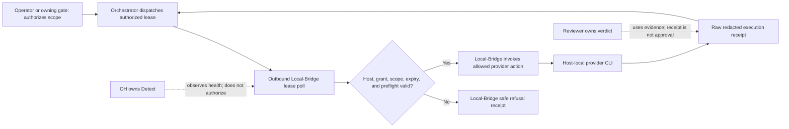

### Epic: EP-PER-003 Wave 2 delivery evidence and atomic ownership
Priority: P0
Size: L

#### Objective

Create verifiable delivery-evidence contracts for the Wave 2 Discovery-Agent, PO-Agent, Reviewer-Agent, SBR-Agent, and UAT-Agent personas. Preserve each persona's atomic accountability, peer boundaries, and handoff artifacts while distinguishing current from target authority and treating `ratified`, `built`, `commissioned`, and `effective` as independent evidence-backed states.

#### Release Value

Operators and agents can tell what has merely been documented, what code exists, which principal is authorized to act, and which behavior is actually active. Delivery gates consume attributable evidence from the correct owner instead of treating a UI, runtime label, group vote, or completed task as authority.

#### Success Criteria

- Each persona has a versioned evidence packet with separate `ratified`, `built`, `commissioned`, and `effective` claims, each carrying an evidence reference, observed version, timestamp, and verifier.
- Every packet records `currentAuthorityOwner`, `targetAuthorityOwner`, transition conditions, exceptions, and the safe behavior while a transition remains incomplete.
- Discovery capture remains attributable and distinct from Liaison carriage/continuity.
- PO value, scope, MoSCoW, and outcome attestation remain distinct from named Stakeholder decisions and PM delivery economics.
- Reviewer produces a structurally independent current-HEAD verdict; Orchestrator owns review dispatch, gate evaluation, merge, and closeout.
- SBR owns seeded-specification review and reversible write-back custody; named Stakeholders own content and R-36 decisions, and R-36 remains identified as designed rather than built.
- UAT owns readiness, process, scenario evidence, round state, and closeout while PO, named Stakeholder, PM, Reviewer, and Orchestrator retain their atomic decisions.
- No delivery claim advances because a later state was inferred from an earlier one: ratification does not prove build, build does not commission, and commissioning does not prove effective deployment.

#### Feature Scope

- Produce separate evidence/effectivity packets for Discovery, PO, Reviewer,
  SBR, and UAT.
- Bind each handoff to the object version, current owner, target owner,
  authority reference, and independent verifier.
- Preserve conjunctive gates as separately attributable attestations.
- Keep R-36 designed/not-built until separately ratified, implemented, and
  verified.

#### Assumptions

- Existing Discovery, SBR, review, and UAT surfaces may act only under their
  current recorded owner or stand-in.
- Named Stakeholder identity and decisions can be stored as attributable
  evidence.
- Reviewer independence can be proven for the exact current HEAD.
- Wave 1 evidence contracts are available before Wave 2 effectivity.

#### Dependencies

| Dependency | Type | Owner | State |
|---|---|---|---|
| EP-PER-001 authority/effectivity contract | Governance | Operator | Blocking |
| EP-PER-002 protocol/event/execution evidence | Foundation | Wave 1 owners | Blocking for commissioning |
| Current R-36 ruling | Workflow authority | Operator | Effective; amendment proposed |
| Named Stakeholder and Reviewer evidence paths | Gate evidence | Current owners | Partial |

#### I Know I Am Done When

- Five schema-complete persona evidence packets validate and cross-link to their canonical persona/RACI documents.
- Every conjunctive gate preserves separately attributable attestations rather than a shared or majority-vote Accountable assignment.
- Every current-versus-target difference has a named transition owner and fail-closed interim behavior.
- Evidence replay reproduces the same status result from immutable source references.
- Independent review finds no Liaison/Discovery, PO/Stakeholder, Reviewer/Orchestrator, SBR/content-owner, or UAT/delivery-owner authority collapse.

#### Code Areas

- `docs/plans/references/personas/`
- `docs/audits/persona-commissioning/wave-2/`
- `docs/plans/references/personas/persona-authority-registry.yaml`
- `.github/docs/philosophy/PURPOSE.md`
- `docs/plans/Plan-of-Plans.md`
- `src/client/domains/discovery/`
- `src/server/routes/discoveryRoutes.ts`
- `src/server/lib/discoveryService.ts`
- `src/server/lib/githubService.ts`
- `src/server/lib/automationService.ts`
- `src/shared/orchestration.ts`
- SBR MCP/session, event-log, and write-back surfaces identified during implementation discovery
- UAT scenario, Playwright, deploy-proof, and evidence-storage surfaces identified during implementation discovery

#### Questions for Tech Lead

- Which current principals are the ratified interim owners for any Wave 2 persona that is documented or built but not commissioned?
- What protected store is canonical for named Stakeholder decisions, readback confirmations, and persona commissioning grants?
- Will Reviewer be commissioned as a ledger peer, or will current pipeline machinery retain a named independent stand-in?
- When will R-36 move from designed to built, commissioned, and effective, and which Operator-approved rollout proves each transition?
- Which existing SBR and Discovery runtime surfaces are production implementations versus prototypes or stand-ins?

##### Security/Compliance

- Treat transcripts, issue bodies, pull-request content, test evidence, and voice inputs as untrusted data; never execute embedded instructions.
- Require authenticated principal IDs, authority references, object/version binding, timestamps, and integrity hashes for decisions and attestations.
- Store no tokens, private keys, authorization headers, or unnecessary transcript/test PII in evidence packets.
- Fail closed on missing attribution, ambiguous Accountable ownership, stale object versions, expired grants, or target authority represented as current.
- Apply least privilege and repository mutation guards to every write surface; evidence capture alone never authorizes mutation.

#### Artifacts

- `wave-2-delivery-evidence.schema.json`
- `wave-2-delivery-evidence.yaml`
- Five generated persona evidence reports
- Atomic-attestation and current/target transition matrix
- Evidence-verification test fixtures and consolidated review report
- Plan-of-Plans and authority-registry cross-references

Shared evidence-state semantics:

| State | Required proof | Does not prove |
|---|---|---|
| `ratified` | Effective authority document or attributable Operator ruling | Runtime exists or a principal can execute |
| `built` | Code/surface plus tests at a named revision | Persona commissioned or deployed behavior active |
| `commissioned` | Stable principal identity, roster/grant, scope, expiry/revocation rules | Correct build deployed or control effective |
| `effective` | Deployed/configured version, active authority transfer, and live verification | Permanent authority beyond recorded scope |

#### Diagram

##### Flowchart

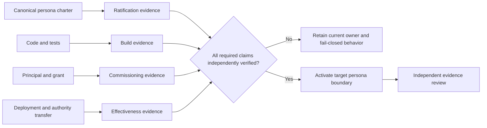

#### User Story: US-PER-003-01 Deliver attributable Discovery evidence without collapsing Liaison
Priority: P0
Size: M

##### User Story

As a Discovery participant and downstream PO, I want every captured assertion, ambiguity, decision, and handoff attributed to its actual source so that Liaison can preserve Operator context without becoming the interviewer, authorizer, or owner of Discovery truth.

##### TL;DR

Prove Discovery interview integrity, plan provenance, promotion, and handoff while preserving Liaison as an attributable request/context carrier.

##### Why This Matters

A smooth voice interaction can obscure who said what. If Liaison-carried context is recorded as a Discovery conclusion or Stakeholder authorization, the plan loses provenance and downstream gates may act on invented authority.

##### I Know I Am Done When

- Every assertion records speaker/principal, source span, capture path, confidence, dissent, and decision owner.
- Discovery owns interview conduct, ambiguity remediation, Stage-0/1 drafting, and `discovery.plan_ready` truth.
- Liaison may invoke, carry context, or report status but cannot conduct, approve, promote, or assert Stakeholder intent unless separately commissioned into that exact role.
- Prototype/stand-in runtime evidence is not reported as production Discovery commissioning.

##### Acceptance Criteria

- A Liaison-carried request records both `originatingPrincipalId` and `liaisonCaptureId`; the Liaison is not substituted as the source.
- Discovery promotion requires schema/ambiguity evidence and attributable Operator confirmation; silence, timeout, or Liaison readback never promotes.
- R-36 capture names one `decidingStakeholderId`; Discovery captures stated intent but neither grants nor withholds loop engagement.
- The output is a provenance-rich Stage-0/1 skeleton, not direct-seed approval; the unassigned seeding Accountable gap remains fail-closed.
- The status packet records the live Discovery surface as prototype/stand-in unless production identity, grant, build, deployment, and effective authority are separately proven.

##### MoSCoW

- **Must Have**:
  - Attributable transcript/assertion and ambiguity ledgers.
  - Operator-confirmed promotion evidence.
  - Discovery/Liaison boundary and delivery-state proof.
- **Should Have**:
  - Cross-session bookmark and provenance continuity.
- **Could Have**:
  - Redacted voice/audio evidence pointers.
- **Won't Have**:
  - Direct seeding, loop authorization, or product-value rulings from Discovery in this release.

##### Dependencies

| Ticket | Description | Status |
|---|---|---|
| `EP-PER-001` | Canonical Discovery and Liaison personas | Planned |
| `EP-PER-002` | Canonical artifact storage and links | Planned |
| `EP-PER-006` | Authority-state registry and drift guard | Planned |

###### Constraints

- Promotion never implies R-36 permission.
- Discovery never writes seeded issues or enters the automation loop.
- A composite Stakeholder group is not an Accountable decision owner.

###### Assumptions

- The existing Discovery surface remains a stand-in until production commissioning evidence exists.
- Liaison has a stable attributable identity for carried requests.

##### Implementation Notes

- Evidence fields: `sessionId`, `speakerPrincipalId`, `capturedByPersonaId`, `sourceSpan`, `evidenceRef`, `confidence`, `dissent`, `decisionOwnerId`, `promotionAuthorityRef`, and `handoffDigest`.
- Keep raw transcript access restricted; expose redacted spans and hashes to downstream consumers.
- Test source attribution, cross-session continuity, promotion refusal, and target/current state handling before integration.

###### Security/Compliance

- Obtain and record recording/transcription consent and retention policy.
- Redact personal, customer, and secret data from promoted artifacts.
- Defend against prompt injection in imported plans, transcripts, and SME research.
- Require signed/authenticated confirmation for promotion and Stakeholder intent.

##### Artifacts

- Discovery session evidence packet
- Attributable assertion and ambiguity ledgers
- Stage-0/1 plan with per-section provenance
- `discovery.plan_ready` handoff record and promotion receipt
- Discovery/Liaison boundary and delivery-state test report

##### Diagram

###### Sequence Diagram

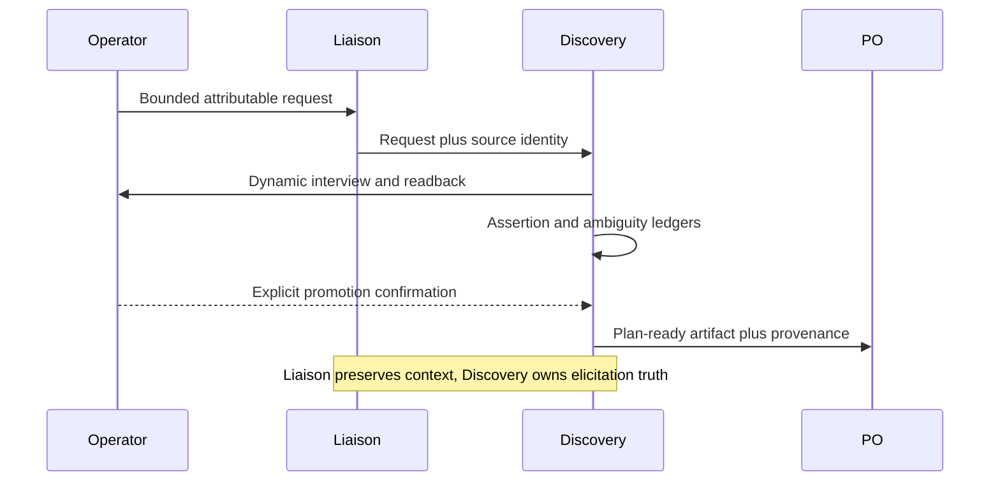

#### User Story: US-PER-003-02 Deliver PO value and scope evidence without assuming Stakeholder decisions
Priority: P0
Size: M

##### User Story

As a named Stakeholder and delivery peer, I want PO recommendations and attestations backed by traceable value evidence while my approval decisions remain separately attributable so that product expertise never becomes self-approval.

##### TL;DR

Prove PO ownership of UVP, business justification, MoSCoW, curation, scope disposition, and outcome attestation while preserving Stakeholder decisions, PM economics, and Orchestrator execution.

##### Why This Matters

PO evidence shapes investment and scope, but the author of a recommendation must not silently become the approver. Group-valued sign-off also obscures who accepted risk, budget, loop engagement, or business outcomes.

##### I Know I Am Done When

- Every value claim traces to BA/SME evidence and a versioned Project Scope.
- PO recommendations and business-outcome attestations are separate from named Stakeholder approvals.
- PM owns schedule/cost/change administration and Orchestrator owns issue/PR mutation and delivery mechanics.
- PO delivery-state claims are independently evidenced rather than inferred from the charter's existence.

##### Acceptance Criteria

- UVP records target customer, problem, solution, differentiation, sources, assumptions, and contrary evidence.
- MoSCoW and scope dispositions identify the PO as Accountable for the recommendation and one named Stakeholder for any required approval.
- An R-36 decision carries `decidingStakeholderId`, authority, PS/version, choice, timestamp, and gate state; PO is Consulted and cannot assert it.
- UAT retains separate PO business-outcome attestation and named Stakeholder acceptance.
- Out-of-scope change uses PO value/scope negotiation, PM cost/schedule administration, and named Stakeholder approval; PO does not mutate the backlog.

##### MoSCoW

- **Must Have**:
  - Traceable value, UVP, MoSCoW, and curation evidence.
  - Named Stakeholder decision records.
  - PO/PM/Orchestrator atomic boundaries.
- **Should Have**:
  - Conflict-of-interest and contrary-evidence fields.
- **Could Have**:
  - Market-evidence freshness indicators.
- **Won't Have**:
  - Anonymous group approval or PO self-approval in this release.

##### Dependencies

| Ticket | Description | Status |
|---|---|---|
| `US-PER-003-01` | Promoted Discovery evidence and provenance | Required |
| `EP-PER-005` | RACI overlap and conflict controls | Planned |
| `EP-PER-006` | Authority/principal registry | Planned |

###### Constraints

- Product priority cannot override an R-36 hold or missing enabled-gate decision.
- Value recommendations do not authorize spend, mutation, merge, or acceptance.
- The PO recuses from approving evidence it authored where a material conflict exists.

###### Assumptions

- Named Stakeholders have resolvable principal IDs and authority references.
- PM and Orchestrator provide their own economic and execution receipts.

##### Implementation Notes

- Evidence fields: `valueClaimId`, `sourceRefs`, `assumptions`, `counterEvidence`, `moscowVersion`, `scopeDisposition`, `poAttestation`, and `stakeholderDecisionRef`.
- Generate one curation handoff that preserves Discovery provenance and identifies every unresolved decision.
- Validate that every approval points to an authenticated principal rather than `Stakeholders` as a group label.

###### Security/Compliance

- Record source licensing and confidentiality for analyst/customer/partner research.
- Minimize customer and market-sensitive data in public backlog artifacts.
- Require authenticated, scoped Stakeholder decisions and immutable decision provenance.
- Disclose SME/PO conflicts and preserve dissent rather than suppressing it.

##### Artifacts

- Value case and UVP evidence register
- Versioned MoSCoW and curation handoff
- Named Stakeholder decision records
- PO business-outcome attestation template
- PO delivery-state and boundary verification report

##### Diagram

###### Flowchart

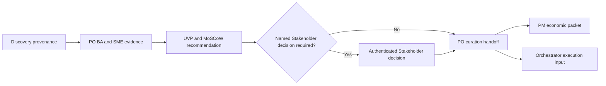

#### User Story: US-PER-003-03 Deliver structurally independent current-HEAD review evidence
Priority: P0
Size: L

##### User Story

As an Orchestrator and merge-gate consumer, I want an independent verdict bound to the current pull-request HEAD so that stale, self-authored, refused, or thread-incomplete review evidence can never authorize merge.

##### TL;DR

Prove reviewer independence, temporal coverage, thread disposition, CI context, and typed verdict while leaving gate enforcement and merge with Orchestrator.

##### Why This Matters

Green CI, an old review, or a bot refusal can look reassuring while providing no usable review. Built pipeline machinery also does not prove that a standalone Reviewer principal is commissioned.

##### I Know I Am Done When

- Every verdict records reviewer identity, worker identity, review surface, HEAD SHA, kind/subreason, findings, thread state, and CI context.
- Reviewer identity is structurally independent from the worker for the issue.
- Orchestrator requests/re-dispatches review, consumes the verdict, evaluates gates, and merges; Reviewer does none of those actions.
- Built review machinery and Reviewer commissioning/effectiveness are reported separately.

##### Acceptance Criteria

- A verdict is `usable_pass` only for an independent review of current HEAD with zero unresolved finding threads and non-red CI.
- `predates_head`, `no_review`, `service_failure`, refusal, stale local evidence, open findings, changes requested, or unresolved threads cannot pass.
- Green CI is a precondition, not a review verdict.
- A new fix commit invalidates prior temporal coverage and requires re-review of the new HEAD.
- The commissioning packet identifies a stable Reviewer principal/grant or names the current structurally independent stand-in; absence remains blocking.
- Reviewer may adjudicate its own findings but cannot dispatch, reprioritize, override a gate, merge, close, or resolve findings it did not adjudicate.

##### MoSCoW

- **Must Have**:
  - Independent identity and current-HEAD binding.
  - Typed verdict/subreason and thread truth.
  - Reviewer/Orchestrator authority separation.
- **Should Have**:
  - Review-surface and liveness evidence.
- **Could Have**:
  - Voice narration linked to, but never replacing, the verdict.
- **Won't Have**:
  - Self-review, majority-vote acceptance, or merge authority for Reviewer.

##### Dependencies

| Ticket | Description | Status |
|---|---|---|
| `EP-PER-006` | Commissioning/current-authority registry | Planned |
| `src/server/lib/githubService.ts` | Existing verdict and temporal-coverage machinery | Built evidence source |
| `src/server/lib/automationService.ts` | Existing Orchestrator gate/round behavior | Built evidence source |

###### Constraints

- GitHub current HEAD and review-thread state are authoritative at the action boundary.
- Administrative handoff commits follow the ratified temporal-coverage exception only.
- A task ack, spoken summary, or completed review request is not a verdict.

###### Assumptions

- At least one structurally independent reviewer provider or current stand-in can be named.
- Orchestrator retains all merge and gate mutations.

##### Implementation Notes

- Canonical verdict fields: `pr`, `headSha`, `reviewerPrincipalId`, `workerPrincipalId`, `reviewSurface`, `kind`, `subReason`, `findingRefs`, `unresolvedThreadIds`, `ciState`, and `observedAt`.
- Add regression fixtures for self-review, predates-head, bot refusal, service failure, green-CI-only, unresolved thread, and new-head re-review.
- Commissioning evidence must point to a principal/grant/roster record; code symbol existence is only build evidence.

###### Security/Compliance

- Use least-privilege review credentials and prevent reviewer tokens from acquiring merge scope.
- Sanitize untrusted diff, comment, and review content before logging or rendering.
- Preserve reviewer identity and conflict/recusal records.
- Re-read HEAD, threads, and checks immediately before merge-gate consumption.

##### Artifacts

- Current-HEAD verdict schema and evidence packet
- Independence/recusal record
- Temporal-coverage and thread-truth test suite
- Reviewer build-versus-commissioning status report
- Orchestrator gate-consumption receipt

##### Diagram

###### Sequence Diagram

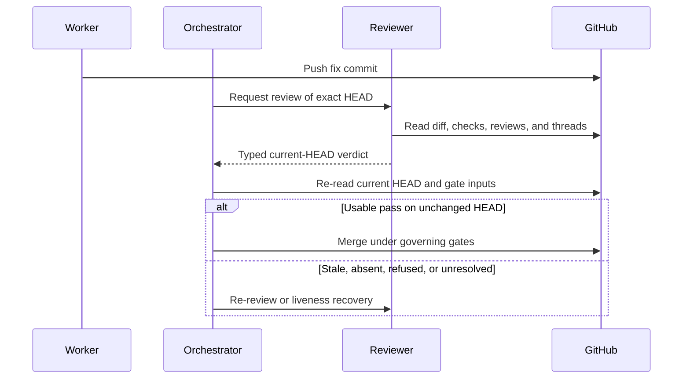

#### User Story: US-PER-003-04 Deliver SBR review and reversible write-back evidence without content authority
Priority: P0
Size: L

##### User Story

As a named Stakeholder and seeded-backlog owner, I want SBR to provide cited specification verdicts and reversible surgical write-back so that I retain content decisions and R-36 authority while SBR retains review-session and mutation custody.

##### TL;DR

Prove verbatim specification review, evidence-backed verdicts, snapshot-FACT-before-write, rollback, and exact R-36 semantics without granting SBR content, priority, dispatch, or permission authority.

##### Why This Matters

The SBR surface is both a review container and an editing mechanism. Without atomic attestations, a session can appear to authorize content, loop engagement, or broad issue rewriting that belongs to a named Stakeholder or Orchestrator.

##### I Know I Am Done When

- Every verdict cites verbatim issue text, the obligation under test, and evidence for positive claims.
- Every write-back is Stakeholder-decided, uses current GitHub truth, lands a pre-write FACT, and has verified rollback custody.
- R-36's designed state is not reported as built or effective.
- SBR review/pass, Stakeholder content decision, Operator readback where required, and Orchestrator runtime enforcement remain separate.

##### Acceptance Criteria

- SBR reviews only already-seeded Project Scope trees and never authors Discovery input or seeds/re-parents/re-labels work.
- A write-back touches only approved subsections, never shrinks or wholesale re-renders the body, and aborts if the snapshot FACT does not land or current content changed.
- Value/MoSCoW/priority disputes route to PO; unresolved intent routes to Discovery/named Stakeholder; missing work routes to Orchestrator/plan fan-out.
- R-36 Level 1 is a per-project `gateEnabled` toggle, default OFF; Level 2 is a named Stakeholder PS decision of `bypass` or `hold`.
- With the gate OFF there is no permission requirement. With it ON, absence is not permission and is not `hold`; SBR only surfaces the request, while the named Stakeholder asserts the decision.
- The SBR pass itself never blocks dispatch; only the effective R-36 permission state can block a PS.

##### MoSCoW

- **Must Have**:
  - Verbatim/cited verdict evidence.
  - Stakeholder-decided reversible write-back.
  - Exact R-36 current/target and authority semantics.
- **Should Have**:
  - Session pause/resume and per-subsection custody evidence.
- **Could Have**:
  - Voice readback linked to the underlying text/hash.
- **Won't Have**:
  - SBR-owned content truth, seeding, prioritization, dispatch, merge, or inferred consent.

##### Dependencies

| Ticket | Description | Status |
|---|---|---|
| `US-PER-003-02` | PO and named Stakeholder decision boundaries | Required |
| `EP-PER-006` | Authority registry and current/target state | Planned |
| R-36 Operator ruling | Two-level gate contract | Ratified design evidence |

###### Constraints

- R-36 is designed, not built; no code currently reads the toggle/permission record.
- The event log, not the session store, is the durable FACT source.
- Silence, timeout, pending review, or session completion never grants permission.

###### Assumptions

- The SBR MCP/session/write-back surfaces can expose versioned evidence without expanding authority.
- Named Stakeholder and Operator readback identities are authenticatable.

##### Implementation Notes

- Verdict fields: `issue`, `level`, `subsection`, `originalContentHash`, `obligationRef`, `verdict`, `evidenceRefs`, and `approvedContentHash`.
- Write-back gate: named Stakeholder decision, required Operator readback, landed snapshot FACT, live-body hash match, bounded mutation, and rollback verification.
- Model R-36 design/build/commission/effectiveness independently from the already-built SBR review surface.
- Add closed-issue and stale-snapshot regression fixtures.

###### Security/Compliance

- Enforce read-only mode before every mutation and allow only the bounded write-back operation.
- Treat issue content and voice/session input as untrusted.
- Require immutable pre-write evidence and reject stale hashes.
- Preserve who decided content, who confirmed readback, and which SBR principal executed the write.

##### Artifacts

- SBR verdict and write-back schemas
- Verbatim citation and evidence packet
- Snapshot FACT, mutation receipt, and rollback proof
- R-36 state/authority contract and designed-not-built evidence
- SBR current/target delivery-state report

##### Diagram

###### Flowchart

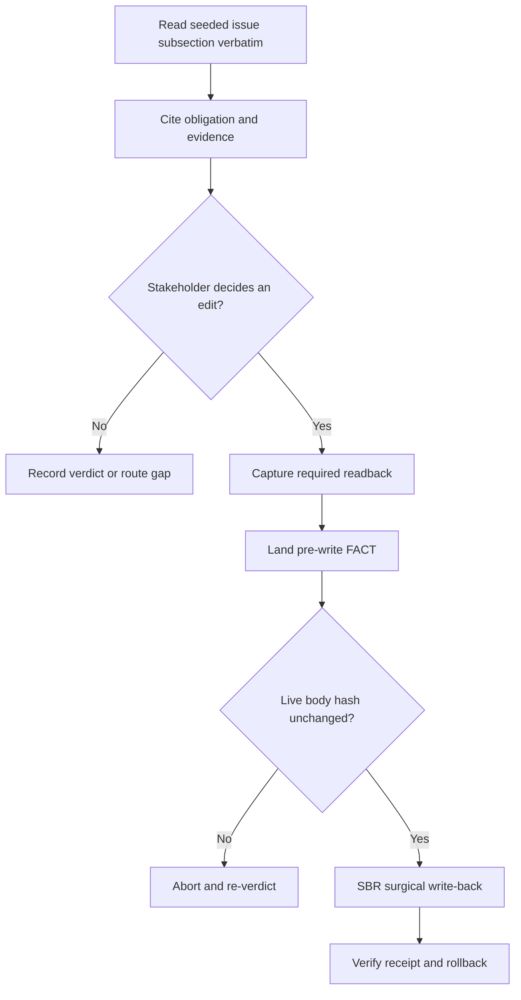

#### User Story: US-PER-003-05 Deliver UAT process evidence with atomic outcome and delivery owners
Priority: P0
Size: L

##### User Story

As a PO and named Stakeholder, I want a frictionless UAT round backed by readiness and scenario evidence so that I assess business expectations rather than basic functionality while each remediation, economic, technical-review, and acceptance decision retains its owner.

##### TL;DR

Prove merged/deployed/function-tested readiness, UAT scenario execution, Round[n+1] evidence, and conjunctive closeout without giving UAT scope, mutation, forecast, or business-acceptance authority.

##### Why This Matters

UAT loses value when participants discover broken controls or when a finding silently becomes backlog scope. Shared “PO + Stakeholder + UAT” sign-off also hides which attestation failed and who can remediate it.

##### I Know I Am Done When

- Every UAT candidate has merged, deployed, function-tested, and instruction evidence before release to business participants.
- UAT owns process verdict, evidence integrity, round state, notification, and closeout.
- PO owns scope/outcome definitions and business-outcome attestation; each named Stakeholder owns acceptance.
- PM owns cost/schedule/change administration, Reviewer owns current-HEAD technical verdict, and Orchestrator owns all issue/PR/lane/dispatch/remediation/merge mutations.

##### Acceptance Criteria

- A gate cannot open without named issue/version, deployment proof, functional test evidence, realistic prerequisites/data, numbered steps, expected results, and UAT instructions.
- A finding records observed/expected behavior, reproduction, evidence, scope proposal, and retest result; UAT cannot mutate an issue or lane.
- PO disposition determines in-scope versus proposed scope change against approved definitions.
- Out-of-scope work requires PM's impact/change-order packet and a named Stakeholder approval/rejection; no quiet absorption occurs.
- Closeout evaluates separate UAT process verdict, PO outcome attestation, required Stakeholder acceptance, and applicable Reviewer current-HEAD verdict as a conjunction, not a vote.
- A tie or missing attestation keeps the gate closed; remediation routes through Orchestrator and Round[n+1] is independently verified.

##### MoSCoW

- **Must Have**:
  - Pre-UAT functional/deploy/readiness evidence.
  - Repeatable realistic scenarios and finding packets.
  - Atomic UAT/PO/Stakeholder/PM/Reviewer/Orchestrator ownership.
- **Should Have**:
  - Round velocity and blocker evidence for Optimizer/PM.
- **Could Have**:
  - Sample voice/media fixtures for applicable UAT paths.
- **Won't Have**:
  - UAT-owned backlog mutation, priority, forecast, merge, or business acceptance.

##### Dependencies

| Ticket | Description | Status |
|---|---|---|
| `US-PER-003-02` | PO outcomes and named Stakeholder decisions | Required |
| `US-PER-003-03` | Current-HEAD technical review evidence | Required |
| `EP-PER-006` | Authority and drift validation | Planned |

###### Constraints

- Functionality is verified before business UAT, including automated UI/UX coverage where applicable.
- Realistic test data must not expose production secrets or personal data.
- A UAT finding is evidence, not mutation authority.

###### Assumptions

- Deploy provenance and test artifacts are retrievable by immutable references.
- Named Stakeholders can provide separately attributable acceptance decisions.

##### Implementation Notes

- Candidate fields: `gateId`, `issueRefs`, `commitShas`, `deploymentRef`, `functionalEvidenceRefs`, `uatInstructions`, and `releasedAt`.
- Finding fields: `scenarioId`, `observed`, `expected`, `reproduction`, `artifactRefs`, `scopeDispositionRef`, `remediationRef`, and `retestVerdict`.
- Closeout stores each atomic attestation separately and derives the conjunction without overwriting source verdicts.
- Add negative tests for undeployed, untested, stale Reviewer verdict, missing Stakeholder, out-of-scope without change order, and UAT-attempted mutation.

###### Security/Compliance

- Use sanitized realistic data and least-privilege test accounts.
- Redact recordings, screenshots, logs, and traces before durable publication.
- Prohibit destructive production test steps unless separately authorized and isolated.
- Bind every attestation to the tested deployment/version and authenticated principal.

##### Artifacts

- UAT candidate/readiness packet
- Repeatable scenario set and functional-test evidence
- Finding/remediation/retest packets
- Atomic closeout attestations and derived gate result
- UAT delivery-state and boundary verification report

##### Diagram

###### Sequence Diagram

```mermaid
sequenceDiagram
    participant Orchestrator
    participant Reviewer
    participant UAT
    participant PO
    participant PM
    participant Stakeholder
    Orchestrator->>UAT: Deployed candidate and function-test proof
    Reviewer-->>UAT: Current-HEAD technical verdict
    UAT->>UAT: Execute scenario and preserve evidence
    UAT-->>PO: Finding and outcome evidence
    PO-->>UAT: Scope disposition and outcome attestation
    PM-->>UAT: Schedule/cost packet when needed
    Stakeholder-->>UAT: Separate acceptance or change decision
    UAT->>UAT: Evaluate conjunctive closeout
    UAT-->>Orchestrator: Typed remediation request if gate remains closed
```

### Epic: EP-PER-004 Wave 3 — Delivery Forecast and Bounded Coordination

Priority: P0
Size: XL

#### Objective

Deliver the Wave 3 planning and coordination contracts for PM-Agent,
Scrum-Coordinator, the inherited Scrum-Participant attendance contract, and
Liaison-Agent without transferring product value, budget authority, domain
truth, or hard-action authority.

The Epic must preserve three separate states for every capability:

1. **Current** — authority and runtime behavior positively proven today.
2. **Target** — the proposed accountable model after Operator GOVERN.
3. **Effective** — target behavior whose ratification, principal, grant,
   implementation, verification, and activation conditions all hold.

Target-state prose never changes current authority by itself.

#### Release Value

Stakeholders receive traceable delivery forecasts and change impacts; peers
receive a bounded, repeatable way to coordinate joint work and resolve timely
impasses; and the Operator can delegate cross-peer coordination without
creating a mandatory intermediary or universal super-agent. Conflict,
recusal, minority views, ties, and overdue decisions remain visible rather
than being flattened into fabricated consensus.

#### Success Criteria

- [ ] PM delivery forecast, variance, runway, change administration, and impact
      communication are separated from PO product value, Token actuals, and
      Operator or named-Stakeholder budget authorization.
- [ ] Scrum-Coordinator owns ceremony sequence, frozen roster, barriers,
      timebox, record completeness, debt, and closeout only.
- [ ] Scrum-Coordinator has no content verdict, domain decision, casting vote,
      dispatch, review, merge, deploy, quarantine, Detect, or AAH authority.
- [ ] Scrum-Participant is implemented as behavior inherited by an attending
      persona under that persona's identity, with no separate principal,
      AgentCard, credential, grant, or standing runtime.
- [ ] Liaison executes only a verifiable, bounded, revocable Operator
      delegation, remains optional, and cannot perform or authorize a hard
      action.
- [ ] All 2-, 3-, 4-, and n-party efforts record conflicts of interest,
      scoped recusals, eligible roster, advisory result, dissent, Accountable
      owner, and effectivity state.
- [ ] Advisory voting never transfers RACI Accountability; ties, failed quorum,
      missing required owners, and incompatible Accountable owners preserve the
      last-known-safe state and escalate.
- [ ] Every ad hoc Agentic-Scrum closes or escalates at T0+30; extension is
      forbidden.
- [ ] Direct Operator-to-peer and ordinary peer-to-peer paths continue to work
      when Liaison is absent, expired, revoked, or bypassed.

#### Feature Scope

- PM forecast, variance, runway, impact, and change-order administration.
- Scrum-Coordinator container, barrier, roster, timebox, debt, and closeout.
- Scrum-Participant inherited attendance and recommendation conduct.
- Liaison bounded delegation, task-graph continuity, synthesis, and readback.
- Shared multi-party COI, recusal, advisory, tie, and escalation contract.
- Current/target/effective-state evidence and activation gates.

#### Assumptions

- `.github/docs/philosophy/PURPOSE.md` remains the current authority source
  until an Operator-ratified amendment becomes effective.
- #2002 is a proposal and source-preservation vehicle, not ratification.
- The current `docs/scrums/README.md` rotation remains authoritative until the
  Operator ratifies its replacement or demotion.
- Token-Agent is proposed and has no current authority; historical usage/cost
  truth remains with the current accountable owner until an explicit transfer
  becomes effective.
- Every hard action continues through its owning lane's positive-truth and
  permission gates.

#### Dependencies

| Ticket or artifact | Dependency | State |
|---|---|---|
| #2002 | Operator GOVERN amendment proposal and preserved persona corpus | Proposed; not effective |
| #1909 / #1921 / #1934 | KPI plane and canonical provider-usage actuals | Planned/in progress |
| #1743 / #1977 | Typed coordination record and active ledger rollover | Interim transport |
| `docs/scrums/README.md` | Current ceremony and round-robin contract | Current authority |
| `docs/scrums/roster.json` | Proposed frozen-roster input | Must be repo-governed |
| ACI delegation profile | Envelope, peer recognition, lifecycle, conformance | Target dependency |
| EMI Event/FACT profile | Observable coordination and effectivity events | Target dependency |

#### Current, Target, and Effectivity Register

| Surface | Current | Target | Becomes effective only when |
|---|---|---|---|
| PM-Agent | Draft persona; no proven commissioned PM principal | Accountable for delivery forecast, variance, runway, change administration, and impact communication | PURPOSE amendment ratified; principal/grant registered; implementation verified; explicit responsibility transfer recorded |
| Scrum-Coordinator | `docs/scrums/README.md` round-robin remains authoritative; standing coordinator is not commissioned | Standing servant-conductor with the rotation retained as standby | Operator registers `scrum-coordinator` and ratifies the README change; runtime, watchdog separation, and closeout UAT pass |
| Scrum-Participant | Existing attendees follow the current ceremony contract under their own identities | Every attending commissioned persona inherits the common attendance/conduct contract | The common contract is ratified for that ceremony and the underlying persona is in an active attendance window; no new identity is created |
| Liaison-Agent | Proposed, not ratified or built as E.V.A.; direct Operator-to-peer path is current | Optional Operator-assistance plane for bounded delegation and attributable synthesis | PURPOSE/card boundary ratified; `liaison-agent` principal and least-privilege grant exist; ACI recognition/runtime tests pass; a valid envelope is active |

#### Joint-Effort, COI, Advisory, and Tie Contract

Every joint effort records `effortId`, `decisionId`, objective, scope,
authority reference, Accountable principal, Responsible/Consulted/Informed
principals, expected artifacts, evidence, dependencies, conflicts, response
deadlines, stop conditions, independent verifier, current/target/effective
state, and final disposition.

A participant discloses a scoped conflict when it authored or executed the
disputed work, would review itself, benefits from the KPI/resource/acceptance
result, issued the challenged ruling, shares an identity/session/provider or
evidence source that defeats independence, or is under delegation pressure
inconsistent with its charter. Recusal is scoped to evidence synthesis,
recommendation, decision, or verification. A recused peer may remain an
attributable factual witness. Recusal never transfers authority to Liaison or
Scrum-Coordinator. If the Accountable owner is implicated and no independent
substitute exists, the Operator decides the waiver or authority question.

RACI decisions are not democratic. The atomic non-conflicted Accountable owner
decides within its grant after consultation. A ballot is advisory evidence
only. Freeze eligible roster `E` after accepted decision-scope recusals;
quorum is `Q = max(2, ceil(2E/3))`; every non-recused Accountable owner whose
lane must act must respond; a unique option needs more than `E/2` support.
Abstention counts toward quorum but not support. Silence is neither consent nor
abstention and receives one reissue. The facilitator has no casting vote.

| Joint effort | Quorum and advisory recommendation | Impasse |
|---|---|---|
| 2-party (`E=2`) | `Q=2`; only 2-0 can recommend | 1-1, silence, recusal leaving fewer than 2 eligible |
| 3-party (`E=3`) | `Q=2`; at least 2 support one unique option | 1-1-1, equal top options, no option above 1.5, missing required owner |
| 4-party (`E=4`) | `Q=3`; at least 3 support one unique option | 2-2, 2-1-1, failed quorum, missing required owner |
| n-party | `Q=max(2,ceil(2E/3))`; unique option above `E/2` | Equal top options, no strict majority, failed quorum, required-owner absence |

An impasse preserves committed scope and the last-known-safe state. One
non-conflicted domain owner may rule inside its existing grant. Incompatible
Accountable owners, authority collisions, contested recusals, grant ambiguity,
or constitutional change escalate to the Operator.

#### Thirty-Minute No-Extension Contract

| Window | Phase | Required output |
|---|---|---|
| T0-3 | Open | Freeze decision, roster, RACI, options, COIs, and authority owners |
| T3-8 | Self-improvement | Each peer names its contribution, gap, and bounded change |
| T8-13 | Peer-read | Steelman every position; record agreement, dispute, and missing evidence |
| T13-18 | Self-reflection | Update, retain, or withdraw positions with reasons |
| T18-23 | Recommendation | Option, evidence, risk, falsifier, dissent, optional advisory ballot |
| T23-28 | Co-remediation | One Accountable owner per action, helpers, tests, dependency, checkpoint, verifier |
| T28-30 | Closeout | Ruling or tie, dissent, debt, actions, escalation, next observation |

At T0+30 the container closes. Unresolved items become owned, deadlined debt
and escalation records. The meeting is never extended or immediately repeated
unchanged.

#### I Know I Am Done When

- [ ] All four Stories satisfy their commissioning and negative-authority tests.
- [ ] Current, target, and effective states are queryable and agree across
      governance, registry, runtime, Event/FACT, UI/voice, and audit surfaces.
- [ ] 2-, 3-, 4-, and n-party fixtures prove quorum, recusal, dissent, tie,
      failed-quorum, required-owner, and no-casting-vote behavior.
- [ ] A 30-minute test clock proves hard closeout and escalation with no
      extension path.
- [ ] PM, PO, Token/current accounting owner, Optimizer, Operator, Coordinator,
      Participant, Liaison, and domain owners retain atomic Accountability.
- [ ] Direct Operator-to-peer communication passes while Liaison is unavailable.
- [ ] Independent review finds no authority laundering through a forecast,
      ceremony record, advisory ballot, voice instruction, task completion, or
      silence.

#### Code Areas

- `.github/docs/philosophy/PURPOSE.md`
- `docs/scrums/README.md`
- `docs/scrums/roster.json`
- `docs/plans/references/personas/`
- `src/shared/personas.ts`
- Principal/grant registry and delegation-envelope contracts
- Coordination ledger/A2A task and Event/FACT projection surfaces
- KPI/provider-usage and PM forecast read models
- Voice identity, transcript provenance, and Operator readback surfaces

#### Questions for Tech Lead

- Which runtime component owns the current/target/effective transition record
  and rejects target-only behavior?
- How is an advisory roster frozen consistently across ledger and future A2A
  transport without making either the authorization source?
- Which current principal owns token actuals until Token-Agent transfer becomes
  effective?
- What independent non-laptop watchdog proves a standing Coordinator did not
  become a single point of failure?
- How does Liaison verify Operator identity and revocation for voice-originated
  envelopes without storing raw voice as an authorization token?

#### Security/Compliance

- Target-state cards and personas grant nothing until ratification,
  registration, least-privilege grant, verification, and activation all pass.
- `E.V.A.` is a display/voice alias only; `liaison-agent` is the sole proposed
  security and audit principal.
- Voice transcript or text provenance is integrity-bound, but raw speech,
  credentials, signing secrets, and unnecessary personal data are excluded
  from task records.
- Every delegation is allowlisted, audience-bound, expiring or one-shot,
  revocable, depth-limited, and denied after completion, expiry, revocation,
  authority conflict, or production-protection sentinel.
- Ceremony artifacts and advisory results request work; owning hard-action
  gates must re-derive positive truth at the action boundary.
- COI, recusal, dissent, and waiver records are immutable and independently
  reviewable.

#### Artifacts

| Artifact | Required content |
|---|---|
| `wave3-effectivity-register` | Current, target, prerequisites, effective time, revocation/fallback |
| `pm-forecast-and-change-record` | Actuals refs, assumptions, forecast, variance, runway, impacts, decision |
| `scrum-roster-freeze` | Roster hash, tiers, COIs, recusals, quorum, deadlines |
| `scrum-closeout` | Barrier modes, elapsed time, advisory result, dissent, debt, escalations |
| `participant-attendance-record` | Underlying persona ID, owed steps, typed responses, debt/discharge |
| `OperatorDelegationEnvelope` | Authenticated principal, bounded scope, allowed requests, exclusions, expiry/revocation |
| `liaison-final-report` | Attributed facts, contradictions, outcomes, cost/time impact, residual decisions |

#### Flowchart

```mermaid
flowchart LR
    C["Current authority"] --> P["Operator GOVERN proposal"]
    P --> R{"Ratified?"}
    R -->|No| C
    R -->|Yes| I["Principal, grant, implementation, verification"]
    I --> E{"All effectivity gates pass?"}
    E -->|No| C
    E -->|Yes| T["Effective target behavior"]
    T --> X["Expiry, revocation, suspension, or rollback"]
    X --> C

    PM["PM: forecast and variance"] -. "consults" .-> PO["PO: value and priority"]
    PM -. "consumes actuals" .-> TOK["Token/current accounting owner"]
    SC["Coordinator: container only"] -. "hosts" .-> SP["Participants: own content"]
    L["Liaison: optional bounded coordination"] -. "requests" .-> OWN["Accountable domain peers"]
```

---

#### User Story: US-PER-004-01 PM Delivery Forecast, Variance, and Change Administration

Priority: P0
Size: L

##### User Story

As a Stakeholder, I want a PM-owned delivery forecast and attributable change
packet based on measured actuals, delivery evidence, and known constraints so I
can understand schedule, runway, and variance without giving PM product-value
or budget-authorization authority.

##### TL;DR

PM owns execution economics and communication; PO owns value and priority;
Token/current accounting owner owns actuals; Operator or a named Stakeholder
authorizes budget.

##### Why This Matters

Combining actuals, forecast, value, and authorization in one agent creates a
self-approving cost model. Separating these accountabilities allows PM to give
useful delivery advice while preserving measured truth and reserved decisions.

##### Current, Target, and Effectivity

| State | Contract |
|---|---|
| Current | PM persona is proposed; no commissioned PM principal or transfer is proven |
| Target | PM is Accountable for time/token delivery forecast, variance, runway, capacity/dependency impact, change administration, and impact communication |
| Effective | Only after Operator ratification, principal/grant registration, verified implementation, and explicit transfer; Token target rows wait for separate Token commissioning |

##### Assumptions

- Historical actuals and delivery evidence remain attributable and immutable
  inputs.
- PO, named Stakeholder, Token/current accounting owner, and Operator decisions
  remain separately available.
- Forecast uncertainty and stale inputs can be represented explicitly.

##### Dependencies

| Ticket or artifact | Description | State |
|---|---|---|
| #1909 / #1921 / #1934 | Measured provider-usage facts and publication plane | Planned/in progress |
| #2002 | PM GOVERN proposal | Proposed |
| PO charter | Product value, MoSCoW, and priority | Separate Accountability |
| Optimizer evidence | Efficiency and conversion interpretation | Consulted |

##### I Know I Am Done When

- [ ] Forecasts identify actuals, assumptions, confidence, freshness, variance,
      runway, dependencies, and next observation.
- [ ] Change packets name the deciding principal and preserve its decision.
- [ ] No forecast changes product priority, budget, scope, or technical state.
- [ ] Outside-normal time/token impacts notify PM and reach Stakeholders.

##### Acceptance Criteria

- [ ] Historical token usage/cost actuals and descriptive projections are
      immutable referenced inputs; PM cannot rewrite them or call an estimate
      an invoice.
- [ ] PM computes forward token/time forecast, variance, runway, delivery
      impact, capacity, and dependency impact with explicit uncertainty.
- [ ] PO supplies value, UVP, MoSCoW, and priority decisions; PM may quantify
      consequences but cannot decide them.
- [ ] Operator or the policy-named Stakeholder approves, rejects, or revises a
      budget or change order; PM administers request, impact packet, decision
      record, and baseline update.
- [ ] A Stakeholder-held Project Scope is modeled as an intentional wait, not a
      blocker or outage; PM prices its schedule effect without recommending
      release or changing the toggle.
- [ ] Root-cause truth remains with the domain owner or authorized Auditor; PM
      owns impact synthesis and communication only.
- [ ] A PM-requested impasse uses the shared 30-minute contract; a tie preserves
      committed scope/baseline and routes to the relevant PO, Stakeholder,
      domain owner, or Operator.
- [ ] Negative tests reject PM attempts to authorize spend, re-prioritize,
      mutate technical state, or overwrite actuals.

##### Constraints

- Forecasts must distinguish zero from missing and actual from projection.
- No PM output is a merge, deploy, dispatch, budget, or value authorization.
- Current-owner evidence remains valid until the corresponding transfer is
  effective.

##### Implementation Notes

- Model actual, forecast, decision, and baseline as separate immutable/versioned
  records.
- Include `asOf`, source refs, assumptions, confidence, falsifier, normal error
  band, variance reason, and next checkpoint.
- **Artifacts:** `pm_delivery_forecast`, `pm_variance_notice`,
  `change_order_impact_packet`, `change_order_decision_ref`,
  `delivery_baseline_revision`.

##### Security/Compliance

- Budget decisions require authenticated named principals and cannot be
  inferred from silence or an advisory vote.
- Forecast views use least data necessary and do not expose provider secrets or
  prompt contents.
- Every baseline revision links the prior version and decision provenance.

##### Sequence Diagram

```mermaid
sequenceDiagram
    participant A as "Token/current actuals owner"
    participant O as "Optimizer"
    participant PO as "PO"
    participant PM as "PM"
    participant D as "Named decision principal"
    A-->>PM: Measured actuals, provenance, freshness
    O-->>PM: Efficiency evidence
    PO-->>PM: Value and priority constraints
    PM->>PM: Forecast, variance, runway, impact
    PM-->>D: Change and delivery impact packet
    D-->>PM: Approve, reject, or revise reserved decision
    PM->>PM: Record decision and version baseline
```

---

#### User Story: US-PER-004-02 Scrum-Coordinator Bounded Ceremony Container

Priority: P0
Size: XL

##### User Story

As a rostered peer, I want a Scrum-Coordinator to operate a deterministic,
never-extended collaboration container so every voice, barrier, debt, dissent,
and escalation is recorded without the facilitator deciding content or
authorizing action.

##### TL;DR

The Coordinator owns sequence, frozen roster, barriers, timebox, record
completeness, and closeout—never content, domain truth, casting vote, or hard
action.

##### Why This Matters

A facilitator with content or casting authority can launder a meeting result
into a domain decision. A facilitator without deterministic barriers and hard
closeout can instead create an endless coordination stall.

##### Current, Target, and Effectivity

| State | Contract |
|---|---|
| Current | The deterministic round-robin in `docs/scrums/README.md` remains authoritative |
| Target | `scrum-coordinator` becomes standing servant-conductor; rotation remains the capped standby ladder |
| Effective | Only when Operator registers the principal and ratifies the README change, and watchdog separation, roster, barrier, closeout, failover, and UAT evidence pass |

##### Assumptions

- The current ceremony contract remains effective until explicitly amended.
- Every roster member retains its own persona identity and authority.
- An independent watchdog can observe coordinator absence or phase stall.

##### Dependencies

| Ticket or artifact | Description | State |
|---|---|---|
| `docs/scrums/README.md` | Current eight-step/daily ceremony contract | Current |
| `docs/scrums/roster.json` | Frozen denominator, tiers, triggers, supported types | Target |
| #1743 / #1977 | Interim typed coordination surface | Active interim |
| #2005 | Obsolete Scrum scheduler cleanup | Stabilization |
| OH watchdog | Independent absence and phase-stall detection | Target; must not be hosted by Coordinator |

##### I Know I Am Done When

- [ ] The roster, COIs, recusals, options, and Accountable owners freeze at
      open.
- [ ] Barriers release by declared predicate or deadline, never facilitation
      judgment.
- [ ] Closeout occurs by T0+30 with debt and escalation for incompleteness.
- [ ] The Coordinator cannot vote, grade, dispatch, Detect, or execute.

##### Acceptance Criteria

- [ ] The container implements the T0-3, T3-8, T8-13, T13-18, T18-23,
      T23-28, and T28-30 phases with no extension branch.
- [ ] Frozen roster—not posted artifacts—defines the denominator; roster hash,
      eligible roster, recusals, quorum, and required owners are published.
- [ ] 2-, 3-, 4-, and n-party fixtures enforce the shared quorum/majority table
      and preserve dissent.
- [ ] 1-1, 2-2, equal top options, failed quorum, missing required owner, and
      contested recusal close as impasse with no facilitator casting vote.
- [ ] Each co-remediation action has exactly one Accountable owner, named
      helpers, test, dependency, checkpoint, and independent verifier.
- [ ] Incomplete work becomes owned `scrum_debt`; it does not extend a barrier
      or disappear at closeout.
- [ ] Coordinator verifies form and presence only and cannot author, grade, or
      disposition another peer's content.
- [ ] Detect/liveness routes to OH, delivery impacts to PM, domain decisions to
      the domain owner, systemic forensics to Auditor, and hard actions to the
      owning gate.
- [ ] Negative tests reject merge, deploy, dispatch, quarantine, board-write,
      priority, roster-membership, suspension, and casting-vote attempts.

##### Constraints

- A meeting artifact is never the system of record or authorization source.
- The denominator cannot be silently reduced by absence or silence.
- Coordinator state is reconstructable from shared records; no private state is
  required for standby takeover.

##### Implementation Notes

- Use roster-driven expected submissions, typed responses, writer-namespaced
  record IDs, phase-open/phase-close facts, and idempotent closeout.
- Retain the existing rotation until both Operator gates are complete.
- **Artifacts:** `scrum_open`, `scrum_roster_freeze`,
  `scrum_phase_opened/closed`, `impasse_declared`, `scrum_debt`,
  `scrum_closeout`, `scrum_conduct_failed`.

##### Security/Compliance

- Only Operator can change membership, promote blocking status, or suspend a
  peer.
- A ceremony acknowledgement, vote, recommendation, or completion grants no
  authority.
- Independent OH watchdog and capped standby prevent Coordinator
  self-attestation and single-point-of-failure.

##### Flowchart

```mermaid
flowchart LR
    O["T0-3 Open and freeze"] --> S["T3-8 Self-improvement"]
    S --> P["T8-13 Peer-read and steelman"]
    P --> R["T13-18 Self-reflection"]
    R --> A["T18-23 Recommendation and advisory ballot"]
    A --> C["T23-28 Co-remediation plan"]
    C --> X["T28-30 Closeout"]
    X --> D["Owned debt and routed escalation"]
    X -->|"ruling within existing grant"| E["Accountable owner acts through normal gate"]
    D -. "never extend" .-> O
```

---

#### User Story: US-PER-004-03 Scrum-Participant Inherited Attendance Contract

Priority: P0
Size: L

##### User Story

As an Agentic Orchestration peer attending a Scrum, I want a common inherited
attendance and conduct contract so I know what I owe while retaining only my
underlying persona's authority and identity.

##### TL;DR

Attendance adds obligations, never permissions; Scrum-Participant is behavior,
not a principal, AgentCard, credential, grant, or permanent role.

##### Why This Matters

Ceremony liveness fails when a productive peer ignores owed steps, while
governance fails when attendance is treated as a new identity or permission.
The inherited contract solves the first problem without creating the second.

##### Current, Target, and Effectivity

| State | Contract |
|---|---|
| Current | Existing rostered peers attend under their own IDs and the current README obligations |
| Target | Every commissioned persona inherits preparation, typed response, reflection, recommendation, COI, recusal, debt, and follow-through behavior while attending |
| Effective | Only during the underlying persona's attendance window and debt discharge; no separate principal/card/grant exists before, during, or after |

##### Assumptions

- Each attendee already has a stable underlying persona or explicitly bounded
  stand-in identity.
- The ceremony roster, deadlines, and required outputs are published at open.
- Typed refusal and recusal records can be retained without exposing secrets.

##### Dependencies

| Ticket or artifact | Description | State |
|---|---|---|
| `docs/scrums/README.md` | Current ceremony obligation | Current |
| Scrum-Coordinator contract | Container, barriers, deadlines, closeout | Target after commissioning |
| Underlying persona charter/grant | Sole authority source for participant actions | Required |

##### I Know I Am Done When

- [ ] The attendance record uses the underlying persona's identity.
- [ ] Every owed step is completed, typed-blocked/refused, or converted to debt.
- [ ] COI and recusal scopes are declared before advisory participation.
- [ ] No ceremony statement or agreement is treated as hard-action permission.

##### Acceptance Criteria

- [ ] There is no `scrum-participant` principal, AgentCard, token, credential,
      grant, dispatch target, or independent runtime.
- [ ] The underlying persona prepares in its own voice, reports prior-plan
      progress, answers/blocks/refuses before deadlines, and owns debt discharge.
- [ ] A typed out-of-grant refusal satisfies attendance and cannot be treated as
      liveness failure.
- [ ] Silence is neither consent nor veto; it receives one reissue and then the
      declared degraded/impasse treatment.
- [ ] Participants disclose authorship, self-review, prior ruling,
      KPI/resource benefit, delegation pressure, and identity/session/provider
      independence conflicts.
- [ ] Recusal is scoped to synthesis, recommendation, decision, or
      verification; the participant may remain an attributable fact witness.
- [ ] Every recommendation states fact, inference, assumption, confidence,
      evidence, risk, and falsifier; the target Accountable owner records
      accept/reject/defer/escalate.
- [ ] A tie leaves the decision with its existing Accountable owner and
      preserves safe state.
- [ ] Accepted actions execute only through the underlying persona's existing
      grant and owning lane.

##### Constraints

- Attending changes what a peer owes, never what it may do.
- A delegate may receive asks but cannot author the absent peer's steps.
- Human-facing Discovery, UAT, or Operator sessions may declare bounded
  non-tick windows but do not waive preparation.

##### Implementation Notes

- Model inheritance as ceremony context attached to the existing persona
  identity.
- Carry `owedSteps`, typed disposition, COI, recusal scope, advisory response,
  debt ID, and discharge reference.
- **Artifacts:** `participant_prepared`, `participant_response`,
  `participant_coi_disclosure`, `participant_recusal`,
  `participant_recommendation`, `participant_debt_discharge`.

##### Security/Compliance

- Identity and grant resolution always use the underlying persona.
- The attendance layer cannot mint tokens, widen scopes, or bypass
  read-only/permission guards.
- Independent verification rejects self-review even when two sessions share a
  persona or provider identity.

##### State Diagram

```mermaid
stateDiagram-v2
    [*] --> UnderlyingPersona
    UnderlyingPersona --> Attending : ceremony window opens
    Attending --> Responded : complete, blocked, or refused
    Attending --> Debt : deadline or closeout missed
    Responded --> UnderlyingPersona : closeout
    Debt --> Discharged : new record references debt
    Discharged --> UnderlyingPersona
    note right of Attending
      Adds obligations only
      Authority remains underlying grant
    end note
```

---

#### User Story: US-PER-004-04 Liaison Verifiable Bounded Operator Delegation

Priority: P0
Size: XL

##### User Story

As the Operator, I want an optional Liaison to faithfully translate one bounded
delegation into attributable peer requests and an evidence-backed report so I
do not have to relay every update, while retaining direct peer access and all
reserved hard-action authority.

##### TL;DR

Liaison coordinates and reports under a verifiable envelope; it never becomes a
mandatory intermediary, domain owner, dispatcher, or hard-action authority.

##### Why This Matters

Cross-peer objectives need continuity, contradiction preservation, and one
Operator readback. Without a bounded envelope, a voice-first assistant can
silently expand scope, launder authority, flatten dissent, or impersonate the
Operator.

##### Current, Target, and Effectivity

| State | Contract |
|---|---|
| Current | Liaison/E.V.A. is proposed, not ratified, not built, and not commissioned; Operator speaks directly to peers |
| Target | Optional `liaison-agent` captures bounded intent, maintains the task graph, requests peer work, preserves contradictions, monitors, and reports |
| Effective | Only after GOVERN, principal/grant/card/runtime/ACI conformance, and while a verifiable unexpired/unrevoked `OperatorDelegationEnvelope` is active |

##### Assumptions

- The Operator can authenticate to a trusted delegation issuer or ledger.
- Every receiver can validate issuer, audience, proof, time, nonce, and
  revocation.
- Direct Operator-to-peer communication remains available at all times.

##### Dependencies

| Ticket or artifact | Description | State |
|---|---|---|
| #2002 | Liaison GOVERN proposal | Proposed |
| `OperatorDelegationEnvelope` | Identity, scope, allowlist, exclusions, expiry, revocation, stop conditions | Required |
| ACI profile | Envelope validation and peer recognition | Target |
| EMI profile | Delegated-task observation and correlation | Target |
| Accountable peer charters | Domain truth and action ownership | Always authoritative |

##### I Know I Am Done When

- [ ] Every Liaison request traces to an authenticated Operator, source
      evidence, active envelope, bounded scope, and stop condition.
- [ ] Direct Operator-to-peer and peer-to-peer paths remain available.
- [ ] Every domain conclusion is attributed to its Accountable peer.
- [ ] Completion, expiry, revocation, or sentinel stops downstream work.
- [ ] No Liaison request, task result, voice statement, acknowledgement, vote,
      silence, or report authorizes a hard action.

##### Acceptance Criteria

- [ ] Envelope includes immutable delegation ID, authenticated
      `operatorPrincipal`, issue/expiry/one-shot policy, objective, scope,
      allowed request classes, excluded actions, integrity-bound source
      evidence, correlation refs, delegation depth, reporting policy, and stop
      conditions.
- [ ] `E.V.A.` remains display/voice alias; all security, card, event, task,
      owner, and audit fields use `liaison-agent`.
- [ ] One-to-many requests name every recipient, expected acknowledgement,
      artifact, deadline, and disposition owner.
- [ ] Many-to-many synthesis preserves minority positions, COIs, recusals,
      typed refusals, contradictions, confidence limits, and unresolved
      collisions.
- [ ] Liaison may recommend a lead from charter/evidence but cannot transfer
      Accountability or cast a deciding vote.
- [ ] Liaison requests the shared 30-minute container after one failed typed
      reconciliation—or immediately for authority/COI conflict—and accepts
      closeout at T0+30 without extension.
- [ ] Invalid, ambiguous, conflicting, expired, revoked, or out-of-scope
      instructions fail closed and route to Operator or the owning authority.
- [ ] Receiving peers may acknowledge, perform, request input, block, or
      typed-refuse based on charter, grant, capability, safety, and positive
      truth.
- [ ] Merge, deploy, close, board mutation, quarantine, loop stop, credential,
      policy, governance, architecture, and production-profile actions remain
      unavailable to Liaison.
- [ ] Negative UAT proves the ecosystem works without Liaison and rejects
      spoofed alias, missing audience, expired envelope, excessive delegation
      depth, revoked objective, and unauthorized hard-action requests.

##### Constraints

- Liaison is an optional coordination plane, never Stage 00 or a peer gateway.
- Liaison cannot maintain an unlimited private SME swarm; an accountable parent
  peer owns each transient SME result.
- A peer task store is not the durable authority or Event/FACT system of record.

##### Implementation Notes

- Keep delegation state machine separate from the cross-peer task graph.
- Re-validate envelope status and peer grant at each material request.
- Propagate cancellation/revocation to active receivers and produce a final
  attributable report.
- **Artifacts:** `OperatorDelegationEnvelope`, `liaison_task_graph`,
  `liaison_peer_ack`, `liaison_contradiction_register`,
  `liaison_delegation_closeout`, `liaison_operator_report`.

##### Security/Compliance

- Bind voice-originated intent to authenticated Operator session and integrity
  reference; raw voice is evidence, never a bearer authorization.
- Enforce allowlisted request classes, explicit denied hard actions,
  audience/scope, expiry, revocation cascade, depth limit, replay protection,
  and least privilege.
- Never include signing secrets or unnecessary personal transcript content in
  cards, tasks, events, or issue artifacts.
- ACI validates the contract; Liaison populates/uses it; Operator owns the
  grant; receiving peers independently evaluate it.

##### Sequence Diagram

```mermaid
sequenceDiagram
    participant O as "Operator"
    participant L as "Liaison"
    participant C as "Accountable peers"
    participant S as "Scrum-Coordinator"
    O->>L: Signed bounded delegation
    L->>L: Validate identity, scope, expiry, exclusions
    L->>C: Typed requests with envelope and deadlines
    C-->>L: Complete, input-required, blocked, or refused
    alt direct path preferred
        O->>C: Direct Operator-to-peer request
        C-->>O: Direct attributable response
    else impasse after one typed reconciliation
        L->>S: Request 30-minute advisory container
        S-->>L: Closeout, dissent, tie, debt, escalation
    end
    L-->>O: Attributed evidence, contradictions, residual decisions
    O->>L: Completion, expiry, or revocation
    L->>C: Cancel bounded outstanding requests
```

### Epic: EP-PER-005 Wave 4 Governance, Learning, and Measurement Accountability

Priority: P0
Size: XL

#### Objective

Ratify, reconcile, build, commission, and make effective the five Wave 4 personas—Inference and Model Optimization (IMO), Auditor, Provost, Token, and Optimizer—without allowing recommendation, forensic evidence, curriculum, accounting actuals, or KPI measurement to become hard-action authority.

The Epic uses five independent effectivity states:

| State | Required evidence |
|---|---|
| Designed / proposed | A reviewable charter and Atomic RACI exist; no authority is created. |
| Ratified | The Operator GOVERN amendment accepts the exact boundary and precedence. |
| Built | Required contracts, runtime, tests, and artifacts exist at a verified revision. |
| Commissioned | A principal, AgentCard, bounded grant, scope, expiry, revocation, and rollback are recorded when a standing peer is required. |
| Effective | A recorded transition names the current owner, target owner, transferred atom, retained atoms, effective time, and rollback; repository presence or a running service is insufficient. |

The starting ledger is:

| Persona | Current state | Target boundary |
|---|---|---|
| IMO | Proposed, not ratified or commissioned; DGX Spark, vLLM, an OpenAI-compatible endpoint, and a Qwen3.6 35B lab baseline are partly built substrate, not an IMO runtime or production profile. | Own reproducible model/workload-fit and inference-profile recommendations; never route, dispatch, activate, deploy, promote, roll back, or issue credentials. |
| Auditor | Persona charter is proposed; operational audit packets and the AAH skill are built and used, and several Operator directives/AAH practices are ratified. Current mutation accountability remains unresolved. | Own bounded systemic forensic truth; AAH is always incident/grant-scoped, with the Operator explicitly deciding whether mutation `A` remains Operator-held or transfers within a narrow ratified envelope. |
| Provost | Proposed, not ratified or commissioned; designed, not built. | Own pedagogy, curriculum lifecycle, cross-College coherence, and learning disposition; domain owners own subject truth, Guide owns publication, Optimizer owns measurement, and independent assessors own competency verdicts. |
| Token | Proposed target persona, not current authority; `kdtix.token-reporting` is built non-Agent infrastructure. Canonical per-run emission and measured integrations remain incomplete. | Own normalized historical LLM usage/cost actuals, provenance, missingness, reconciliation, and actuals reporting only; never collect, manage quotas/credentials, forecast, define KPIs, route, or authorize. |
| Optimizer | A standing role and closed-system ledger identity are documented; current build, grant, and publication-surface evidence must be traced rather than inferred. Token and Provost integrations are target-only. | Own workflow-efficiency KPI methods, thrash diagnosis, recommendations, auditable publication, and post-change measurement; never own Token actuals or implement/authorize its recommendations. |

#### Release Value

The system gains a closed evidence-to-improvement loop with honest ownership:

- IMO supplies model/workload-fit evidence to the lane that owns routing or promotion.
- Auditor supplies bounded systemic truth and, only under an effective incident grant, a class-level AAH correction.
- Provost converts accepted evidence into teachable, revisable curriculum.
- Token supplies source-faithful historical usage/cost actuals.
- Optimizer joins outcome evidence to defined KPIs, recommends improvements, and measures whether they worked.

No favorable scorecard, audit verdict, lesson, token report, or KPI authorizes mutation. The accountable action owner revalidates current state and acts under its own effective grant.

#### Success Criteria

- [ ] Each persona has a current/target ledger covering design, ratification, build, commissioning, and effectivity.
- [ ] Every responsibility is atomic with one Accountable owner and explicit interim ownership.
- [ ] IMO can recommend model/workload fit but cannot route, activate, promote, deploy, or roll back a profile.
- [ ] Auditor owns bounded systemic forensic truth, while every AAH mutation requires an incident-specific effective grant and an Operator ruling resolves current accountability.
- [ ] Provost cannot accept domain truth, publish current guidance, self-certify competency, define KPI truth, or mutate runtime.
- [ ] Token owns historical usage/cost actuals only; collection, credentials, quota/admission, forecasts, KPIs, and routing remain with their current owners.
- [ ] Optimizer owns KPI methods, recommendations, publication, and post-change measurement without owning Token actuals or implementation.
- [ ] Cross-persona handoffs preserve provenance, null/missing states, conflicts of interest, independent verification, and current-owner continuity.
- [ ] Plan-of-Plans, PURPOSE, persona registry, affected plans, and backlog issues reference one canonical Wave 4 package.

#### Feature Scope

**In scope**

- Five ratifiable charters and Atomic RACI overlays.
- Current-to-target transfer records and commissioning gates.
- IMO profile/benchmark recommendation contracts.
- Auditor registration, packet, authority-decision, grant, action-record, and return-to-normal contracts.
- Provost College/curriculum/evaluation/disposition contracts.
- Token historical-actuals read-model and provenance contracts.
- Optimizer KPI, banding, recommendation, publication, and post-change verification contracts.
- Negative-authority, independence, replay, missingness, and supersession tests.

**Out of scope**

- Granting any persona architecture, credential, deploy, route, dispatch, merge, budget, quota, or product-priority authority.
- Treating a lab model as production-approved.
- Treating an AAH skill or prior incident action as a blanket standing mutation grant.
- Creating standing College/Dean principals.
- Creating a second usage collector, token ledger, event stream, KPI plane, or forecast plane.
- Lowering review, CI, UAT, safety, or production-protection bars to improve a measured result.

#### Assumptions

- EP-PER-001 provides the canonical effectivity vocabulary and Operator GOVERN amendment path.
- EP-PER-002 provides Guide, ACI, EMI, Orchestrator, OH, and Local-Bridge boundaries.
- Current repository, issue, deployment, grant, and audit evidence can be inspected before a state is marked built, commissioned, or effective.
- Existing owners continue operating until an explicit accepted transfer becomes effective.
- Independent Reviewer/UAT or another named verifier is available where self-certification would create a conflict.

#### Dependencies

- EP-PER-001 governance, canonical corpus, effectivity, Atomic RACI, and Auditor-authority adjudication.
- EP-PER-002 foundation persona boundaries and commissioning gates.
- EP-PER-003 delivery-evidence personas for independent review and UAT.
- Current Operator rulings, grant registry, AgentCard registry, PURPOSE, and architecture records.
- Existing audit corpus and AAH skill.
- Existing DGX/model-runtime evidence, Token Reporting service, usage-emitter backlog, and KPI publication work.

#### I Know I Am Done When

- [ ] The Operator has accepted or explicitly deferred every authority-changing clause.
- [ ] The Auditor mutation-accountability decision is provenance-verifiable and no contradictory current-state claim remains unlabeled.
- [ ] Token’s charter and all peer overlays remove collection, quota, credential, forecast, KPI, and routing ownership.
- [ ] Optimizer and IMO use “recommend” and “measure” without acquiring execution authority.
- [ ] Provost modules require domain acceptance and Guide publication before current use.
- [ ] All five personas pass negative-authority and conflict-of-interest tests.
- [ ] Every built/commissioned/effective claim resolves to current evidence and an effective date.
- [ ] A decommission or rollback drill proves removal of any new persona does not strand the normal delivery loop.
- [ ] Independent SMEs confirm no shared `A`, second source of truth, or hidden hard-action path.

#### Code Areas

- `.github/docs/philosophy/PURPOSE.md`
- `docs/plans/Plan-of-Plans.md`
- Canonical Wave 4 persona and research package under
  `docs/plans/references/personas/`
- DGX/model registry, inference-profile, benchmark, shadow/canary, and model-evidence surfaces
- `docs/audits/`, `docs/plans/SDLCA-AI-Auditor.md`, and `.agents/skills/auditor-authorized-hotfix/`
- Proposed `docs/agentic-university/` curriculum package
- `kdtix-open/token-reporting` contracts and the SDLCA canonical usage-emitter/event consumers
- KPI publication contracts and evidence surfaces associated with #1909 and #1922
- Principal, AgentCard, grant, commissioning, transfer, and revocation registries

#### Questions for Tech Lead

- Which exact Operator decisions are currently effective for Auditor forensics and AAH mutation, and which merely ratified an engagement method?
- If the Operator ratifies the broader draft charter, does Auditor remain
  Accountable only for the existing narrow AAH boundary, gain a separately
  bounded systemic-class restoration accountability, or become Responsible
  with the Operator Accountable for that broader mutation class?
- Should IMO be a standing principal or a distributed model/profile governance function?
- Which existing component owns model/workload-fit recommendations until IMO becomes effective?
- Which current owner remains Accountable for historical usage/cost actuals until Token is commissioned?
- Which current Token draft projection and refresh clauses must be reassigned to PM and registered collectors?
- What evidence proves the Optimizer’s current principal/grant and each KPI surface are commissioned and effective?
- Which curriculum pilot is safe and representative enough to prove one full Provost observe-to-disposition cycle?

#### Security/Compliance

- No scorecard, audit, curriculum artifact, usage report, KPI, event, message, AgentCard, or acknowledgement grants authority.
- All mutating Auditor activity requires applicable scoped authority or grant,
  an explicit trigger, safe state, rollback, action log, and independent
  current-HEAD verification; current ratified narrow AAH does not imply broader
  persona authority.
- Benchmark, audit, curriculum, accounting, and KPI artifacts must redact secrets, private prompts, restricted source content, personal data, and credential material.
- Token and Optimizer surfaces must preserve tenant boundaries, source provenance, null/missing states, and correction/supersession history.
- Model endpoints and benchmark stores must follow the ratified exposure and data-residency profile.
- Commissioning and transfer records must be tamper-evident and must fail closed on missing or ambiguous authority.
- No quality, review, CI, UAT, production-protection, or conflict-of-interest control may be weakened to create a favorable result.

#### Artifacts

- `EP-PER-005 Wave 4 Authority and Effectivity Ledger.md`
- `Wave 4 Atomic RACI Matrix.md`
- `Wave 4 Current Owner and Transfer Register.csv`
- `Wave 4 Negative-Authority and Independence Test Report.md`
- `Wave 4 Commissioning and Decommissioning Evidence.md`
- `Wave 4 Backlog and Plan Reference Update Ledger.csv`
- `Wave 4 Independent SME Review.md`

#### Flowchart

```mermaid
flowchart LR
    Facts["Source-owned operational facts"] --> Token["Token: historical usage and cost actuals"]
    Token --> Optimizer["Optimizer: KPI methods, recommendations, and post-change measurement"]
    Outcomes["Quality and workload outcomes"] --> IMO["IMO: model and workload-fit recommendation"]
    IMO --> Owner["Orchestrator, implementation lane, or Operator owns hard action"]
    Optimizer --> Owner
    Failure["Systemic failure evidence"] --> Auditor["Auditor: bounded systemic forensic truth"]
    Auditor --> Grant{"Effective incident AAH grant?"}
    Grant -- "No" --> Hold["Preserve safe state and escalate"]
    Grant -- "Yes" --> ClassFix["Grant-scoped class fix plus independent verification"]
    Auditor --> Provost["Provost: curriculum and pedagogy"]
    Domain["Domain owner accepts subject truth"] --> Provost
    Provost --> Guide["Guide publishes accepted current curriculum"]
    Operator["Operator GOVERN"] -. "ratifies and commissions" .-> IMO
    Operator -.-> Auditor
    Operator -.-> Provost
    Operator -.-> Token
    Operator -.-> Optimizer
```

#### User Story: US-PER-005-01 Establish IMO Model and Workload-Fit Recommendations Without Routing Authority

Priority: P0
Size: L

##### User Story

As an Operator, Orchestrator, and model-platform stakeholder, I want IMO to maintain reproducible model/workload-fit evidence and immutable inference-profile recommendations, so that model choices improve APQ outcomes without allowing the recommender to route, deploy, promote, activate, roll back, or issue credentials.

##### TL;DR

IMO owns model-domain evidence and recommendations. Local-Bridge owns one host’s observed facts and authorized execution fidelity. Orchestrator owns actual routing/dispatch. Reviewer and UAT own independent verdicts. Operator owns production promotion, policy, exposure, credentials, and architecture.

##### Why This Matters

The current DGX Spark, vLLM, OpenAI-compatible endpoint, and Qwen3.6 35B configuration prove a lab baseline, not an optimal APQ model, approved production profile, commissioned IMO, or routing grant. A disciplined IMO prevents benchmark theater and profile drift while preserving action authority in existing lanes.

| Effectivity dimension | Current | Target |
|---|---|---|
| Designed | Persona and target contracts are proposed. | Ratified charter and Atomic RACI define recommendation-only authority. |
| Ratified | IMO is not ratified. | PURPOSE and architecture records accept the exact model-domain boundary. |
| Built | Partial inference substrate exists; no IMO registry, corpus, or runtime is proven. | Versioned model/profile registries, APQ corpus, benchmark harness, and evidence packets pass verification. |
| Commissioned | No IMO principal/card/grant. | `imo-agent` is commissioned only if a standing peer is needed. |
| Effective | Existing Operator, Orchestrator, Bridge, Reviewer, UAT, PM, and Optimizer lanes retain responsibility. | Named recommendation atoms transfer at a recorded time; hard actions never transfer. |

##### Assumptions

- Representative, redacted APQ workloads can be assembled without exposing secrets or customer content.
- Current host facts can be obtained from Local-Bridge or another accountable producer.
- Orchestrator can consume a recommendation while independently applying its routing policy.

##### MoSCoW

- **Must Have**:
  - Model portfolio, immutable deployment-profile contract, APQ benchmark corpus, reproducibility, independent review/UAT, and recommendation-only enforcement.
  - Explicit separation from Orchestrator routing, Local-Bridge execution, Optimizer KPI truth, Token actuals, PM forecasts, and Operator promotion.
- **Should Have**:
  - Shadow comparison, canary evidence, contamination checks, rollback recommendation, and capacity/SLO modeling.
- **Could Have**:
  - Fleet-expansion scenarios and teaching-role workload studies with Provost.
- **Won't Have**:
  - IMO-issued routes, deployments, restarts, credentials, profile activation, provider selection, merge, or self-commissioning.

##### Dependencies

| Ticket | Description | Status |
|---|---|---|
| EP-PER-001 | Operator GOVERN, effectivity, and Atomic RACI contract | Required |
| EP-PER-002 | Orchestrator, Local-Bridge, ACI, EMI, and OH boundaries | Required |
| EP-PER-003 | Independent Reviewer and UAT evidence | Required |
| Existing model work | DGX/vLLM/model lab evidence and secure benchmark environment | Inventory required |

##### I Know I Am Done When

- [ ] Every model/profile claim is reproducible from pinned model revision, image digest, runtime, hardware, task corpus, evaluator, and timestamps.
- [ ] Worker/reviewer independence and production-protection behavior are explicit gates.
- [ ] IMO emits recommendations with confidence, limitations, hold/rollback conditions, and target owner.
- [ ] Orchestrator can reject or apply a recommendation under its own authority.
- [ ] No target responsibility is marked effective before ratification, build proof, commissioning if required, and transfer.

##### Acceptance Criteria

1. A current-state inventory labels the Qwen/DGX result as lab evidence and does not call it production-approved or optimal.
2. Approved profile artifacts are immutable; changes create a new version and retain the known-good rollback reference.
3. Benchmark evidence separates model quality from latency, throughput, capacity, cost, and energy.
4. A recommendation can identify workload-role fit, fallback, capacity, and risk, but contains no executable route/deploy authorization.
5. Orchestrator independently decides dispatch/provider resolution; Local-Bridge executes only an externally authorized profile action.
6. Operator approval is required for first production promotion, exposure change, credential action, architecture change, and policy exception.
7. Reviewer and UAT independently verify implementation and end-to-end acceptance; IMO cannot certify its own change.
8. Faster or cheaper results fail promotion when correctness, review independence, tool use, structured output, security, recovery, or production protection regress.
9. AgentCard publication advertises bounded evaluation skills and grants nothing.
10. Decommissioning IMO leaves current routing and provider execution operational.

##### Constraints

- IMO is not a runtime proxy or mandatory inference hop.
- Generic public benchmarks are supplemental, not APQ fitness proof.
- Observed host facts remain owned by their producer.
- No approved profile is edited in place.
- Recommendation evidence cannot bypass current-head review or production gates.

##### Implementation Notes

1. Inventory current model endpoints, host facts, lab results, provider configuration, and interim recommendation owners.
2. Define `ModelRecord`, `InferenceDeploymentProfile`, `BenchmarkCampaign`, and `ModelFitRecommendation`.
3. Build Red-Green-Refactor tests for provenance loss, contamination, incomparable environments, worker/reviewer dependence, unsafe endpoint posture, and attempted recommendation-as-route.
4. Run lab, benchmark, shadow, and canary stages only under separately authorized execution.
5. Record ratification, optional commissioning, transfer, effectivity, and rollback as separate events.

##### Security/Compliance

- Pin and verify model revisions, images, runtime versions, licenses, and remote-code posture.
- Redact benchmark prompts/outputs and enforce data-residency classifications.
- Keep endpoints loopback-only or authenticated according to the ratified exposure profile.
- Store no credentials in profiles, scorecards, events, prompts, or repository history.
- Fail closed when provenance, evaluator independence, or authorization is missing.

##### Artifacts

- `IMO Persona Charter.md`
- `IMO Atomic RACI - Recommendation Versus Action.md`
- `IMO Model and Inference Profile Registry.md`
- `IMO APQ Benchmark and Reproducibility Contract.md`
- `IMO Model-Fit Recommendation Schema.md`
- `IMO Negative-Authority and Independent Verification Report.md`
- `IMO Ratification Commissioning and Effectivity Record.md`

##### Subtasks Needed

- Inventory the as-built model/inference substrate.
- Author profile and campaign contracts.
- Build the redacted APQ benchmark corpus and conformance tests.
- Produce one non-production recommendation packet and independent review.
- Complete ratification/commissioning/transfer evidence.

##### Flowchart

```mermaid
flowchart LR
    Bridge["Local-Bridge: observed host facts"] --> IMO["IMO evaluates model and workload fit"]
    Corpus["Redacted APQ benchmark corpus"] --> IMO
    IMO --> Rec["Evidence-backed recommendation"]
    Rec --> Review["Reviewer and UAT independently verify"]
    Review --> Orch["Orchestrator decides runtime route"]
    Rec --> Operator["Operator decides promotion, policy, and exposure"]
    Orch --> Bridge
    Operator --> Bridge
    IMO -. "no route, deploy, activation, or credential authority" .-> Boundary["Recommendation boundary"]
```

#### User Story: US-PER-005-02 Resolve Auditor Authority and Enforce Grant-Scoped Systemic AAH

Priority: P0
Size: XL

##### User Story

As an Operator and pipeline stakeholder, I want the Auditor’s built forensic practice and AAH method reconciled to one explicit current authority model, so that the Auditor can own bounded systemic forensic truth and restore a failure class only under a valid incident grant without becoming a routine lane, self-invoking, or self-verifying.

##### TL;DR

The role and AAH practice exist, but the persona charter remains provisional
and present documents conflict over mutation accountability. Ratified PURPOSE
currently authorizes the AI-Auditor as Accountable for a narrow,
evidence-backed, scoped AAH without additional case-by-case Operator approval;
the Operator retains Govern and every listed exclusion. The draft's
Operator-Accountable alternative is not effective unless the Operator amends
PURPOSE. The Operator must adjudicate the future model. Under either decision,
AAH remains bounded, attributable, independently reviewed, and tied to an
applicable authority/grant.

##### Why This Matters

Operator directives established the forensic role in May 2026, operational audit packets are built and active, and the AAH engagement model was ratified on 2026-07-03. Yet the persona says it is not ratified, while other passages describe broad executor behavior. Treating practice, skill ratification, persona ratification, and mutation authority as one state would create an unbounded emergency actor.

| Effectivity dimension | Current | Target |
|---|---|---|
| Designed | Persona and consolidated plan are drafted; some source material is not on `main`. | One canonical charter reconciles every source and conflict. |
| Ratified | Forensic/escalation and narrow AAH decisions exist; the full persona and any broader systemic-class mutation accountability are unresolved. | Operator ruling names forensic `A`, any broader mutation `A`, exception triggers, prohibited actions, and precedence. |
| Built | R-A-REG, audit packet schema, pattern library, dated audits, and AAH skill exist and are used. | Registration, grant validation, action logging, return-to-normal, fishing, and independent-verification controls are verified end to end. |
| Commissioned | No new standing persona is inferred from the draft; the ratified PURPOSE AAH path and its applicable controls remain current. | `ai-auditor` commissioning records make identity, scope, grants, and revocation explicit. |
| Effective | Ratified PURPOSE makes AI-Auditor `A` for an eligible narrow AAH; Operator retains Govern and excluded decisions. | The Operator-selected mutation model becomes effective; every action still requires applicable authority, bounded scope, and independent review. |

##### Assumptions

- Original Operator directives, audit history, AAH skill history, and current code/issue evidence can be provenance-verified.
- A safe current state can be preserved while the authority decision is pending.
- A separate Reviewer or verifier can evaluate an Auditor-authored fix.

##### MoSCoW

- **Must Have**:
  - Source reconciliation, explicit Operator ruling, R-A-REG, last-resort trigger, incident grant, class-not-run boundary, action record, rollback, independent verification, teach-to-fish return leg, and residual handoff.
- **Should Have**:
  - Machine-checkable grant envelope, audit-packet linting, crash recovery, and recurring-pattern detection.
- **Could Have**:
  - Cross-provider pickup automation after identity and evidence controls are proven.
- **Won't Have**:
  - Self-invocation, blanket mutation grant, routine issue clearing, self-review, product/provider/secret/permission decisions, or vote-authorized AAH.

##### Dependencies

| Ticket | Description | Status |
|---|---|---|
| US-PER-001-05 | EP-PER-001 Auditor and AAH current-authority adjudication | Blocking |
| EP-PER-002 | OH Detect, Orchestrator normal loop, Guide authority order, and Bridge boundaries | Required |
| EP-PER-003 | Independent current-head Reviewer and UAT evidence | Required |
| Audit corpus | `docs/audits/`, AAH skill, consolidated plan, and dated evidence | Reconcile |

##### I Know I Am Done When

- [ ] Every current authority claim is provenance-labeled and reconciled or explicitly superseded.
- [ ] Operator ruling distinguishes forensic verdict accountability from mutation accountability.
- [ ] No AAH action occurs without the applicable scoped authority or grant;
      current ratified narrow AAH is not used as authority for a broader
      systemic-class repair.
- [ ] Auditor fixes a reproducible systemic class, not the stalled run used as its acceptance test.
- [ ] Auditor’s own change receives independent current-head verification.
- [ ] The taught lower layer is observed handling the class and teaches corrections back upstream.

##### Acceptance Criteria

1. R-A-REG creates the recoverable status anchor and WIP entry before substantive investigation or action.
2. Invocation requires the ratified four-part AAH trigger and a provenance-valid
   escalation showing first-line handling failed; Auditor does not self-start
   on the routine board.
3. Auditor may own the bounded systemic forensic verdict, evidence packet, and
   transient-SME synthesis; mutation authority exists only inside the current
   ratified narrow AAH boundary or a separately effective future grant.
4. Until the Operator's target ruling is effective, eligible narrow AAH keeps
   AI-Auditor `A`; noneligible mutation keeps its normal accountable owner and
   Operator retains GOVERN and the ratified exclusions.
5. The target ruling explicitly chooses whether to preserve the current narrow
   AAH model, add a separately bounded systemic-class restoration `A`, or make
   Auditor `R` under an Operator-accountable broader repair; no ambiguous
   shared `A` is allowed.
6. Every AAH authority record or grant names incident, trigger, scope, targets,
   actions, prohibitions, expiry, safe state, rollback, independent reviewer,
   and return-to-normal point.
7. Auditor does not hand-clear stalled PRs/issues; normal-loop progress of those items is the class-fix acceptance test.
8. Every action is captured in the executed-action record and no product scope, provider choice, secret, permission, architecture, or user-facing decision is made.
9. AAH exits to the normal Orchestrator path as soon as the class is safely restored.
10. Residuals transfer to their accountable owner; Auditor retains no standing operational backlog.
11. A pattern, locking test, observed fishing result, and teach-the-teacher correction close the learning loop.
12. Missing/disputed grant or authority preserves quarantine/last-known-safe state and escalates to Operator; advisory voting cannot authorize mutation.

##### Constraints

- Auditor is last-resort and episodic, outside normal swim-lanes.
- Forensic ownership is bounded to the registered question and evidence.
- A built or ratified skill does not self-commission a persona.
- Reviewer verdict and post-cure verification remain independent.
- Historical audit evidence cannot outrank current PURPOSE or Operator rulings.

##### Implementation Notes

1. Build a chronology and precedence matrix for May/July directives, the persona, canonical plan, audit corpus, AAH skill, and peer RACI rows.
2. Present atomic Operator decisions for forensic truth, AAH authorization, AAH execution, merge/deploy/close, and residual handoff.
3. Define a machine-checkable `AAHIncidentGrant` and fail-closed validation.
4. Test self-invocation, missing grant, expired grant, scope expansion, lane still healthy, stale review, self-review, missing rollback, and attempted run-clearing.
5. Verify one disposable/safe class-fix scenario from registration through observed fishing and normal-loop return.
6. Record commissioning only after the decision and proof; do not retroactively relabel past actions.

##### Security/Compliance

- Incident grants must be least-privilege, expiring, revocable, provenance-bound, and auditable.
- Secrets, credentials, private prompts, and restricted logs must be redacted from audit packets.
- Executed actions require tamper-evident records and independent current-head review.
- Rollback and kill-switch paths must be tested before production AAH.
- The Auditor must disclose authorship, provider/session, KPI-benefit, and prior-ruling conflicts.
- Missing evidence or authority fails closed.

##### Artifacts

- `Auditor Persona Charter.md`
- `Auditor Authority Source and Conflict Ledger.csv`
- `Operator Decision - Auditor Forensic and AAH Accountability.md`
- `Auditor Atomic RACI - Forensics Grant Action and Verification.md`
- `AAH Incident Grant and Executed-Action Contract.md`
- `Auditor Class-Fix Fishing and Return-to-Normal Test Report.md`
- `Auditor Ratification Commissioning and Effectivity Record.md`

##### Subtasks Needed

- Freeze and reconcile the authority evidence bundle.
- Obtain the atomic Operator ruling.
- Implement/test grant and packet validation.
- Exercise one safe class-level scenario with independent review.
- Update peer overlays and transfer/effectivity records.

##### Flowchart

```mermaid
flowchart TD
    Detect["Recorded first-line failure evidence"] --> Invoke{"Operator directive or valid escalation?"}
    Invoke -- "No" --> Stop["No Auditor engagement"]
    Invoke -- "Yes" --> Register["R-A-REG and bounded question"]
    Register --> Forensics["Auditor owns systemic forensic truth"]
    Forensics --> Grant{"Incident AAH grant valid?"}
    Grant -- "No" --> Escalate["Preserve safe state and escalate"]
    Grant -- "Yes" --> Fix["Grant-scoped class fix"]
    Fix --> Review["Independent current-head review"]
    Review --> Fish["Lower layer handles original stalled class"]
    Fish --> Return["Teach back, hand off residuals, return to normal loop"]
    Operator["Operator resolves mutation accountability"] -.-> Grant
```

#### User Story: US-PER-005-03 Commission Provost Curriculum Governance Without Subject-Truth or Publication Authority

Priority: P1
Size: XL

##### User Story

As an Operator, domain owner, teacher, and learner, I want a Provost persona to curate evidence-driven pedagogy and curriculum lifecycle, so that system learning becomes durable and measurable while subject truth remains with domain owners and accepted publication remains with Guide.

##### TL;DR

Provost owns the learning container, objectives, sequencing, pedagogy, cross-College coherence, and curriculum disposition. Domain owners accept subject truth. Guide publishes accepted current material. Independent assessors own competency verdicts. Optimizer owns effectiveness measurement. No lesson authorizes runtime action.

##### Why This Matters

The Provost is proposed, not ratified or commissioned, and its runtime/curriculum root is designed but not built. Creating Colleges or publishing lessons prematurely could establish shadow principals, duplicate domain guidance, or convert course completion into authority.

| Effectivity dimension | Current | Target |
|---|---|---|
| Designed | Persona, College model, curriculum lifecycle, and K.R.E.A.G.E.R. alias are designed. | Ratified contracts and one bounded pilot cover observe-to-disposition. |
| Ratified | No Provost authority is ratified. | PURPOSE accepts learning-system accountability and hard boundaries. |
| Built | No runtime, card, grant, voice key, College, or curriculum corpus is proven built. | College, learning-candidate, module, assessment, disposition, and publication handoff contracts pass tests. |
| Commissioned | No `provost-agent` principal. | Principal/card/grant is commissioned; alias never substitutes for identity. |
| Effective | Current domain, Guide, Optimizer, Reviewer, UAT, and execution owners remain in force. | Curriculum-lifecycle atoms transfer after a successful provisional pilot; all peer authority remains retained. |

##### Assumptions

- A domain owner will sponsor a safe pilot College and accept/reject subject claims.
- Guide can publish an accepted module with provenance and currentness controls.
- A named independent assessor and Optimizer measurement path are available.

##### MoSCoW

- **Must Have**:
  - College charter, evidence lifecycle, domain acceptance, curriculum versioning, independent assessment, Guide publication, Optimizer measurement, disposition, and identity/alias separation.
- **Should Have**:
  - Unseen transfer test, delayed retention measure, contradiction register, and teach-the-teacher loop.
- **Could Have**:
  - Additional Colleges and voice presentation after the first pilot graduates.
- **Won't Have**:
  - Provost-owned domain truth, Guide publication, KPI truth, self-certified competency, policy ratification, hard actions, standing Dean creation, or alias-based identity.

##### Dependencies

| Ticket | Description | Status |
|---|---|---|
| EP-PER-001 | Governance, corpus, effectivity, and Atomic RACI | Required |
| EP-PER-002 | Guide publication, ACI identity, and EMI event boundaries | Required |
| EP-PER-003 | Reviewer/UAT and independent evidence boundaries | Required |
| US-PER-005-05 | Optimizer curriculum-effectiveness measurement contract | Required for graduation |

##### I Know I Am Done When

- [ ] One College completes observe, validate/disprove, domain acceptance, curriculum design, Guide publication, practice, independent assessment, longitudinal measurement, and disposition.
- [ ] At least one claim advances and one is disproved/rejected or remains contested with an owner/deadline.
- [ ] Subject truth, curriculum selection, publication, measurement, and competency verdict remain separate decisions.
- [ ] Superseded/withdrawn curriculum remains historical but is absent from current discovery.
- [ ] No College, Dean, course, competency record, or alias creates a grant or hard-action authority.

##### Acceptance Criteria

1. Every learning claim separately records validation status, confidence, authority status, and currency.
2. Provost routes subject validation to the accountable domain owner and cannot accept its own subject claim.
3. Curriculum promotion requires domain acceptance and an authority-impact check; policy changes route to Operator.
4. Guide owns canonical publication, placement, reachability, current/history distinction, and drift handling.
5. An independent assessor—not author or learner—owns the competency verdict.
6. Optimizer owns KPI methods and longitudinal outcome measurement; Provost uses results for curriculum disposition.
7. Practice cannot mutate production without a separate authorization and owning execution lane.
8. A logical College or bounded Dean delegate creates no new principal, card, grant, or Accountable persona.
9. `provost-agent` remains the security identity; K.R.E.A.G.E.R. remains display/voice alias only.
10. Ratification does not imply build, build does not imply commissioning, and commissioning does not imply pilot graduation/effectivity.

##### Constraints

- Curriculum acceptance never ratifies policy.
- Historical evidence is referenced, not copied into a shadow truth source.
- Conflicting findings remain attributable and are not averaged into consensus.
- Reviewer/UAT verdicts cannot be replaced by curriculum assessment.
- Provost cannot dispatch, merge, deploy, restart, page, issue credentials, or self-commission.

##### Implementation Notes

1. Define `CollegeCharter`, `LearningCandidate`, `EvidencePacket`, `CurriculumModule`, `PromotionGate`, `PracticeRun`, `CompetencyRecord`, and `Disposition`.
2. Select one low-risk pilot with an accountable domain owner and independent assessor.
3. Build status-transition and negative-authority tests before runtime.
4. Require content hashes, evidence references, counterevidence, review dates, and supersession.
5. Keep the proposed curriculum root absent until ratification authorizes its creation.
6. Graduate from provisional only after publication, transfer, delayed retention, and operational-outcome proof.

##### Security/Compliance

- Practice environments must be sandboxed, scoped, cleaned up, and separately authorized for any mutation.
- Curriculum artifacts must redact secrets, personal data, and restricted source material.
- Identity fields must use `provost-agent`, never a voice/display alias.
- Assessment evidence must minimize learner data and disclose scoring conflicts.
- Withdraw unsafe or authority-invalid content immediately while preserving provenance.

##### Artifacts

- `Provost Persona Charter.md`
- `Provost Atomic RACI - Curriculum Truth Publication and Measurement.md`
- `Agentic College and Curriculum Contracts.md`
- `Provost Pilot College Evidence Packet.md`
- `Curriculum Promotion Publication and Disposition Ledger.csv`
- `Provost Independent Transfer and Retention Assessment.md`
- `Provost Ratification Commissioning and Effectivity Record.md`

##### Subtasks Needed

- Ratify the learning-system boundary.
- Author College/curriculum contracts and tests.
- Select and execute one provisional pilot.
- Obtain domain acceptance, Guide publication, and independent assessment.
- Measure outcome and record graduation or remediation.

##### Flowchart

```mermaid
flowchart LR
    Evidence["Attributable outcome evidence"] --> Candidate["Provost learning candidate"]
    Candidate --> Domain["Domain owner validates subject truth"]
    Domain -- "Rejected or disproved" --> Disposition["Provost records educational disposition"]
    Domain -- "Accepted" --> Module["Provost curates pedagogy and curriculum"]
    Module --> Guide["Guide publishes accepted current material"]
    Guide --> Practice["Learner practices in safe scope"]
    Practice --> Assessor["Independent assessor owns competency verdict"]
    Assessor --> Optimizer["Optimizer measures longitudinal effect"]
    Optimizer --> Disposition
    Disposition --> Module
```

#### User Story: US-PER-005-04 Commission Token for Historical Usage and Cost Actuals Only

Priority: P0
Size: XL

##### User Story

As an Operator, PM, Optimizer, and evidence consumer, I want a non-authorizing Token persona to normalize and publish historical LLM usage/cost actuals with complete provenance and missingness, so that decisions use one honest accounting record without giving Token collection, credential, quota, forecast, KPI, routing, or spend authority.

##### TL;DR

Token consumes source-owned receipts and snapshots. It owns historical actuals semantics, reconciliation, attribution quality, cost classification, missingness, and actuals reporting. Registered producers collect. Operator/security owns credentials and spend authority. Orchestrator owns quota/admission/routing. PM forecasts. Optimizer owns KPIs.

##### Why This Matters

`kdtix.token-reporting` is a built external service but PURPOSE currently classifies it as non-Agent infrastructure. The proposed Token charter is not effective, and parts of the draft currently describe refresh and descriptive projection responsibilities that exceed this Story’s stricter historical-actuals-only boundary. Those clauses must be reassigned rather than silently retained.

| Effectivity dimension | Current | Target |
|---|---|---|
| Designed | Proposed Token charter and existing reports/integration contracts exist. | Ratified actuals-only charter and source/consumer contracts are canonical. |
| Ratified | Token is not ratified; current owners retain accountability. | PURPOSE permits historical accounting only and explicitly excludes collection/forecast/KPI/route atoms. |
| Built | Token Reporting is built non-Agent infrastructure; canonical emitter and measured integrations are incomplete. | One historical read model, parity exports, reconciliation, correction, and replay tests are verified. |
| Commissioned | No `token-agent` principal/card/grant. | Separate read, reconcile, persist, and publish grants are commissioned; collection is excluded. |
| Effective | Existing source owners and reporting operators remain effective. | Actuals ownership transfers explicitly; source collection and all excluded atoms remain retained. |

##### Assumptions

- Source producers can supply immutable receipts/snapshots without exposing credentials.
- The Orchestrator-owned canonical usage emitter can correlate run, lease, issue, role, provider, and model when usage exists.
- Missing provider fields remain valid explicit evidence rather than causing run failure.

##### MoSCoW

- **Must Have**:
  - One actuals read model; zero-vs-missing; provenance; attribution confidence; cost classification; dedupe/replay; tenant separation; correction/supersession; UI/API/export parity; no collection or hard action.
- **Should Have**:
  - Provider-by-provider freshness/completeness, contradiction display, and live reconciliation drills.
- **Could Have**:
  - Additional read-only export formats after semantic parity is proven.
- **Won't Have**:
  - Provider polling/collection, credential handling, quota/admission, billing mutation, forecasts/projections, KPI definitions, savings claims, model/routing recommendations, dispatch, merge, or deploy.

##### Dependencies

| Ticket | Description | Status |
|---|---|---|
| #1921 | Canonical `provider_usage_observed` emitter and correlation path | Open target |
| #1922 | Optimizer-owned KPI projection consuming honest nullable actuals | Separate owner |
| EP-PER-002 | EMI replay, Orchestrator emitter/store, OH, and Local-Bridge source boundaries | Required |
| Token Reporting | Existing service, contracts, reports, and export surfaces | Inventory and reconcile |

##### I Know I Am Done When

- [ ] Every number resolves to source references, method version, scope/window, provenance, freshness, completeness, and content hash.
- [ ] Missing usage is `null`/unknown with a typed reason, never fabricated zero.
- [ ] Token creates no collector, credential path, quota gate, forecast, KPI, or route.
- [ ] Replay, retry, import, and correction cannot double-count.
- [ ] Current owners accept the exact historical-actuals transfer before effectivity.
- [ ] Removing Token does not stop provider execution or the normal loop.

##### Acceptance Criteria

1. The existing service remains non-Agent infrastructure until ratification, commissioning, transfer, and effectivity all succeed.
2. Registered provider/host/runtime producers own collection and raw source truth; Token only consumes immutable evidence.
3. Orchestrator/runner owns canonical per-run emission; Token creates no second FACT or polling path.
4. Token distinguishes measured, estimated allocation, unattributed, global, missing, stale, partial, and contradictory evidence.
5. Historical cost is labeled provider-billed, actual, derived, estimated, seat-based, or unknown with versioned method; no future forecast is produced.
6. PM owns every forward cost/time/resource forecast; Optimizer owns every efficiency/KPI/savings claim.
7. Operator/security owns credentials and spend changes; Orchestrator owns quota/rate/cooldown admission and routing.
8. UI, API, MCP/CLI, and exports are semantically equivalent or carry an explained versioned difference.
9. Correction creates a superseding artifact and notifies downstream consumers without erasing the original.
10. Collection credentials are neither requested nor stored by Token; missing access is reported as source missingness.
11. Token cannot independently certify its own adapter, normalization, attribution, price method, correction, or export.
12. A report or favorable actual never authorizes spend, dispatch, route, model promotion, merge, deploy, or KPI claim.

##### Constraints

- One canonical emitter and one historical accounting read model.
- Prompt content is not required for accounting and must not be persisted.
- Cross-tenant evidence is denied by default.
- Intended provider/model labels cannot override observed receipts.
- Token availability cannot gate a provider run when usage is optional.

##### Implementation Notes

1. Inventory current producers, collectors, snapshots, imports, reports, adapters, stores, and current owners.
2. Remove/reassign Token draft clauses for refresh/collection and descriptive future projection.
3. Define `UsageActual`, `CostActual`, `SourceEvidence`, `Attribution`, `Missingness`, `Reconciliation`, and `Supersession` contracts.
4. Build TDD coverage for zero/missing, partial providers, stale sources, reset, duplicate, replay, cross-tenant access, price-method changes, and export parity.
5. Commission only read/reconcile/persist/publish capabilities with separate scopes.
6. Record current owner, transfer acceptance, effective time, revocation, and rollback.

##### Security/Compliance

- Token must not receive, store, rotate, or expose provider/admin credentials.
- Tenant/account/pipeline scopes must be validated on every read and artifact.
- Raw evidence, reports, logs, cards, and exports must contain no prompts, secrets, or credential values.
- Source hashes and correction history must be tamper-evident.
- Read-only mode must guard persistence/backfill operations.
- An independent verifier must review sensitive reconciliation and pricing-method changes.

##### Artifacts

- `Token Persona Charter - Historical Actuals Only.md`
- `Token Atomic RACI - Source Actual Forecast KPI and Route.md`
- `Token Historical Usage and Cost Actuals Contract.md`
- `Token Source Ownership and Transfer Register.csv`
- `Token Missingness Reconciliation and Supersession Policy.md`
- `Token Parity Replay and Negative-Authority Test Report.md`
- `Token Ratification Commissioning and Effectivity Record.md`

##### Subtasks Needed

- Inventory and assign every source/collector owner.
- Narrow the draft charter and reciprocal peer overlays.
- Complete canonical emitter/read-model contracts and tests.
- Verify live reconciliation and export parity.
- Commission scoped capabilities and execute rollback/decommission proof.

##### Flowchart

```mermaid
flowchart LR
    Producer["Registered source owner collects raw usage"] --> Emitter["Orchestrator canonical usage emitter"]
    Emitter --> EMI["EMI envelope and replay"]
    EMI --> Token["Token reconciles historical actuals"]
    Provider["Provider-owned billing snapshot"] --> Token
    Token --> Actuals["Provenance-rich nullable actuals"]
    Actuals --> PM["PM owns forecasts and runway"]
    Actuals --> Optimizer["Optimizer owns KPI and savings claims"]
    Actuals --> IMO["IMO consumes evidence for model-fit recommendation"]
    Operator["Operator/security owns credentials and spend"] -.-> Producer
    Orch["Orchestrator owns quota and routing"] -. "not authorized by report" .-> Actuals
```

#### User Story: US-PER-005-05 Harden Optimizer KPI Recommendations and Independent Post-Change Measurement

Priority: P0
Size: XL

##### User Story

As an Operator, lane owner, and Stakeholder, I want the Optimizer to define auditable workflow-efficiency KPIs, diagnose thrash, recommend bounded improvements, and measure post-change outcomes, so that the ecosystem improves true healthy delivery without letting Optimizer own Token actuals or implement/authorize its recommendation.

##### TL;DR

Optimizer owns KPI methods, banding, workflow-efficiency interpretation, recommendations, publication, and post-change measurement. Token supplies historical actuals after its own effectivity. The lane owner accepts/rejects and implements. PM forecasts. OH detects. Auditor owns systemic forensics/AAH. Quality bars never move to manufacture a win.

##### Why This Matters

Optimizer is documented as a standing peer with a closed-system ledger identity, but current grant scope and each publication surface still require evidence-based tracing. Its Token and Provost integrations are explicitly target-only. The target must preserve measurement independence and prevent an efficiency recommendation from becoming dispatch, product-priority, or production authority.

| Effectivity dimension | Current | Target |
|---|---|---|
| Designed | KPI bands, publication gates, thrash packets, and peer overlays exist. | Canonical method, recommendation, publication, and post-change contracts are ratified. |
| Ratified | A standing posture and Operator ledger identity are documented; exact governing source/scope must be verified. | PURPOSE and grant records explicitly delimit measurement/recommendation authority. |
| Built | Illustrative live/report/publication surfaces exist or are planned; each must be inventoried and verified. | Canonical KPI projection/publication, evidence joins, null handling, and independent verification pass. |
| Commissioned | Ledger records `optimizer`; scope/expiry/revocation must be confirmed. | Commissioning evidence resolves the principal to bounded current surfaces. |
| Effective | Current measurement/recommendation duties apply only within verified grant; Token/Provost integrations are not effective. | Integrations activate only after their transfers; implementation authority remains with lane owner. |

##### Assumptions

- Healthy-close and workflow outcomes can be derived from authoritative current facts.
- Token actuals remain nullable and may be unavailable without blocking KPI publication.
- Each proposed optimization has an accountable lane owner and an independent evidence/review path.

##### MoSCoW

- **Must Have**:
  - Versioned KPI definitions, honest bands/nulls, baseline, thrash evidence, recommendation, lane-owner decision, post-change window, independent measurement, publication hash, and no quality-bar lowering.
- **Should Have**:
  - Continuous observe loop, correction/supersession, capability matrix, and fishing-test measures.
- **Could Have**:
  - Cross-project benchmarking after scope and comparability controls are proven.
- **Won't Have**:
  - Token actuals ownership, code/runtime implementation, dispatch, merge, Detect, AAH, forecast, MoSCoW, Stakeholder hold override, or self-certified savings.

##### Dependencies

| Ticket | Description | Status |
|---|---|---|
| #1909 | KPI auditable publication-plane work | Verify current state |
| #1922 | Canonical KPI projection and explain surface | Open target |
| US-PER-005-04 | Token historical actuals contract and effectivity | Target integration |
| US-PER-005-03 | Provost curriculum lifecycle | Target learning integration |
| EP-PER-002 | OH Detect and Orchestrator implementation boundaries | Required |

##### I Know I Am Done When

- [ ] Every KPI publication resolves to a versioned definition, frozen source set, window, banding, exclusions, null reasons, and content hash.
- [ ] Optimizer recommendations identify a lane owner and cannot execute themselves.
- [ ] The lane owner’s decision and implementation are distinct from Optimizer’s post-change measurement.
- [ ] Historical token actuals are consumed from the current canonical owner and later Token without duplication.
- [ ] No quality bar or Stakeholder decision is relabeled to improve throughput.
- [ ] The recommendation author is not the sole certifier of the claimed benefit.

##### Acceptance Criteria

1. Current principal, grant, scope, expiry, revocation, and each built/deployed KPI surface are inventoried before being called commissioned/effective.
2. Healthy, self-healed, stakeholder-held, other, and unknown/null outcomes follow versioned, reproducible band rules.
3. `stakeholder_held` is excluded from healthy and Backlog-to-Done denominators and never classified as thrash, stranding, or a leak.
4. Missing token evidence remains null with a typed reason; Optimizer neither invents actuals nor creates another token source.
5. A recommendation includes baseline, objective, invariant quality bars, smallest proposed change, accountable lane owner, expected effect, observation window, failure threshold, rollback, and fishing test.
6. The lane owner accepts/rejects and implements under its own authority; Optimizer cannot dispatch, merge, deploy, or change policy.
7. Post-change measurement uses a predeclared method/window and preserves adverse/unexpected outcomes.
8. Recommendation author, implementer, source producer, and independent verifier are attributable; one conflicted actor cannot fill every role.
9. Optimizer may request IMO reassess model/workload fit but cannot select or route the model.
10. Persistent systemic thrash becomes an evidence packet for Auditor/Operator, never an AAH authorization.
11. Provost owns curriculum disposition; Optimizer supplies learning-effect measures only after Provost effectivity.
12. A corrected publication supersedes the prior hash and retains the original for audit.

##### Constraints

- Review, CI, UAT, merge, security, and production-protection bars are invariant.
- Nominal merge/close count is not healthy delivery by itself.
- Detection belongs to OH; temporary evidence surfacing does not transfer Detect `A`.
- Forecast/runway belongs to PM; product value/MoSCoW belongs to PO/Stakeholders.
- A tie leaves current lane behavior unchanged; cross-authority conflict escalates to Operator.

##### Implementation Notes

1. Inventory current grants, measure surfaces, publication surfaces, definitions, freezes, APIs/MCP, and consumers.
2. Define `KPIDefinition`, `FrozenEvidenceWindow`, `BandClassification`, `OptimizationRecommendation`, `LaneDecision`, and `PostChangeMeasurement`.
3. Build TDD coverage for token missingness, held-scope exclusion, self-healed separation, stale evidence, incomparable windows, quality-bar regression, conflicted self-certification, and attempted recommendation-as-action.
4. Make Token integration switch from current actuals owner only after explicit effectivity; preserve one source.
5. Require post-change publication to include negative/no-change findings.
6. Verify decommissioning stops Optimizer publication/recommendations without stopping the normal loop.

##### Security/Compliance

- KPI artifacts must minimize sensitive project, tenant, provider, and personnel data.
- Frozen evidence sets and publications must be content-hashed and provenance-linked.
- Publication endpoints and MCP reads must enforce least-privilege scopes.
- Optimizer must not possess deploy, merge, broad repository-write, credential, or AAH grants to measure efficiency.
- Conflict-of-interest and method changes must be visible in every affected publication.
- Quality and safety regressions force a failed recommendation outcome regardless of throughput.

##### Artifacts

- `Optimizer Persona Charter.md`
- `Optimizer Atomic RACI - Actuals KPI Recommendation and Implementation.md`
- `Optimizer KPI Definition and Banding Registry.md`
- `Optimizer Recommendation and Lane-Decision Contract.md`
- `Optimizer Post-Change Measurement and Independence Contract.md`
- `Optimizer Publication Supersession Ledger.csv`
- `Optimizer Negative-Authority and KPI Integrity Test Report.md`
- `Optimizer Ratification Commissioning and Effectivity Record.md`

##### Subtasks Needed

- Verify current identity/grant and as-built KPI surfaces.
- Ratify KPI/recommendation/implementation boundaries.
- Build canonical contracts and regression tests.
- Run one bounded recommendation through lane decision and independent post-measurement.
- Activate Token/Provost integrations only after their effectivity gates.

##### Flowchart

```mermaid
flowchart LR
    Outcomes["Authoritative workflow outcomes"] --> Method["Optimizer KPI method and baseline"]
    Token["Current accounting owner or effective Token actuals"] --> Method
    Method --> Diagnosis["Thrash diagnosis and bounded recommendation"]
    Diagnosis --> Owner{"Accountable lane accepts?"}
    Owner -- "No" --> Record["Record decision; behavior unchanged"]
    Owner -- "Yes" --> Implement["Lane owner implements under its grant"]
    Implement --> Measure["Optimizer performs predeclared post-change measurement"]
    Measure --> Verify["Independent verifier checks evidence and invariants"]
    Verify --> Publish["Optimizer publishes hashed result, including no-change or harm"]
    Diagnosis -. "never executes or authorizes" .-> Boundary["Implementation boundary"]
```

### Epic: EP-PER-006 Backlog alignment and persona-drift prevention
Priority: P0
Size: L

#### Objective

Align the open `kdtix-open/agent-project-queue` backlog to the governed persona/RACI model without rewriting accurate issues or creating comment noise. Preserve the audit as a deduplicated 20-family/50-issue-action manifest, add canonical parent and current-versus-target authority references, resolve known duplicates, and prevent renewed drift with a deterministic read-only checker.

#### Release Value

Agents can determine who is Accountable, Responsible, Consulted, and Informed from one governed source before dispatch or mutation. Proposed personas cannot silently acquire current authority, duplicate coordination is removed, and future backlog drift is detected before it redirects implementation.

#### Success Criteria

- The approved manifest contains exactly 20 families and 50 unique issue-action records; every record has evidence, severity, action type, affected personas, authority state, and canonical document/parent references.
- The 316 open issues outside the action set remain unchanged unless a separately reviewed evidence amendment adds them.
- Issue corrections are dry-run, independently reviewed, applied in place, and post-write verified; no bulk comments, labels, closes, reopens, or parent changes occur.
- `#2013` remains the keeper, `#2015` is closed only after unique evidence/relationships are preserved, and retired duplicates `#326`/`#330` remain closed.
- Current authority, target authority, uncommissioned roles, explicit exceptions, and unresolved conflicts are machine-distinguishable.
- The checker reports persona, RACI, parent, duplicate, infrastructure/persona, and authority-state drift while having no GitHub mutation path.

#### Feature Scope

- Preserve the 20-family/50-action forensic manifest and the 316-issue
  no-change population.
- Apply idempotent, family-specific current-versus-target references only to
  the approved action set.
- Consolidate the duplicate Token Reporting activation journal without losing
  unique evidence.
- Build read-only persona/RACI/authority drift checks and reviewed mutation
  guards.

#### Assumptions

- REST remains available when GraphQL is exhausted.
- Issue comments can carry durable governance references without claiming
  implementation completion.
- Closed reference-only issues #326 and #330 remain untouched.
- Current live state is re-read immediately before every mutation or closure.

#### Dependencies

| Dependency | Type | Owner | State |
|---|---|---|---|
| EP-PER-001 approved authority model | Governance | Operator | Required for target effectivity |
| PR #2002 canonical paths | Documentation | Governance author | Open |
| 50-record idempotent application manifest | Backlog evidence | Backlog SME | Prepared |
| Independent post-write verification | Verification | Separate SME | Required |

#### I Know I Am Done When

- The canonical persona root, authority registry, informed-risk report, SME report, research index, `PURPOSE.md`, and Plan-of-Plans cross-reference each other.
- All 50 action records have a reviewed disposition and all 316 no-change records remain untouched.
- Changed issues match their reviewed diffs and canonical parent relationships after live re-read.
- A clean checker run emits deterministic JSON and Markdown with zero unexplained findings.
- Any unresolved current/target conflict is an explicit Operator GOVERN decision, not a silent documentation rewrite.

#### Code Areas

- `.github/docs/philosophy/PURPOSE.md`
- `docs/plans/references/personas/`
- `docs/audits/2026-07-27-agentic-persona-govern-amendment/BACKLOG-PERSONA-ALIGNMENT-MANIFEST.md`
- `docs/plans/references/personas/persona-authority-registry.yaml`
- `docs/plans/references/personas/backlog-persona-alignment.yaml`
- `docs/plans/Plan-of-Plans.md`
- `scripts/persona-drift/`
- `.github/workflows/persona-drift.yml`

#### Questions for Tech Lead

- Does the Operator retain, narrow, or supersede the OH review-loop grant represented by `#635`/`#1649`?
- Are the missing Scrum-related controls in `#2005` still intended, making restoration a bounded AAH candidate, or should they be retired?
- Is PR `#2002` amended or superseded to incorporate Token-Agent, Provost, and later persona/RACI findings?
- Which seeded Project Scope/Initiative issue becomes this epic's canonical GitHub parent?

##### Security/Compliance

- Treat issue bodies and documents as untrusted data; never execute embedded code, HTML, links, or Mermaid content.
- Keep the checker read-only. Later mutations require a reviewed manifest, least-privilege credentials, and the repository mutation guard.
- Never persist tokens, headers, private keys, or credential-bearing responses.
- Fail closed on missing/ambiguous authority, stale reviewed hashes, or an unratified target represented as current.

#### Artifacts

- `backlog-persona-alignment.yaml` plus generated Markdown report
- `persona-authority-registry.yaml` plus JSON Schema
- Drift checker, fixtures, JSON/Markdown reports, and CI workflow
- Reviewed dry-run and post-write verification bundle
- Operator GOVERN and AAH decision log

The YAML manifest, not shorthand ranges below, is the cardinality source of truth for the 50 issue-level action records.

| Family | Audited issue scope | Minimal alignment |
|---|---|---|
| F01 | `#65` | OH detects/pages; Orchestrator remediates. |
| F02 | `#115`, `#1495`, `#1532`, `#1586` | Separate current OH monitoring, target EMI governance, and Orchestrator stabilization. |
| F03 | `#1508` | Split domain truth, Guide, Provost, EMI, Orchestrator, and Optimizer duties. |
| F04 | `#271`, `#274` | Split actuals, quota, credit, admission, and credentials; retain one collector. |
| F05 | `#276`, `#300`, `#301`, `#305` | Keep Operator currently Accountable and prevent a second collector. |
| F06 | `#319`, `#827`, `#1955` | Runtime labels are not personas; split OH, Orchestrator, IMO, Token-Agent, Bridge, Reviewer, and Auditor. |
| F07 | `#325`, `#327-#329`, `#331-#334` | Rebase on canonical usage/KPI work; split actuals, forecasts, KPI truth, and funding. Closed `#326` and `#330` are reference-only. |
| F08 | `#357` | Separate stakeholder content, SBR verdict/write-back, Product Owner scope, and Orchestrator mutation. |
| F09 | `#473` | Remove universal policy/model/self-heal authority from SBR. |
| F10 | `#635`, `#1649` | Record the OH charter conflict; require Operator reconciliation or explicit exception. |
| F11 | `#2007` | Ratified PURPOSE makes AI-Auditor A for an eligible narrow AAH; temporary Helm identity is R under applicable scope, Reviewer is independent, and Orchestrator receives handback. |
| F12 | `#1048` | Orchestrator handles same-cycle analysis; Auditor handles systemic class. |
| F13 | `#1103`, `#1106`, `#1111`, `#1121`, `#1123-#1125` | Roundtable quorum is advisory and cannot authorize hard actions. |
| F14 | `#1324`, `#1345` | ACP is not an Accountable persona; retain bounded ACI, Bridge, Orchestrator, Guide, UAT, and Reviewer roles. |
| F15 | `#1909`, `#1910`, `#1911`, `#1915` | Split Optimizer KPI, Token actuals, Orchestrator emission, EMI envelope, Bridge receipt, PM forecast, and Operator freeze. |
| F16 | `#1921`, `#1934` | Orchestrator emits; Bridge receipts; EMI envelopes; Auditor consumes evidence. |
| F17 | `#1922`, `#1935` | Optimizer A for KPI, Token-Agent C for actuals, Orchestrator R for implementation. |
| F18 | `#1977` | Add `personaId`, `authorityRef`, and `accountablePrincipalId`; runtime identity is not authority. |
| F19 | `#2005` | Scrum remains uncommissioned; Operator decides restore versus retire. |
| F20 | `#2013`, `#2015` | Keep `#2013`; close `#2015`; distinguish `token-reporter` infrastructure from Token-Agent. |

#### Diagram

##### Flowchart

```mermaid
flowchart LR
    A["Governed persona documents"] --> B["Authority registry"]
    C["20-family audit"] --> D["50-action manifest"]
    B --> E["Read-only drift checker"]
    D --> E
    E --> F{"Independent review passes?"}
    F -->|Yes| G["Targeted body and parent updates"]
    F -->|No| H["GOVERN or bounded AAH decision"]
    G --> I["Verify and publish one report"]
    H --> B
    I --> J["CI drift gate"]
```

#### User Story: US-PER-006-01 Govern the alignment manifest and targeted backlog corrections
Priority: P0
Size: L

##### User Story

As an Operator and backlog maintainer, I want one approved manifest to drive canonical body/parent corrections so that every mutation is evidence-backed, unique, reversible, and limited to the audited action set.

##### TL;DR

Normalize the 20-family/50-action audit, preserve the 316-issue no-change population, dry-run exact diffs, apply only approved changes, and verify live state.

##### Why This Matters

Prose-only findings are easy to duplicate or over-apply. A manifest prevents two SMEs from changing the same issue, preserves no-change decisions, and stops broad “persona aligned” comments from becoming backlog noise.

##### I Know I Am Done When

- The manifest has 20 unique families, 50 unique issue-action records, and a dated 366-open-issue census.
- Each action records disposition, personas, current/target authority, authority reference, canonical document/parent, evidence, and reviewers.
- Every applied diff matches one approved record and post-write verification.
- No issue in the 316-item no-change set changes.

##### Acceptance Criteria

- Given the audit input, normalization fails on duplicate issue numbers, missing family IDs, invalid disposition, missing parent/authority reference, or cardinality other than 20/50.
- Given `#65`, alignment limits OH to detection/paging and assigns normal-loop remediation to Orchestrator.
- Given `#1921`/`#1934`, alignment makes Orchestrator the emitter, Bridge the receipt source, EMI the target envelope owner, and Auditor an evidence consumer.
- Given `#2007`, alignment records the current ratified split: AI-Auditor A
  for the eligible narrow AAH, temporary Helm identity R under applicable
  scope, independent Reviewer, Operator Govern/exclusions, and Orchestrator
  handback.
- Given `#635`/`#1649`, alignment records the live authority conflict without erasing the prior ruling.
- Given an accurate issue, the apply phase emits no edit, comment, label, relationship, close, or reopen action.
- Given a reviewed baseline hash mismatch, apply fails closed and requires a fresh diff.

##### MoSCoW

- **Must Have**:
  - Schema-validated manifest and exact-target apply guard.
  - Current/target authority and canonical parent fields.
  - Independent dry-run review and post-write verification.
- **Should Have**:
  - Generated Markdown and before/after hashes.
- **Could Have**:
  - CSV review export.
- **Won't Have**:
  - Mass comments or automatic Operator decisions in this release.

##### Dependencies

| Ticket | Description | Status |
|---|---|---|
| PR `#2002` | Proposed GOVERN amendment; non-effective evidence until ratified | Open |
| `EP-PER-001` | Canonical persona documents and IDs | Planned |
| `EP-PER-005` | RACI risk normalization | Planned |

###### Constraints

- Audit evidence is not mutation authority.
- Live issue state is refreshed immediately before writes.
- Body edits preserve user requirements, evidence, and acceptance criteria.

###### Assumptions

- `docs/plans/references/personas/` is the plan's canonical draft-corpus root;
  authority and backlog registries must not create a second editable corpus.
- REST remains a valid fallback when GraphQL is exhausted.

##### Implementation Notes

- Keep YAML canonical; generate Markdown deterministically.
- Suggested fields: `issue`, `familyId`, `severity`, `disposition`, `personas`, `currentAuthority`, `targetAuthority`, `authorityState`, `authorityRef`, `canonicalDocument`, `canonicalParentIssue`, `evidence`, `reviewers`, and `commentPolicy`.
- Separate `plan`, `apply`, and `verify`; `plan` is the default.
- Prefer bounded body sections and parent relationships; comments are exceptions for duplicate closure or otherwise invisible governance evidence.

###### Security/Compliance

- Reject unsafe YAML tags, duplicate keys, unexpected URI schemes, ranges, and globs at the write boundary.
- Use least-privilege credentials and never log secrets or auth headers.
- Record actor, authority, manifest digest, timestamp, and before/after hashes.

##### Artifacts

- Alignment schema, YAML manifest, and generated report
- Reviewed dry-run bundle
- Applied-action audit record
- Canonical-parent and post-write verification report

##### Diagram

###### Sequence Diagram

```mermaid
sequenceDiagram
    participant Manifest
    participant Planner
    participant Reviewer
    participant GitHub
    Manifest->>Planner: Approved action records
    Planner->>GitHub: Read live body and parent
    Planner->>Reviewer: Exact dry-run diffs
    Reviewer-->>Planner: Issue-level verdicts
    Planner->>GitHub: Apply approved actions only
    Planner->>GitHub: Re-read and verify
```

#### User Story: US-PER-006-02 Publish authority state and resolve duplicate coordination
Priority: P0
Size: M

##### User Story

As a persona SME, I want a machine-readable authority registry and explicit keeper/supersedence records so that runtime labels, infrastructure, proposed personas, and duplicate issues cannot masquerade as governed authority.

##### TL;DR

Encode current/target/uncommissioned/exception/conflict states, one-Accountable RACI rules, and safe duplicate handling for `#2013`/`#2015`, `#326`, and `#330`.

##### Why This Matters

Token Reporting infrastructure is not the proposed Token-Agent, a temporary Helm identity is not automatically Accountable, and a future persona is not commissioned merely because an issue names it. Duplicate coordination compounds this ambiguity by splitting evidence.

##### I Know I Am Done When

- Every persona has a stable ID, lifecycle state, canonical document, and authority reference.
- Each governed decision has one Accountable principal unless a dated exception explicitly says otherwise.
- `#2013` is the keeper, `#2015` is safely superseded, and `#326`/`#330` remain historical closed decisions.
- Token-Agent, Provost, and Scrum remain target/uncommissioned until an effective GOVERN amendment says otherwise.

##### Acceptance Criteria

- OH detection/paging, Orchestrator normal-loop authority, Auditor systemic/authorized AAH work, and Operator hard-action authority are distinct.
- PM owns forecast/variance, Optimizer owns KPI method/publication, IMO recommends model/workload fit, Bridge owns raw execution receipts, and EMI owns target event governance.
- A runtime identity or infrastructure name cannot satisfy a persona reference without an explicit mapping and effective authority grant.
- Before closure, unique evidence/relationships from `#2015` are preserved on or linked from `#2013`; at most one concise closure comment is posted.
- `#326` is not reopened because `#1921` is the canonical usage emitter; `#330` is not reopened because `#1922`/`#1935` are canonical KPI work.
- Ambiguous keeper selection or contradictory grants produce a governance finding rather than an automatic closure or rewrite.

##### MoSCoW

- **Must Have**:
  - Persona lifecycle and authority states.
  - Decision-level RACI with one Accountable validation.
  - Evidence-preserving supersedence records.
- **Should Have**:
  - Effective dates, expiration, and supersedence history.
- **Could Have**:
  - Generated relationship diagrams.
- **Won't Have**:
  - Automatic persona commissioning or destructive issue deletion.

##### Dependencies

| Ticket | Description | Status |
|---|---|---|
| PR `#2002` | Proposed authority changes | Open |
| `#2013`, `#2015` | Keeper and duplicate coordination issues | Open |
| `#1921`, `#1922`, `#1935` | Canonical token implementation references | Open |
| `US-PER-006-01` | Approved manifest and parent map | Required |

###### Constraints

- Ratified `PURPOSE.md` authority outranks persona drafts.
- Closure requires explicit reviewed authority; deletion is prohibited.
- Runtime/provider/process names are not personas by convention.

###### Assumptions

- `#2013` remains the evidence-rich keeper at execution time.
- The Operator remains Accountable for unresolved governance, credentials,
  spend, security policy, and hard actions outside an applicable ratified
  bounded exception such as an eligible AAH.

##### Implementation Notes

- Registry sections: `personas`, `runtimeIdentities`, `infrastructure`, `decisions`, `exceptions`, `supersedence`, and `governanceSources`.
- Validate known persona references, exactly one Accountable assignment, effective-date ordering, no supersedence cycles, and no target-as-current promotion.
- Re-read keeper/duplicate comments and relationships immediately before closure.

###### Security/Compliance

- Require protected review for Accountable or lifecycle-state changes.
- Expired exceptions fail closed.
- Preserve attribution without copying private or credential-bearing content.
- Record pre/post closure state for independent verification.

##### Artifacts

- Authority registry, schema, and generated view
- Lifecycle/RACI validation fixtures
- `#2013`/`#2015` duplicate decision record
- Historical negative precedents for `#326`/`#330`

##### Diagram

###### State Diagram

```mermaid
stateDiagram-v2
    [*] --> Draft
    Draft --> Target : SME review
    Target --> Uncommissioned : governance pending
    Target --> Current : GOVERN effective
    Uncommissioned --> Current : GOVERN effective
    Current --> Exception : bounded grant
    Exception --> Current : grant expires
    Current --> Conflict : contradiction found
    Conflict --> Current : Operator decision
    Current --> Superseded : successor effective
```

#### User Story: US-PER-006-03 Implement the read-only persona-drift checker
Priority: P0
Size: L

##### User Story

As a Reviewer, I want a deterministic checker over persona docs, authority registry, manifest, Plan-of-Plans, and issue snapshots so that known drift classes fail before merge or dispatch without editing GitHub.

##### TL;DR

Build a pure comparison core, local fixtures for all 20 families, clean controls, stable reports, and an optional read-only live adapter.

##### Why This Matters

Manual SME forensics catches semantics but does not scale. Deterministic rules cheaply prevent known failure classes while leaving ambiguous governance to the accountable humans and agents.

##### I Know I Am Done When

- All 20 families have regression fixtures and representative accurate issues have no-finding controls.
- Outputs are deterministically ordered and link each finding to evidence and canonical authority.
- Exit codes distinguish clean, drift, invalid input, and unavailable live source.
- No code path can comment, edit, label, close, reopen, or re-parent an issue.

##### Acceptance Criteria

- Unknown persona, missing/multiple Accountable, target-as-current, runtime-as-authority, infrastructure-as-persona, stale parent, and missing authority reference each emit a stable rule ID.
- Open `#2015` after approved supersedence emits `duplicate-still-active`; reopened `#326`/`#330` emits `retired-duplicate-reactivated`.
- Accurate controls such as `#1775` and `#1907` emit no finding and no proposed comment.
- Identical inputs produce byte-identical canonical findings; runtime timestamps are stored separately.
- Live mode uses read-only endpoints and respects pagination, rate limits, and bounded response sizes.

##### MoSCoW

- **Must Have**:
  - Read-only architecture and deterministic JSON/Markdown.
  - Authority, RACI, identity, parent, and duplicate rules.
  - Family regressions and clean controls.
- **Should Have**:
  - Local and CI entry points.
- **Could Have**:
  - Advisory similarity hints that never fail CI.
- **Won't Have**:
  - Automatic mutations, mass comments, or LLM-only pass/fail decisions.

##### Dependencies

| Ticket | Description | Status |
|---|---|---|
| `US-PER-006-01` | Alignment manifest and schemas | Required |
| `US-PER-006-02` | Authority registry and supersedence semantics | Required |
| `EP-PER-002` | Canonical document migration/link policy | Planned |

###### Constraints

- CI must work from local snapshots without network access.
- Issue Markdown is parsed as inert text.
- Heuristics cannot assign or change authority.

###### Assumptions

- Canonical docs expose stable persona IDs and authority references.
- The repository's Node/TypeScript test conventions can host the checker.

##### Implementation Notes

- Keep GitHub retrieval in a thin optional adapter around a pure normalized comparison core.
- Initial rule IDs: `unknown-persona`, `accountability-gap`, `competing-accountability`, `authority-state-conflation`, `runtime-authority-conflation`, `infrastructure-persona-conflation`, `canonical-parent-drift`, `duplicate-still-active`, `retired-duplicate-reactivated`, and `missing-authority-ref`.
- Use Red-Green-Refactor: one failing family fixture, minimum rule, then a clean control.
- Scheduled checks publish one consolidated artifact/check summary, never per-issue comments.

###### Security/Compliance

- Test that the live adapter exposes no mutation methods.
- Sanitize issue strings before terminal, Markdown, SARIF, or annotation output.
- Redact tokens/headers and prevent raw authenticated-response dumps.
- Bound file sizes and API pages to resist resource exhaustion.

##### Artifacts

- Checker source and schemas under `scripts/persona-drift/`
- Unit, fixture, negative, and read-only integration tests
- `persona-drift-report.json` and `persona-drift-report.md`
- `.github/workflows/persona-drift.yml`

##### Diagram

###### Flowchart

```mermaid
flowchart LR
    A["Persona docs"] --> N["Normalizer"]
    B["Authority registry"] --> N
    C["Alignment manifest"] --> N
    D["Issue snapshot"] --> N
    N --> R["Deterministic rules"]
    R --> J["Canonical JSON"]
    J --> M["Markdown/check summary"]
    J --> X{"Severity"}
    X -->|Clean| P["Pass"]
    X -->|Drift| F["Fail or warn"]
```

#### User Story: US-PER-006-04 Operate governed review, AAH escalation, and no-noise reporting
Priority: P1
Size: M

##### User Story

As an Operator and Agentic Scrum coordinator, I want a repeatable review/escalation protocol so that SME disagreement and urgent stabilization resolve promptly without Scrum, Reviewer, Auditor, or automation acquiring domain authority.

##### TL;DR

Time-box independent SME review, route unresolved authority to GOVERN or bounded AAH, update Plan-of-Plans, and publish one consolidated material-delta report.

##### Why This Matters

Rules cannot decide whether an old grant remains an exception or a target persona should be commissioned. A bounded protocol preserves dissent, conflicts of interest, current safe behavior, and accountable tie-breaking without scattering narration across issues.

##### I Know I Am Done When

- Every unresolved finding has a decision owner, evidence bundle, deadline, escalation path, and current safe behavior.
- Persona SME and independent peer/RACI reviews are recorded separately.
- Agentic Scrum coordinates ties but does not own the domain decision.
- Plan-of-Plans links the persona root, GOVERN amendment, manifest, checker, and remediation backlog.
- No-change runs stay in consolidated artifacts; material deltas go to one keeper location.

##### Acceptance Criteria

- Semantic findings receive a persona-SME verdict and an independent peer/RACI verdict; dissent and recusals remain visible.
- Unresolved ties are time-boxed through Agentic Scrum and decided by the current Accountable role or Operator.
- `#2007` remains the proven P0 AAH case.
- `#2005` is conditional AAH only if intended runtime controls are proven missing and required; otherwise Operator decides restore versus retire.
- `#1586` remains latent stabilization, and `#1955` remains normal stabilization unless live incident evidence changes classification.
- PR `#2002` cannot make Token-Agent, Provost, or other target roles current until an effective Operator GOVERN amendment is recorded.
- A no-material-delta run posts no per-issue comments; a material delta uses one canonical summary plus only necessary body/state changes.

##### MoSCoW

- **Must Have**:
  - Independent review, conflict disclosure, and tie-break path.
  - Current authority and bounded AAH gates.
  - Plan-of-Plans and GOVERN handoff.
- **Should Have**:
  - Severity-based time boxes and trend metrics.
- **Could Have**:
  - Scheduled read-only review with retained artifacts.
- **Won't Have**:
  - Self-granted authority or repetitive no-change comments.

##### Dependencies

| Ticket | Description | Status |
|---|---|---|
| PR `#2002` | Existing GOVERN proposal | Open |
| `US-PER-006-01` | Targeted update evidence | Required |
| `US-PER-006-03` | Machine drift findings | Required |
| `docs/plans/Plan-of-Plans.md` | Canonical plan routing | Existing |

###### Constraints

- AAH stabilizes a bounded incident; it cannot permanently amend persona governance.
- Current ratified authority remains effective while target debate is unresolved.
- Silence cannot hide a P0, governance conflict, or checker failure.

###### Assumptions

- The Operator remains available for non-delegable governance/security/spend decisions.
- SMEs can review bounded families without loading all 366 issues.

##### Implementation Notes

- Use severity targets: P0 same-cycle, P1 next scheduled review, P2 report/backlog.
- Review sequence: self-evidence, peer evidence, reflection, recommendation, blocker priority, co-remediation plan, time-boxed result, escalation.
- Record reviewer role, conflict/recusal, verdict, evidence, dissent, and authority decision.
- Track competing responsibilities, overlaps, gaps, current/target conflicts, duplicates, stale parents, and unresolved governance.
- On ratification, update `PURPOSE.md`, registry state, persona docs, Plan-of-Plans, and affected manifest records as one reviewed change.

###### Security/Compliance

- AAH records scope, authority, expiry, verifier, and handback.
- Separate authorship, review, and Accountable decision where practical.
- Keep secrets and private deliberations out of public comments.
- Fail closed on missing Operator authority for security, spend, credentials, destructive actions, or permanent governance.

##### Artifacts

- Review and conflict-of-interest template
- Agentic Scrum time-box/escalation record
- AAH matrix for `#2007`, `#2005`, `#1586`, and `#1955`
- Operator GOVERN decision log
- Plan-of-Plans cross-reference and consolidated trend report

##### Diagram

###### Sequence Diagram

```mermaid
sequenceDiagram
    participant Checker
    participant PersonaSME
    participant PeerSME
    participant Scrum
    participant Accountable
    participant Operator
    Checker->>PersonaSME: Evidence finding
    Checker->>PeerSME: Independent review
    PersonaSME-->>Scrum: Verdict
    PeerSME-->>Scrum: Verdict or recusal
    alt Agreement within current authority
        Scrum->>Accountable: Bounded recommendation
        Accountable-->>Checker: Decision and authority
    else Tie or governance gap
        Scrum->>Operator: Escalation bundle
        Operator-->>Checker: GOVERN or AAH decision
    end
```

### Epic: EP-PER-007 Persona-to-Runtime Catch-Up, Stabilization, and AAH Boundary

Priority: P0
Size: XL

#### Objective

Reconcile the ratified persona authority model, proposed persona corpus,
implemented SDLCA behavior, and open backlog. Classify every gap as normal
planned implementation, bounded stabilization, strict Auditor-Authorized
Hotfix (AAH), or Operator-only GOVERN work, then route it through that control
path without silently creating authority from documentation or code.

This Epic does not ratify a persona, mint a principal, publish an AgentCard,
issue a capability grant, or transfer an existing responsibility.

#### Release Value

Operators and agents gain one evidence-backed view of what is authorized,
implemented, proposed, and blocked. Urgent self-blocking failures can be
repaired without broadening AAH; backlog items stop drifting between legacy and
target roles; and post-ratification work begins from an auditable plan.

#### Success Criteria

- [ ] Every preserved persona has current authority, implementation evidence,
      target authority, overlapping RACI, responsibility gaps, and issue links.
- [ ] Every gap has exactly one primary treatment: `planned`,
      `stabilization`, `AAH`, or `Operator GOVERN`.
- [ ] AAH is used only when all four triggers hold: the loop is blocked by its
      own guard/stale state/dispatcher, evidence is repeatable, repair is small
      and direct, and no new requirement or authority decision is needed.
- [ ] Affected issues distinguish the current accountable owner from the
      target owner after Operator commissioning.
- [ ] Token measurement has one canonical fact lineage; ledgers, reports,
      forecasts, and optimizers are consumers or projections.
- [ ] Eligible AAH chains complete red-first regression, current-head review,
      lineage-safe deployment, and observed-fishing verification.
- [ ] Operator-only decisions remain inactive until explicitly ratified.

#### Feature Scope

- Persona-to-runtime evidence and backlog-reference matrix.
- Token measurement lineage and bounded coordination/runtime stabilization.
- Strict AAH triage and narrow recovery for already-authorized behavior.
- Operator commissioning handoff plus independent cross-plane verification.

#### Assumptions

- `.github/docs/philosophy/PURPOSE.md` remains authoritative until an
  Operator-ratified amendment is merged.
- The preserved corpus is design/RACI input, not proof of commissioning.
- Existing issues remain the unit of remediation; unrelated failures are not
  folded into an omnibus hotfix.
- Persona-source preservation and hash synchronization are completed by the
  documentation-preservation lane and consumed here by immutable reference.

#### Dependencies

| Ticket | Description | Status |
|---|---|---|
| #2002 | GOVERN proposal and preserved persona corpus | Open; Operator ratification required |
| #1743 / #1977 | Coordination protocol and active rollover ledger | Open |
| #1909 / #1921 / #1934 | KPI plane and canonical provider-usage event | Open |
| #1871 | Shadow-projection reconciliation | Open AAH |
| #1825 / PR #1826 | Timeout-checkpoint recovery chain | Open; scope reconciliation needed |
| #2007 | Pending-check autoland defect | Open AAH |
| PR #2014 | Bridge forensic default restoration | Open AAH |

#### I Know I Am Done When

- [ ] All child Stories are complete or have an explicit, linked successor.
- [ ] Documentation, issue wording, code, deployment, and live behavior agree
      on current versus target authority.
- [ ] No AAH diff commissions a persona or expands a grant.
- [ ] Every ratified transfer has a migration, fallback, and revocation path.
- [ ] Independent review reports no hidden competing accountability,
      overlapping accountability, or unowned responsibility gap.
- [ ] Plan-of-Plans links this Epic, the canonical corpus, and the GOVERN gate.

#### Code Areas

- `.github/docs/philosophy/PURPOSE.md`
- `docs/plans/Plan-of-Plans.md`
- `docs/plans/references/personas/`
- `src/shared/personas.ts`
- `src/server/lib/automationManager.ts`
- `src/server/lib/auditorReflex.ts`
- `src/server/lib/discoveryService.ts`
- `src/server/lib/sbrService.ts`
- `scripts/optimizer/`
- Event projection, provider-usage, bridge forensic, and deployment-proof paths

#### Questions for Tech Lead

- Which stable identifier binds a commissioned persona, AgentCard subject, and
  runtime principal?
- Where should current owner and target-after-ratification owner be represented
  so the picker and issue readers consume the same truth?
- Which component rejects token consumers that bypass the canonical measured
  fact?
- Should an AAH trigger decision be a typed lifecycle event, an audit artifact,
  or both?

#### Security/Compliance

- Fail closed on authority: code, labels, assignments, service health, or a
  draft card cannot substitute for Operator ratification and an explicit grant.
- Post-ratification delegations require verifiable issuer, subject, audience,
  scope, expiry, revocation, and audit correlation.
- Preserve append-only event lineage; never repair by rewriting or truncating
  production history.
- Exclude secrets, raw prompt content, provider credentials, and private session
  transcripts from evidence.
- Require red-first tests, independent current-head review, and guarded
  mutations for every defect repair.

#### Artifacts

| Artifact | Required content |
|---|---|
| Persona/runtime matrix | Current authority, implementation, target authority, RACI overlap/gap, treatment, issues |
| Backlog update register | Issue, current owner, gated target owner, corpus reference, disposition |
| AAH register | Four triggers, evidence, repair boundary, safety gates, observed fishing |
| Token lineage map | Producer, canonical fact, projections, consumers, deployment proof |
| Commissioning packet | Principals, cards, grants, transfers, fallback, revocation, unresolved decisions |
| Verification bundle | Source hashes, tests, review, deployment identity, live health, residual risk |

#### Flowchart

```mermaid
flowchart TD
    E["Evidence-backed gap"] --> A{"New authority, persona, grant, or requirement?"}
    A -->|Yes| G["Operator GOVERN; remain inactive"]
    A -->|No| B{"All four AAH triggers satisfied?"}
    B -->|Yes| H["Narrow AAH break/fix"]
    B -->|No| C{"Bounded operational or documentation drift?"}
    C -->|Yes| S["Swim-lane stabilization"]
    C -->|No| P["Normal planned implementation"]
    H --> V["Regression, review, safe deploy, observed fishing"]
    S --> V
    P --> V
    G -->|Ratified| P
    V --> Q["Independent RACI and authority verification"]
```

---

#### User Story: US-PER-007-01 Baseline Persona Authority and Normalize the Backlog

Priority: P0
Size: L

##### User Story

As an Operator and dispatcher, I want every persona and affected open issue
mapped to current authority, implementation evidence, and gated target
accountability so that working code is never mistaken for commissioning.

##### TL;DR

Build the full persona/runtime matrix, review the backlog by responsibility and
alias, and update issue references without transferring authority.

##### Why This Matters

Several proposed personas have no runtime principal or exact issue, while some
legacy plans assign prioritization, discovery, audit, coordination, token, or
bridge work differently. Exact-name searches and generic “agent” references
hide those gaps.

##### Assumptions

- The ratified `PURPOSE.md`, active grants, current runtime evidence, and live
  GitHub state remain readable throughout the baseline.
- The 31-artifact corpus and 50-action backlog manifest are the bounded inputs
  for this alignment pass.
- Missing or ambiguous proof is recorded as a typed gap rather than inferred
  authority.

##### MoSCoW

- **Must Have:** One atomic persona/runtime matrix and idempotent updates for
  every affected open issue.
- **Should Have:** Generated coverage and no-change reports that can be
  independently reproduced.
- **Could Have:** A read-only explanation view for current-versus-target
  authority.
- **Won't Have:** Ratification, capability grants, or runtime commissioning
  through backlog edits.

##### Dependencies

- EP-PER-001 authority/effectivity decisions.
- `docs/plans/references/personas/` and its manifest.
- The backlog alignment manifest and current live repository evidence.

##### I Know I Am Done When

- [ ] Every persona appears exactly once in the evidence matrix.
- [ ] Every affected issue has an update, no-change rationale, or
      duplicate/supersession disposition.
- [ ] Current owner and target owner remain distinct fields.
- [ ] A second SME verifies all high-risk rows and updates.

##### Acceptance Criteria

- [ ] Matrix columns include persona ID, source hash, current authority,
      implementation/live proof, target authority, overlaps, gaps, treatment,
      confidence, freshness, and issue/PR links.
- [ ] Runtime evidence distinguishes a service, voice label, scheduled process,
      and commissioned principal.
- [ ] Backlog review covers titles, bodies, labels, project fields,
      dependencies, linked PRs, role aliases, and responsibility phrases.
- [ ] Each changed issue links the canonical corpus and uses explicit
      “target owner after Operator commissioning” language where applicable.
- [ ] Missing issue coverage is recorded instead of attached to an unrelated
      item.
- [ ] No label, assignee, code path, or PR merge is presented as a grant.

##### Constraints

- Gather read-only evidence before issue changes.
- Do not rewrite closed historical issues only to modernize terminology.
- Absence of evidence is a gap, not inferred authority.

##### Implementation Notes

- Start from `PURPOSE.md`, the corpus manifest, persona RACI tables, code
  symbols, live health, and GitHub truth.
- Use independent name, responsibility, and provenance searches.
- Apply idempotent issue amendment sections and preserve existing evidence.

##### Security/Compliance

- Redact secrets and prompt contents from runtime evidence.
- Delegated authority is invalid unless its binding and revocation are
  verifiable.
- Authority-sensitive issue changes require independent review.

##### Artifacts

- Persona/runtime authority matrix with current, target, gap, conflict, and
  confidence fields.
- Fifty-action backlog register plus explicit no-change inventory.
- Independent SME review and post-write verification report.

##### Diagram

```mermaid
flowchart LR
    C["Canonical persona corpus"] --> M["Authority evidence matrix"]
    P["Ratified PURPOSE"] --> M
    L["Live runtime and GitHub evidence"] --> M
    M --> G["Current, target, gap, and conflict"]
    G --> U["Idempotent issue update or GOVERN decision"]
    U --> V["Independent post-write verification"]
```

##### Subtasks Needed

- T-PER-007-01-1 Build and independently verify the evidence matrix.
- T-PER-007-01-2 Review and normalize affected backlog references.

##### Task: T-PER-007-01-1 Build and Verify the Persona/Runtime Matrix

Priority: P0
Size: M

###### Summary

Collect one evidence-backed row per persona and independently verify every
high-risk authority or RACI classification.

###### Context

Implementation presence and governance authority are independent facts.

###### I Know I Am Done When

- [ ] All rows and required fields are populated.
- [ ] Factual claims have stable references or timestamped observations.
- [ ] Disputes are resolved or carried as explicit Operator questions.

###### Implementation Notes

Use exact paths, issue numbers, PR heads, runtime endpoints, and hashes. Record
treatment as an enum.

###### Security/Compliance

Persist hashes and sanitized evidence, never credentials or raw sessions.

##### Task: T-PER-007-01-2 Normalize Backlog References

Priority: P0
Size: M

###### Summary

Review affected open issues and apply approved current-versus-target RACI
references.

###### Context

The backlog must expose target intent without pre-ratifying it.

###### I Know I Am Done When

- [ ] Every candidate has a risk and disposition.
- [ ] Approved changes are present exactly once.
- [ ] Independent review finds no accidental authority transfer.

###### Implementation Notes

Preserve issue history and re-read current GitHub truth before each mutation.

###### Security/Compliance

Issue closure, project-state changes, and dependency rewrites require explicit
in-scope authorization.

---

#### User Story: US-PER-007-02 Reconcile Token Lineage and Bounded Stabilization

Priority: P0
Size: L

##### User Story

As an operations and reporting maintainer, I want one token fact lineage and
bounded coordination/runtime drift repaired in the stabilization lane so that
the system remains coherent without misusing AAH or commissioning a persona.

##### TL;DR

Align token consumers to `provider_usage_observed`; consolidate activation
evidence; stabilize coordination rollover, obsolete LaunchAgents, and event
schema drift.

##### Why This Matters

#327, #334, the KPI hierarchy, and Token Reporting can create competing token
records. Separately, #1963/#1977, #2005, and #1532 are real lifecycle gaps but
do not justify emergency governance authority.

##### Assumptions

- `provider_usage_observed` remains the canonical measured-usage event.
- Token Reporting and the activation journals remain available as evidence
  infrastructure rather than persona-commissioning proof.
- Each stabilization can be delivered and rolled back independently.

##### MoSCoW

- **Must Have:** One measured fact lineage, one activation journal, and
  version-controlled fixes for each stabilization gap.
- **Should Have:** Source provenance, explicit missingness, and build identity
  on every derived token result.
- **Could Have:** A read-only lineage visualization across consumers.
- **Won't Have:** A second usage emitter, parallel activation ledger, or
  unversioned host repair.

##### Dependencies

- Canonical token event work in #1921 and #1934.
- Activation evidence consolidation in #2013 and #2015.
- Coordination successor #1977 and stabilization issues #2005 and #1532.

##### I Know I Am Done When

- [ ] Reports, ledgers, forecasts, and optimizers trace to one canonical token
      fact.
- [ ] Token activation has one accountable journal and positive build proof.
- [ ] Coordination rollover, installer cleanup, and event compatibility have
      tested, version-controlled solutions.
- [ ] Token, EMI, Scrum, and Optimizer personas remain gated target owners
      unless commissioned.

##### Acceptance Criteria

- [ ] #327 and #334 consume #1921/#1934 instead of defining another
      system-of-record.
- [ ] Aggregations retain source event IDs; forecasts are not presented as
      measured usage.
- [ ] #2013/#2015 preserve unique evidence and converge on one activation path.
- [ ] #1963 points deterministically to #1977 and future rollover behavior is
      defined.
- [ ] #2005 uses an installer regression and versioned removal/replacement
      path; no unversioned backup script is restored.
- [ ] #1532 defines schema/topic versioning and producer/consumer compatibility.
- [ ] Each stabilization gap keeps its own issue, PR, test, and rollback
      boundary.

##### Constraints

- No synthetic total may overwrite measured facts.
- No manual host state or board edit becomes source-of-truth.
- Do not combine unrelated stabilization work into one PR.

##### Implementation Notes

- Keep measured facts, projections, forecasts, and recommendations in distinct
  schemas.
- Prefer installer-owned cleanup, immutable ledger successor links, and
  additive event-schema versioning.
- Service availability is not proof of Token Agent commissioning.

##### Security/Compliance

- Token facts exclude credentials, private prompts, and unnecessary
  user/session dimensions.
- Scheduled-process cleanup validates exact labels and owned paths.
- Event contracts reject unknown privileged event types and sanitize errors.

##### Artifacts

- Token producer/consumer lineage map and projection-boundary tests.
- Consolidated activation journal with positive build-provenance evidence.
- Coordination rollover, installer cleanup, and schema-compatibility
  verification bundles.

##### Diagram

```mermaid
flowchart LR
    E["provider_usage_observed receipt"] --> F["One measured token fact"]
    F --> R["Reporting projections"]
    F --> T["Token historical actuals"]
    F --> P["PM forecast inputs"]
    F --> O["Optimizer KPI inputs"]
    J["Activation and stabilization journals"] --> V["Versioned repair proof"]
    V --> R
```

##### Subtasks Needed

- T-PER-007-02-1 Normalize token producers, consumers, and activation proof.
- T-PER-007-02-2 Stabilize coordination, scheduling, and event contracts.

##### Task: T-PER-007-02-1 Normalize Token Lineage

Priority: P0
Size: M

###### Summary

Make the canonical provider-usage event the traceable source for every token
consumer and prove the intended Token Reporting build is active.

###### Context

Healthy output alone does not prove code provenance or measured-fact lineage.

###### I Know I Am Done When

- [ ] Producer, projection, consumer, forecast, and report boundaries are named.
- [ ] Consumers link the canonical event Story and emitter Task.
- [ ] Live build identity, contract, and smoke results agree.

###### Implementation Notes

Use source event IDs and deterministic projection keys. Escalate if the service
cannot expose trustworthy build identity.

###### Security/Compliance

Enforce redaction, provenance, and least-retention rules in schema tests.

##### Task: T-PER-007-02-2 Complete Bounded Stabilization

Priority: P1
Size: M

###### Summary

Close coordination rollover, obsolete scheduler, and event compatibility debt
through normal reviewed stabilization.

###### Context

These defects need repair but do not currently satisfy all four AAH triggers.

###### I Know I Am Done When

- [ ] Peers discover the active ledger from its predecessor.
- [ ] Upgrade/reboot tests prove obsolete agents do not return.
- [ ] Producers and consumers pass versioned contract tests.

###### Implementation Notes

Keep current and proposed persona ownership explicit in each issue.

###### Security/Compliance

Use exact non-destructive targets and preserve actor/event provenance.

---

#### User Story: US-PER-007-03 Drain Strictly Eligible AAH Failures

Priority: P0
Size: XL

##### User Story

As the currently authorized AI-Auditor and remediation loop, I want each
repeatable self-blocking defect repaired in its own narrow chain so operations
recover without expanding governance authority.

##### TL;DR

Apply the four-part gate to #1871, #2007, PR #2014, and #1825/PR #1826; execute
only the small already-authorized repair in each chain.

##### Why This Matters

The failures are operationally real, but a broad or conflicted PR can cease to
qualify as a safe AAH even when the originating issue qualifies. Urgency does
not relax TDD, review, lineage, or authority.

##### Assumptions

- The current ratified `PURPOSE.md` and AAH skill define the controlling
  eligibility and authority boundary.
- Candidate failures remain reproducible at an action boundary.
- Independent review and deployment-identity proof are available before
  closure.

##### MoSCoW

- **Must Have:** Four-trigger eligibility, red-first regression, smallest
  repair, independent current-head review, deployment proof, and normal-loop
  handback.
- **Should Have:** Typed append-only eligibility and remediation records.
- **Could Have:** A read-only AAH eligibility dashboard.
- **Won't Have:** Broad PR rescue, new authority, or governance changes inside
  an AAH repair.

##### Dependencies

- Active failure chains #1871, #2007, PR #2014, and #1825/PR #1826.
- Current AAH grants, deployment gates, and independent reviewer availability.
- Normal orchestration loop support for observed-fishing verification.

##### I Know I Am Done When

- [ ] Every candidate has a completed four-trigger record.
- [ ] Each eligible repair has an independent red-first test and minimal diff.
- [ ] Current-head checks, review threads, latest reviewer coverage, and
      deployment gates pass.
- [ ] The normal loop autonomously handles the same failure shape.

##### Acceptance Criteria

- [ ] #1871 restores shadow equivalence through the audited append-only repair
      path with non-decreasing event count and healthy gap reports.
- [ ] #2007 defers while a required current-head check is nonterminal and
      merges only after the same head becomes terminal-green.
- [ ] PR #2014 completes current-head CI/review and proves forensic execution
      is available under existing authority without widening caller privilege.
- [ ] #1825 is not merged through an oversized, conflicted, partial PR; PR
      #1826 is narrowed, rebased, or explicitly re-planned first.
- [ ] Break/fix and teach-to-fish are separate evidence checkpoints.
- [ ] No card, grant, authority transfer, credential-policy change, event-log
      cutover, or broad redesign appears in an AAH diff.

##### Constraints

- Preserve global PR and dependency-unwind limits.
- Never bypass pending checks, unresolved review threads, or lineage ambiguity.
- Stop and escalate if the smallest repair crosses the four-part AAH boundary.

##### Implementation Notes

- Maintain one register entry and one issue/branch/PR chain per failure class.
- Capture repeatable evidence before writing the failing regression.
- Re-read issue, current PR head, checks, reviews, and live state at every
  action boundary.

##### Security/Compliance

- Mutations use existing permission/read-only guards.
- Forensic restoration cannot broaden network exposure or credential scope.
- Event recovery is append-only and deployment proof binds behavior to source.

##### Artifacts

- Four-trigger eligibility record for every candidate.
- Red/green/refactor evidence and minimal-diff review record.
- Current-head CI, deployment, rollback, handback, and observed-fishing proof.

##### Sequence Diagram

```mermaid
sequenceDiagram
    participant A as "AI-Auditor"
    participant I as "AAH register"
    participant W as "Worker"
    participant R as "Independent reviewer"
    participant P as "Production loop"
    A->>I: Record four-trigger decision
    A->>W: Dispatch one narrow failure
    W->>W: Red test, repair, refactor
    W->>R: Request current-head review
    R-->>W: Findings or verified approval
    W->>P: Gated lineage-safe deployment
    P-->>A: Autonomous observed-fishing proof
    A->>I: Close or escalate residual gap
```

##### Subtasks Needed

- T-PER-007-03-1 Gate and execute independent AAH repairs.
- T-PER-007-03-2 Verify production and observed-fishing closure.

##### Task: T-PER-007-03-1 Gate and Execute AAH Repairs

Priority: P0
Size: L

###### Summary

Validate all four triggers and dispatch eligible defects as separate minimal
repair chains.

###### Context

An AAH issue may still require re-planning when its implementation PR becomes
broad, conflicted, or partial.

###### I Know I Am Done When

- [ ] Every treatment decision is evidence-backed.
- [ ] Eligible repairs are independent and minimal.
- [ ] Ineligible work is routed without partial mutation.

###### Implementation Notes

Sequence by live operational blockage and dependency release.

###### Security/Compliance

Fail closed on missing permission, secret, lineage proof, or expanded scope.

##### Task: T-PER-007-03-2 Prove AAH Closure

Priority: P0
Size: M

###### Summary

Verify regression, current-head review, deployment, and autonomous recovery for
each repaired failure.

###### Context

A merged PR does not prove live recovery or teach-to-fish behavior.

###### I Know I Am Done When

- [ ] Required checks and review cover the deployed head.
- [ ] Positive readback identifies the deployed build.
- [ ] The normal loop handles a same-class case without Operator relay.

###### Implementation Notes

Record break/fix and observed fishing as separate timestamped evidence sets.

###### Security/Compliance

Sanitize logs and retain append-only audit provenance.

---

#### User Story: US-PER-007-04 Prepare GOVERN Handoff and Independently Verify Closure

Priority: P0
Size: L

##### User Story

As the Operator GOVERN authority and independent reviewer, I want explicit
commissioning decisions and cross-plane verification so I can ratify, revise,
or reject target authority and know that the implemented result matches it.

##### TL;DR

Create the commissioning packet, keep proposed authority inactive, and verify
documents, backlog, code, deployment, and live behavior end to end.

##### Why This Matters

Charter acceptance, persona commissioning, AgentCard publication, capability
grant, responsibility transfer, and runtime activation are distinct events.
Neither a green PR nor a healthy service proves all of them.

##### Assumptions

- The Operator can independently approve, revise, defer, or reject each
  material authority decision.
- An independent reviewer can inspect documentation, code, deployment, and
  live behavior.
- Current owners and rollback controls remain effective until a transfer is
  explicitly completed.

##### MoSCoW

- **Must Have:** Separate lifecycle decisions and independent end-to-end
  verification before target authority becomes effective.
- **Should Have:** Machine-readable grant, delegation, transfer, and
  revocation registers.
- **Could Have:** A read-only explanation view for the authority lifecycle.
- **Won't Have:** Agent self-ratification or a big-bang authority cutover.

##### Dependencies

- PR #2002 Operator GOVERN decision.
- EP-PER-001 through EP-PER-006 evidence and remediation outputs.
- Current `PURPOSE.md`, independent review, UAT, and rollback capability.

##### I Know I Am Done When

- [ ] Each proposed principal and transfer has an approve/revise/reject record.
- [ ] Ratified changes have implementation, fallback, and revocation handoffs.
- [ ] Independent verification proves no unratified authority is active.
- [ ] Residual risks have severity, owner, control gate, and linked successor.

##### Acceptance Criteria

- [ ] The packet separates charter, principal, card, grant, delegation,
      transfer, migration, and activation decisions.
- [ ] Delegations specify issuer, subject, audience, scope, expiry, revocation,
      and audit correlation.
- [ ] Conflicts of interest, tie-breaking, escalation, and ad hoc
      Agentic-Scrum triggers have named decisions.
- [ ] A rejected/deferred persona leaves the current accountable owner
      unchanged.
- [ ] Verification checks source hashes, plan links, issue references, PR
      heads, review threads, CI, deployment identity, live health, event
      lineage, gap reports, token reconciliation, and negative authorization.
- [ ] Findings are fixed with regression coverage or retained as risk-ranked
      successors.

##### Constraints

- No self-ratification by an agent or CI workflow.
- No runtime grant is issued from a draft or pending PR.
- Production probes are bounded and non-destructive.

##### Implementation Notes

- Present high-risk responsibility transfers first.
- Use one decision record per material authority change.
- Separate “verified current” from “ratified target” and “implemented target.”

##### Security/Compliance

- Enforce separation of duties among worker, reviewer, auditor, and approver.
- Verify decision provenance before principal or capability mutation.
- Run negative authorization tests with safe denied requests and sanitized
  artifacts; an unexpected privileged success is stop-the-line.

##### Artifacts

- Operator decision packet and authority-effectivity ledger.
- Independent cross-plane verification and negative-authorization bundle.
- Residual-risk register with current owner, control gate, successor, and
  rollback path.

##### Diagram

```mermaid
flowchart LR
    D["Draft persona and target RACI"] --> G{"Operator GOVERN decision"}
    G -->|Reject or defer| C["Current authority remains effective"]
    G -->|Ratify| B["Build principal, card, grants, and controls"]
    B --> M["Commission and transfer atomically"]
    M --> L["Activate runtime"]
    L --> V["Independent cross-plane verification"]
    V --> R["Close or retain residual risk"]
```

##### Subtasks Needed

- T-PER-007-04-1 Assemble and record Operator commissioning decisions.
- T-PER-007-04-2 Execute independent cross-plane verification and publish risk.

##### Task: T-PER-007-04-1 Assemble the Commissioning Packet

Priority: P0
Size: M

###### Summary

Compile decision records for proposed principals, cards, grants, delegations,
transfers, fallback, and revocation.

###### Context

Ratification and implementation are separate lifecycle events.

###### I Know I Am Done When

- [ ] Every decision has options, recommendation, evidence, impact, and
      rollback.
- [ ] Deferred/rejected changes remain inactive.
- [ ] Implementation handoffs cite a ratified amendment.

###### Implementation Notes

Use stable amendment identifiers and effective dates; labels are not grants.

###### Security/Compliance

Record immutable decision provenance without storing signing secrets.

##### Task: T-PER-007-04-2 Verify Closure and Publish Residual Risk

Priority: P0
Size: M

###### Summary

Run independent documentation, GitHub, code, deployment, runtime, token, and
authorization checks and publish the closure result.

###### Context

No single plane proves the complete authority and behavior contract.

###### I Know I Am Done When

- [ ] Every acceptance criterion has timestamped pass/fail evidence.
- [ ] Residual risks have owners and linked successors.
- [ ] Plan-of-Plans and the evidence matrix link the final report.

###### Implementation Notes

Rank competing responsibilities, overlapping responsibilities, and
responsibility gaps separately.

###### Security/Compliance

Use least privilege, safe probes, redacted artifacts, and immutable provenance.
